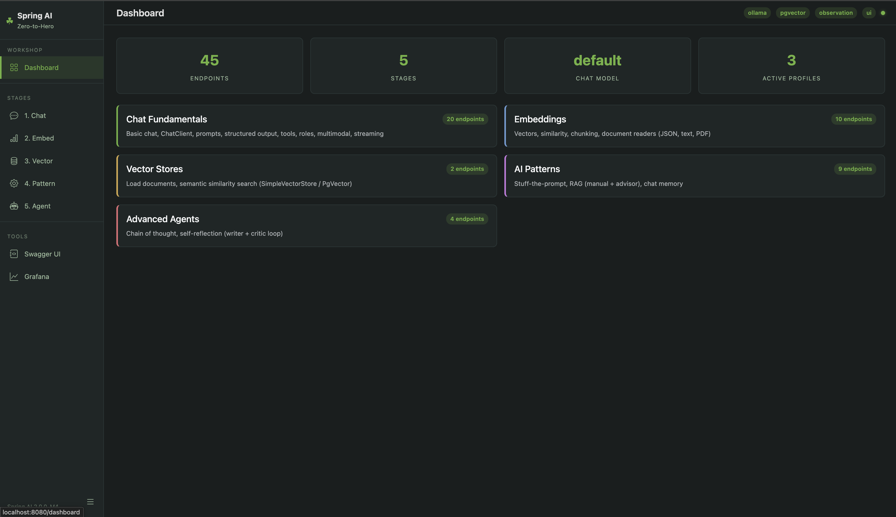
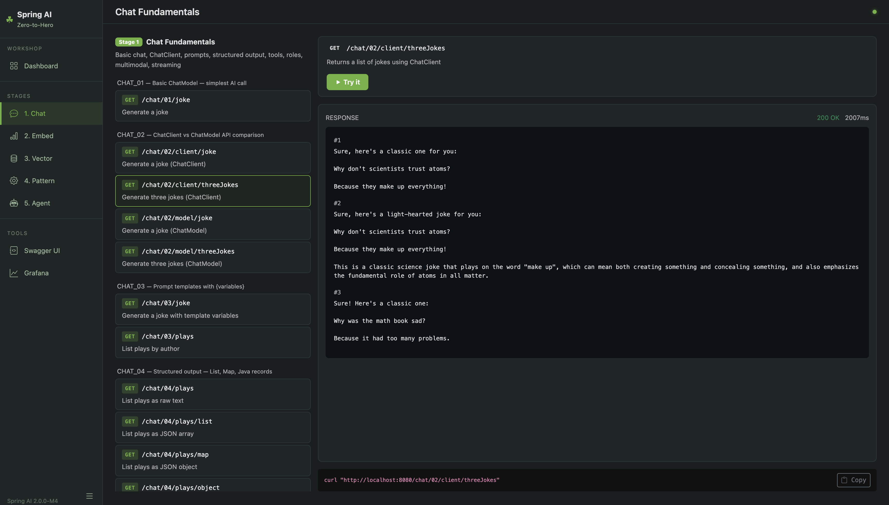
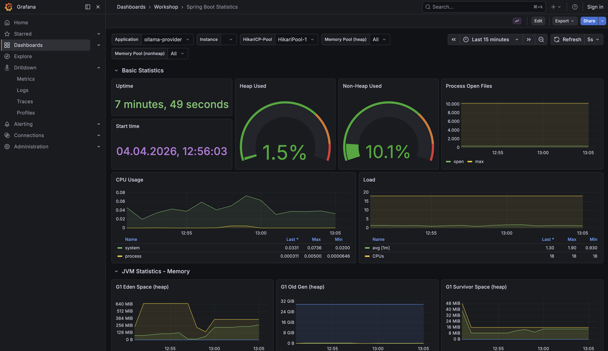
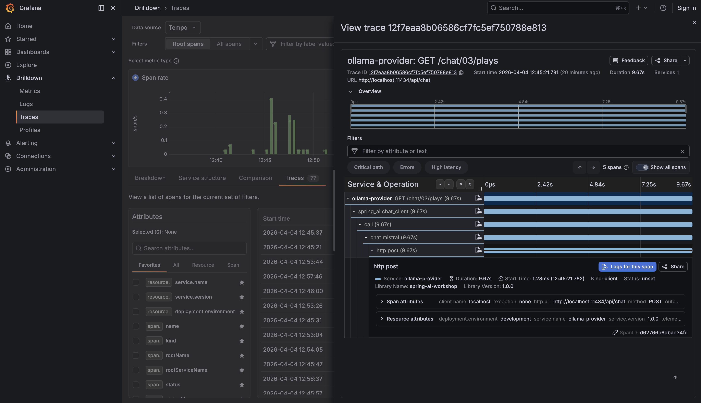

# Spring AI Zero-to-Hero Workshop

**Spring Boot 4.0.5 | Spring AI 2.0.0-M4 | Java 25**

A hands-on workshop for building AI-powered applications with Spring AI. Covers chat, embeddings, vector stores, RAG, tool calling, MCP, agentic patterns, and observability — across 6 AI providers.

<table>
<tr>
<td></td>
<td></td>
</tr>
<tr>
<td align="center"><em>Dashboard — overview of all 5 stages with endpoint counts</em></td>
<td align="center"><em>Stage 1 — try endpoints interactively with "Try it" buttons</em></td>
</tr>
<tr>
<td></td>
<td></td>
</tr>
<tr>
<td align="center"><em>Grafana — Spring Boot application metrics and statistics</em></td>
<td align="center"><em>Grafana — distributed trace with spans and log correlation</em></td>
</tr>
</table>

## Getting Started

| Audience | Guide |
|----------|-------|
| **Workshop attendee** (live session) | [Quickstart](docs/quickstart.md) — 5 minutes to your first AI call |
| **Self-paced learner** | [Full Guide](docs/guide.md) — complete walkthrough of all 8 stages |

### Fastest Path

```bash
./workshop.sh check                                    # Verify prerequisites
./workshop.sh setup                                    # Pull models, images, build
./workshop.sh start ollama --profiles pgvector,observation,ui  # Start everything
```

Then open:
- **Workshop Dashboard** — http://localhost:8080/dashboard
- **Swagger UI** — http://localhost:8080/swagger-ui.html
- **Grafana** — http://localhost:3000

> **Tip:** Use both the **Dashboard UI** and **curl/httpie on the command line** to explore endpoints. The dashboard formats responses for readability (JSON pretty-printing, chat bubbles, similarity charts), while curl shows you the raw API responses — seeing both gives you a clearer picture of what Spring AI actually returns.
>
> ```bash
> # Try the same endpoint in both:
> http localhost:8080/chat/01/joke topic==spring        # raw response
> # ... and click "Try it" in the Dashboard UI          # formatted view
> ```

## Resources

- [Provider Setup](docs/providers.md) — comparison matrix, API keys, model requirements
- [Troubleshooting](docs/troubleshooting.md) — common issues and solutions
- [Chat Examples](docs/examples_chat.md) — all chat endpoint examples
- [Embedding Examples](docs/examples_embedding.md) — all embedding endpoint examples

## Prerequisites

- **Java 25+** — `sdk install java 25.0.2-librca`
- **Docker** — for PostgreSQL/pgvector and Grafana LGTM
- **Ollama** *(optional)* — only needed for local provider: `ollama pull qwen3 && ollama pull nomic-embed-text && ollama pull llava`
- **Cloud provider** *(alternative to Ollama)* — configure API keys with `./workshop.sh creds`

16 GB macOS with Ollama: qwen3 + nomic-embed-text = ~10 GB active RAM. llava loads on-demand.

## Workshop Stages

1. **Chat Fundamentals** — ChatModel, ChatClient, prompt templates, structured output, tool calling, streaming
2. **Embeddings** — vector generation, similarity, chunking, document readers (JSON, Text, PDF)
3. **Vector Stores** — pgvector, similarity search, in-memory vs persistent
4. **AI Patterns** — stuff-the-prompt, RAG (manual + advisor), chat memory
5. **Advanced Agents** — chain-of-thought, self-reflection (writer + critic)
6. **MCP** — Model Context Protocol (stdio, HTTP, dynamic tools, resources, prompts) — runnable from the workshop dashboard at `/dashboard/stage/6`. 👉 **New: [What's new in Stage 6 (MCP)](WHATS_NEW_STAGE_06_MCP.md)** — attendee + trainer walkthrough
7. **Agentic Systems** — inner monologue, model-directed loop, Spring Shell CLIs
8. **Observability** — distributed tracing, metrics, logs with OpenTelemetry + Grafana LGTM

## AI Provider Options

| Provider | Chat | Embedding | Multimodal | Tool Calling | Local | Test Status |
|----------|------|-----------|------------|--------------|-------|-------------|
| **Ollama** | qwen3 (8B) | nomic-embed-text | llava (auto) | Yes | Yes | 44/44 PASS |
| **OpenAI** | gpt-4o-mini | text-embedding-3 | gpt-4o | Yes | No | 44/44 PASS |
| **Anthropic** | Claude (direct API) | - | Claude 3+ | Yes | No | 14/14 PASS |
| **Azure OpenAI** | gpt-4.1-mini | text-embedding-3 | gpt-4o | Yes | No | 8/8 PASS |
| **Google** | Gemini 2.5 Flash | text-embedding-004 | Gemini | Yes | No | 13/13 PASS |
| **AWS Bedrock** | Amazon Nova Lite | - | - | Yes | No | 8/8 PASS |

## Spring Profiles

| Profile | Purpose |
|---------|---------|
| `pgvector` | PostgreSQL vector store (instead of in-memory) |
| `observation` | Full observability (traces + metrics + logs to LGTM) |
| `ui` | Workshop dashboard at /dashboard |
| `spy` | Route traffic through gateway for inspection |

## Spring AI Deep Dive Documentation

In-depth technical documentation covering Spring AI internals, AI model fundamentals (LLMs, tool calling, multimodal architecture), and detailed analysis of every demo across all 8 stages. Each document includes Spring AI component descriptions, Mermaid flow diagrams, and annotated code examples.

| Document | Topic |
|----------|-------|
| [Introduction](docs/spring-ai/SPRING_AI_INTRODUCTION.md) | Spring AI architecture, ChatModel vs ChatClient, provider portability, AI model capabilities (tool calling, vision, audio, structured output), provider compatibility matrix |
| [Stage 1: Chat](docs/spring-ai/SPRING_AI_STAGE_1.md) | ChatModel, ChatClient, prompt templates, structured output, tool calling, system roles, multimodal, streaming |
| [Stage 2: Embeddings](docs/spring-ai/SPRING_AI_STAGE_2.md) | EmbeddingModel, cosine similarity, TokenTextSplitter, document readers (JSON, Text, PDF) |
| [Stage 3: Vector Stores](docs/spring-ai/SPRING_AI_STAGE_3.md) | VectorStore abstraction, SimpleVectorStore vs PgVectorStore, ETL pipeline |
| [Stage 4: AI Patterns](docs/spring-ai/SPRING_AI_STAGE_4.md) | Stuff-the-prompt, manual and advisor-based RAG, chat memory, advisor architecture |
| [Stage 5: Advanced Agents](docs/spring-ai/SPRING_AI_STAGE_5.md) | Chain-of-thought pipeline, self-reflection Writer/Critic loop, TikaDocumentReader |
| [Stage 6: MCP](docs/spring-ai/SPRING_AI_STAGE_6.md) · [What's New](WHATS_NEW_STAGE_06_MCP.md) | MCP servers (STDIO, HTTP), clients, dynamic tools, resources, prompts, completions |
| [Stage 7: Agentic Systems](docs/spring-ai/SPRING_AI_STAGE_7.md) | Inner monologue, model-directed loop, forced tool calling, Spring Shell CLIs |
| [Stage 8: Observability](docs/spring-ai/SPRING_AI_STAGE_8.md) | Custom tracing annotations, OpenTelemetry, LGTM stack, trace-log-metric correlation |

## Repo Organization

- **`/components/apis/`** — provider-independent API demos (chat, embedding, vector-store, audio, image)
- **`/components/patterns/`** — AI patterns (RAG, chat memory, stuff-prompt, chain-of-thought, self-reflection, distributed tracing)
- **`/components/config-openapi/`** — OpenAPI/Swagger UI configuration
- **`/components/config-dashboard/`** — Workshop dashboard UI (Thymeleaf + Bootstrap 5 + htmx)
- **`/components/config-pgvector/`** — PgVector auto-configuration (profile-based)
- **`/components/data/`** — shared datasets (bikes, customers, products, orders)
- **`/applications/`** — provider-specific Spring Boot apps (ollama, openai, anthropic, azure, google, aws, gateway)
- **`/mcp/`** — Model Context Protocol demos (stdio, HTTP, client, dynamic tools, capabilities)
- **`/agentic-system/`** — agentic AI patterns (inner monologue, model-directed loop)
- **`/docker/`** — infrastructure (PostgreSQL/pgvector, Grafana LGTM observability stack)
- **`/docs/`** — workshop documentation
