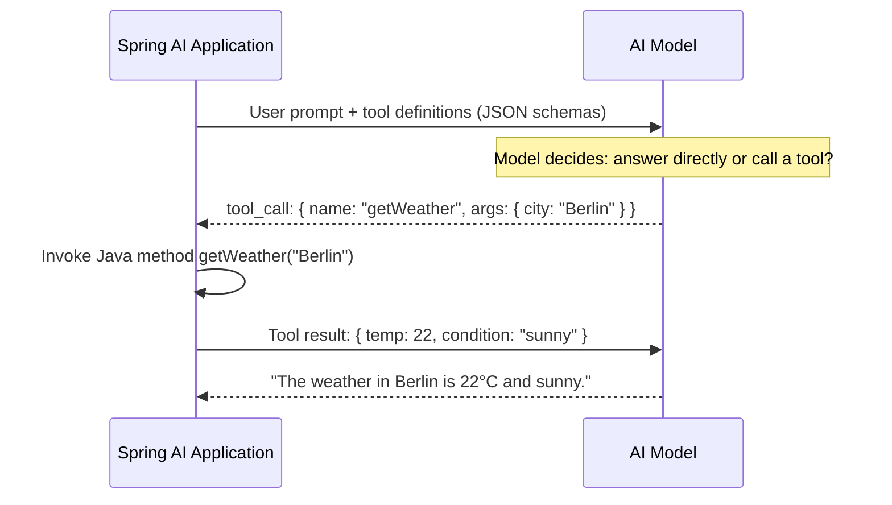

# Spring AI Introduction

**Spring AI Version:** 2.0.0-M4
**Spring Boot Version:** 4.0.5
**Java Version:** 25

---

## What Is Spring AI?

Spring AI is a Spring ecosystem project that brings the familiar Spring programming model — dependency injection, auto-configuration, portable abstractions — to AI-powered applications. Just as Spring Data provides a uniform API across SQL and NoSQL databases, Spring AI provides a uniform API across AI model providers.

The core idea: **write AI logic once, run it against any provider** by swapping a single Maven dependency and a few configuration properties.

### Design Philosophy

Spring AI follows the same principles that make the Spring ecosystem productive:

- **Portable abstractions** — `ChatModel`, `EmbeddingModel`, `VectorStore` work identically across providers
- **Auto-configuration** — Add a provider starter (e.g., `spring-ai-openai-spring-boot-starter`), set your API key, and Spring Boot wires everything
- **POJO-centric** — Your business logic stays in plain Java classes; Spring AI handles serialization, HTTP calls, and retries
- **Composable** — Mix and match components: use OpenAI for chat, Ollama for embeddings, PgVector for storage

### Spring AI vs. Direct Provider SDKs

| Aspect | Direct SDK (e.g., OpenAI Java SDK) | Spring AI |
|--------|-------------------------------------|-----------|
| Provider coupling | Locked to one provider | Swap providers with a dependency change |
| Configuration | Manual HTTP client setup | Auto-configured from `application.yaml` |
| Observability | Manual instrumentation | Built-in Micrometer metrics and tracing |
| Structured output | Manual JSON parsing | `.entity(MyRecord.class)` auto-conversion |
| Tool calling | Provider-specific protocol | Unified `@Tool` annotation |
| Testing | Mock HTTP responses | Swap to Ollama or test provider |

---

## Architecture Overview

```
┌───────────────────────────────────────────────────────────────────┐
│                        Your Application                           │
│  ┌──────────┐  ┌──────────┐  ┌──────────┐  ┌───────────────────┐  │
│  │Controller│  │ Service  │  │  @Tool   │  │ Output Converters │  │
│  └────┬─────┘  └─────┬────┘  └─────┬────┘  └──────────┬────────┘  │
│       │              │             │                  │           │
│  ─────┴──────────────┴─────────────┴──────────────────┴────────── │
│                     Spring AI Abstraction Layer                   │
│  ┌────────────┐  ┌────────────┐  ┌──────────────┐  ┌─────────────┐│
│  │ ChatClient │  │ ChatModel  │  │EmbeddingModel│  │ VectorStore ││
│  │  (fluent)  │  │ (low-level)│  │              │  │             ││
│  └─────┬──────┘  └─────┬──────┘  └──────┬───────┘  └──────┬──────┘│
│        │               │                │                 │       │
│  ──────┴───────────────┴────────────────┴─────────────────┴────── │
│                    Provider Auto-Configuration                    │
│  ┌─────────┐ ┌──────────┐ ┌───────┐ ┌────────┐ ┌──────┐ ┌───────┐ │
│  │ OpenAI  │ │Anthropic │ │ Azure │ │ Google │ │ AWS  │ │Ollama │ │
│  └────┬────┘ └────┬─────┘ └───┬───┘ └───┬────┘ └──┬───┘ └───┬───┘ │
└───────┼───────────┼───────────┼─────────┼─────────┼─────────┼─────┘
        │           │           │         │         │         │
        ▼           ▼           ▼         ▼         ▼         ▼
   ┌─────────┐ ┌─────────┐ ┌─────────┐ ┌─────────┐ ┌─────┐ ┌──────┐
   │ OpenAI  │ │Anthropic│ │  Azure  │ │ Google  │ │ AWS │ │Local │
   │   API   │ │   API   │ │   API   │ │   API   │ │ API │ │Ollama│
   └─────────┘ └─────────┘ └─────────┘ └─────────┘ └─────┘ └──────┘
```

### Key Abstractions

| Abstraction | Interface | Purpose | Workshop Stage |
|-------------|-----------|---------|----------------|
| **Chat** | `ChatModel` / `ChatClient` | Text generation, conversation | Stage 1 |
| **Embedding** | `EmbeddingModel` | Convert text to numerical vectors | Stage 2 |
| **Vector Store** | `VectorStore` | Store and search embeddings | Stage 3 |
| **Advisors** | `Advisor` | Intercept and enrich prompts (RAG, memory) | Stage 4 |
| **Tools** | `@Tool` / `ToolCallback` | Let models call Java methods | Stage 1, 5 |
| **MCP** | Model Context Protocol | Standardized tool/resource sharing | Stage 6 |
| **Streaming** | `StreamingChatModel` | Token-by-token reactive output | Stage 1 |
| **Observability** | Micrometer + OTel | Metrics, traces, logs for AI calls | Stage 8 |

---

## Core Concepts

### Models and Providers

An **AI model** is a neural network trained on large amounts of data (text, images, audio) to perform tasks like text generation, translation, or classification. A **provider** is a company or service that hosts and serves these models via an API.

Spring AI separates the model from the provider. The `ChatModel` interface is provider-agnostic — your code doesn't know or care whether it's talking to OpenAI, Anthropic, or a local Ollama instance.

#### How Spring AI Connects to a Provider

```
application.yaml                Spring Boot Auto-Configuration
─────────────────               ──────────────────────────────
spring:                         Reads properties → creates:
  ai:                           • OpenAiChatModel (implements ChatModel)
    openai:                     • ChatClient.Builder (wraps ChatModel)
      api-key: sk-...           • OpenAiEmbeddingModel
      chat:                     • StreamingChatModel
        model: gpt-4o-mini
```

Each provider has its own Spring Boot starter that auto-configures the correct implementation:

| Provider | Maven Starter | ChatModel Implementation |
|----------|--------------|--------------------------|
| OpenAI | `spring-ai-openai-spring-boot-starter` | `OpenAiChatModel` |
| Anthropic | `spring-ai-anthropic-spring-boot-starter` | `AnthropicChatModel` |
| Azure OpenAI | `spring-ai-azure-openai-spring-boot-starter` | `AzureOpenAiChatModel` |
| Google Vertex AI | `spring-ai-vertex-ai-gemini-spring-boot-starter` | `VertexAiGeminiChatModel` |
| AWS Bedrock | `spring-ai-bedrock-converse-spring-boot-starter` | `BedrockProxyChatModel` |
| Ollama | `spring-ai-ollama-spring-boot-starter` | `OllamaChatModel` |

> **Workshop pattern:** The `components/` modules depend only on `spring-ai-client-chat` (the abstraction). The `applications/provider-*` modules add the provider-specific starter. Same code, different provider.

### ChatModel vs. ChatClient

Spring AI offers two levels of API for chat:

| | `ChatModel` | `ChatClient` |
|-|-------------|--------------|
| **Analogy** | JDBC `DataSource` | Spring Data JPA `Repository` |
| **Style** | Imperative: create `Prompt`, receive `ChatResponse` | Fluent builder: `.prompt().user().call().content()` |
| **When to use** | Low-level control, custom message assembly | Most use cases (recommended) |
| **Injection** | `ChatModel` (auto-configured) | `ChatClient.Builder` (auto-configured) |

```java
// ChatModel — low-level
Prompt prompt = new Prompt("Tell me a joke");
ChatResponse response = chatModel.call(prompt);
String text = response.getResult().getOutput().getText();

// ChatClient — fluent (recommended)
String text = chatClient.prompt()
    .user("Tell me a joke")
    .call()
    .content();
```

### Messages and Roles

AI conversations are structured as a sequence of **messages**, each with a **role**:

| Role | Spring AI Class | Purpose |
|------|----------------|---------|
| `SYSTEM` | `SystemMessage` | Sets the AI's behavior, persona, constraints |
| `USER` | `UserMessage` | The human's input (text, images, audio) |
| `ASSISTANT` | `AssistantMessage` | The AI's response |
| `TOOL` | `ToolResponseMessage` | Result returned from a tool call |

The `Prompt` object wraps a list of these messages. `ChatClient` builds them fluently:

```java
chatClient.prompt()
    .system("You are a helpful travel agent")     // SystemMessage
    .user("Find flights to Berlin")                // UserMessage
    .call()                                        // → AssistantMessage
    .content();
```

### Prompt Templates

Prompt templates separate structure from data using `{variable}` placeholders:

```java
// Inline
chatClient.prompt()
    .user(u -> u.text("Tell me about {topic}").param("topic", "Spring AI"))
    .call().content();

// File-based (classpath resource)
chatClient.prompt()
    .user(u -> u.text(new ClassPathResource("prompts/analysis.st")).param("subject", value))
    .call().content();
```

Templates use the StringTemplate (ST4) engine. Variables are safely substituted at runtime — no string concatenation needed.

---

## AI Model Capabilities

Not all AI models are created equal. Features like tool calling, multimodal input, and structured output are **model capabilities** that must be supported by the underlying AI model itself. Spring AI provides a unified API, but the model must have been trained to use these features.

### Capability Matrix

| Capability | What It Means | Model Requirement | Example Models |
|------------|---------------|-------------------|----------------|
| **Chat Completion** | Generate text from a prompt | All LLMs | All models (qwen3, gpt-4o, claude, gemini) |
| **Tool/Function Calling** | Model emits structured JSON to invoke external functions | Model must be fine-tuned for tool use; it needs to understand when to emit a tool call instead of text | gpt-4o, claude-3.5+, gemini-pro, qwen3 (not all small models) |
| **Structured Output** | Model returns valid JSON matching a schema | Model must reliably follow JSON formatting instructions | Most modern models; smaller models may produce malformed JSON |
| **Multimodal (Vision)** | Process images alongside text | Model architecture must include a vision encoder | gpt-4o, claude-3.5+, gemini-pro-vision, llava (Ollama) |
| **Multimodal (Audio)** | Process audio alongside text | Model architecture must include an audio encoder | gpt-4o, gemini-pro |
| **Streaming** | Return tokens incrementally as they are generated | Supported by the provider's API, not the model itself | All major providers support streaming |

### How Tool Calling Works at the Model Level

Tool calling is not magic — it is a protocol between the application and the model:

1. **Registration:** Spring AI sends the model a list of available tools as JSON schemas (name, description, parameters) alongside the user prompt
2. **Decision:** The model decides whether it needs to call a tool. This is a learned behavior — the model was trained on examples of when to emit a `tool_call` response instead of regular text
3. **Invocation:** The model returns a structured `tool_call` JSON object. Spring AI intercepts this, invokes the Java method, and sends the result back to the model
4. **Synthesis:** The model receives the tool result and generates a final natural-language answer



If a model does not support tool calling, Spring AI will send the tool definitions but the model will ignore them and respond with plain text. This is why choosing the right model matters.

**In Spring AI**, tools are registered via annotations or beans:

```java
// Annotation-based — simplest approach
public class TimeTools {
    @Tool(description = "Returns the current time in a timezone")
    public String currentTimeIn(@ToolParam(description = "IANA timezone") String tz) { ... }
}

// Usage
chatClient.prompt().tools(new TimeTools()).user("What time is it in Berlin?").call().content();

// Bean-based — wraps existing services
@Bean
public FunctionToolCallback weatherCallback(WeatherService svc) {
    return FunctionToolCallback.builder("weatherFunction", request -> svc.getWeather(request.city()))
        .inputType(WeatherRequest.class).description("Get weather").build();
}

// Usage — reference by bean name
chatClient.prompt().toolNames("weatherFunction").user("Weather in Berlin?").call().content();
```

### Multimodal Architecture

Multimodal models extend a text-only language model with additional **encoders** that convert non-text inputs (images, audio) into token embeddings the language model can reason over. Each modality requires its own encoder, trained on modality-specific data. A model that lacks a given encoder simply cannot process that input type — the architecture doesn't support it.

#### Vision Encoder

Vision-capable models include a **Vision Transformer (ViT)** or similar image encoder that converts pixel data into a sequence of visual tokens:

```
┌──────────────┐     ┌───────────────────┐     ┌───────────────────┐
│  Image       │────▶│  Vision Encoder   │────▶│  Visual Tokens    │──┐
│  (PNG/JPEG)  │     │  (ViT / CLIP)     │     │  (embeddings)     │  │
└──────────────┘     └───────────────────┘     └───────────────────┘  │
                                                                      ▼
┌──────────────┐     ┌───────────────────┐     ┌───────────────────┐  │  ┌─────────────────┐
│  Text        │────▶│  Text Tokenizer   │────▶│  Text Tokens      │──┼─▶│  Language Model │──▶ Response
│  (prompt)    │     │  (BPE / SentPiece)│     │  (embeddings)     │  │  │  (Transformer)  │
└──────────────┘     └───────────────────┘     └───────────────────┘  │  └─────────────────┘
                                                                      │
┌──────────────┐     ┌───────────────────┐     ┌───────────────────┐  │
│  Audio       │────▶│  Audio Encoder    │────▶│  Audio Tokens     │──┘
│  (WAV/MP3)   │     │  (Whisper-style)  │     │  (embeddings)     │
└──────────────┘     └───────────────────┘     └───────────────────┘
```

The vision encoder processes the raw image into a fixed-length sequence of embeddings. These are projected into the same dimensional space as the text tokens and concatenated with them. The language model then attends over both visual and textual tokens to produce a response.

**In Spring AI**, vision input uses the `.media()` method on the user message:
```java
.user(u -> u.text("Describe this image")
            .media(MimeTypeUtils.IMAGE_PNG, imageResource))
```

#### Audio Encoder

Audio-capable models include an **audio encoder** (often based on the Whisper architecture) that converts waveform data into token embeddings. The process mirrors vision:

1. **Preprocessing:** Raw audio (WAV, MP3, WebM) is converted to a mel-spectrogram — a 2D time-frequency representation
2. **Encoding:** The audio encoder (a Transformer trained on speech data) converts the spectrogram into a sequence of audio token embeddings
3. **Fusion:** Audio tokens are projected into the language model's embedding space and concatenated with text tokens
4. **Reasoning:** The language model attends over both audio and text tokens to produce a response

Audio models support use cases like:
- **Speech-to-text transcription** with contextual understanding (beyond raw transcription — the model understands the content)
- **Audio analysis** — identifying speakers, emotions, music, environmental sounds
- **Voice-driven interaction** — processing spoken instructions directly without a separate STT pipeline

**In Spring AI**, audio input follows the same `.media()` pattern as images:
```java
.user(u -> u.text("Transcribe and summarize this audio")
            .media(new MimeType("audio", "wav"), audioResource))
```

> **Key insight:** Both vision and audio follow the same architectural pattern — a modality-specific encoder converts raw bytes into token embeddings that the language model can process. Spring AI abstracts this with a unified `.media(mimeType, resource)` API regardless of modality. The model itself determines which modalities it can handle.

#### Modality Support by Model

Not all multimodal models support all modalities. Each encoder must be trained separately:

| Model | Text | Vision | Audio Input | Audio Output |
|-------|------|--------|-------------|--------------|
| GPT-4o / GPT-4o-mini | Yes | Yes | Yes | Yes |
| Claude 3.5 Sonnet / Opus | Yes | Yes | No | No |
| Gemini Pro / Flash | Yes | Yes | Yes | Yes |
| Llava (Ollama) | Yes | Yes | No | No |
| Qwen3 (Ollama) | Yes | No | No | No |
| Whisper (OpenAI) | — | — | Yes (dedicated) | — |

### Structured Output

Spring AI can parse AI text responses into typed Java objects. It works by:

1. Generating a JSON schema from your target Java type
2. Appending format instructions to the prompt ("respond in this JSON format...")
3. Parsing the AI's JSON response into your type

```java
// Return a List<String>
chatClient.prompt().user("List 5 cities").call()
    .entity(new ListOutputConverter(new DefaultConversionService()));

// Return a Map
chatClient.prompt().user("Info about Berlin").call()
    .entity(new MapOutputConverter());

// Return a typed Java record
record City(String name, String country, int population) {}
chatClient.prompt().user("Tell me about Berlin").call()
    .entity(City.class);
```

This requires the model to reliably produce valid JSON. Larger models (GPT-4o, Claude 3.5, Gemini Pro) are very reliable; smaller models may occasionally produce malformed output.

---

## Provider Compatibility

### Supported Providers in This Workshop

| Provider | Starter Dependency | Default Model | Local/Cloud |
|----------|--------------------|---------------|-------------|
| **Ollama** | `spring-ai-ollama-spring-boot-starter` | qwen3 | Local |
| **OpenAI** | `spring-ai-openai-spring-boot-starter` | gpt-4o-mini | Cloud |
| **Anthropic** | `spring-ai-anthropic-spring-boot-starter` | claude-3.5-sonnet | Cloud |
| **Azure OpenAI** | `spring-ai-azure-openai-spring-boot-starter` | gpt-4o | Cloud |
| **Google Vertex AI** | `spring-ai-vertex-ai-gemini-spring-boot-starter` | gemini-pro | Cloud |
| **AWS Bedrock** | `spring-ai-bedrock-converse-spring-boot-starter` | various | Cloud |

### Feature Support Matrix

| Provider | Chat | Tools | Structured Output | Vision | Audio | Streaming |
|----------|------|-------|-------------------|--------|-------|-----------|
| **Ollama** (qwen3) | Yes | Yes | Yes | No (use llava) | No | Yes |
| **OpenAI** (gpt-4o-mini) | Yes | Yes | Yes | Yes | Yes | Yes |
| **Anthropic** (claude) | Yes | Yes | Yes | Yes | No | Yes |
| **Azure OpenAI** | Yes | Yes | Yes | Yes | Yes | Yes |
| **Google** (gemini) | Yes | Yes | Yes | Yes | Yes | Yes |
| **AWS Bedrock** | Yes | Yes | Yes | Varies | Varies | Yes |

### Workshop Architecture: Provider Portability

This workshop demonstrates provider portability through its module structure:

```
components/apis/chat/          ← AI logic (provider-agnostic)
    depends on: spring-ai-client-chat (abstraction only)

applications/provider-ollama/  ← Provider wiring
    depends on: chat + spring-ai-ollama-spring-boot-starter

applications/provider-openai/  ← Same code, different provider
    depends on: chat + spring-ai-openai-spring-boot-starter
```

The same `ChatClient.prompt().user("...").call().content()` code runs against any provider. Switch providers by starting a different application module — no code changes needed.

---

## Workshop Stage Overview

| Stage | Topic | Module | Key Concepts |
|-------|-------|--------|-------------|
| **1** | Chat Fundamentals | `components/apis/chat/` | ChatModel, ChatClient, prompts, structured output, tools, roles, multimodal, streaming |
| **2** | Embeddings | `components/apis/embedding/` | EmbeddingModel, vector similarity, document chunking |
| **3** | Vector Stores | `components/apis/vector-store/` | VectorStore, similarity search, PgVector |
| **4** | AI Patterns | `components/patterns/` | Stuff-the-prompt, RAG, advisors, chat memory |
| **5** | Advanced Patterns | `components/patterns/` | Chain-of-Thought, self-reflection, critic loops |
| **6** | Model Context Protocol | `mcp/` | MCP servers (stdio, HTTP), clients, dynamic tools |
| **7** | Agentic Systems | `agentic-system/` | Inner monologue, model-directed loops, CLI agents |
| **8** | Observability | Docker + config | Tracing (Tempo), metrics (Prometheus), logs (Loki), Grafana |

---

## Further Reading

- [Spring AI Reference Documentation](https://docs.spring.io/spring-ai/reference/)
- [Spring AI API Javadoc](https://docs.spring.io/spring-ai/docs/current/api/)
- [Spring AI GitHub Repository](https://github.com/spring-projects/spring-ai)
- Stage-specific documents: `SPRING_AI_STAGE_1.md` through `SPRING_AI_STAGE_8.md`
