# Stage 1: Chat Fundamentals

**Module:** `components/apis/chat/`
**Maven Artifact:** `spring-ai-client-chat`
**Package Base:** `com.example.chat_01` through `com.example.chat_08`

---

## Overview

Stage 1 introduces the core Spring AI Chat API through 14 progressive demos. Starting with the simplest possible AI call (`chatModel.call(String)`), each demo adds a new layer: fluent APIs, prompt templates, structured output, tool calling, system roles, multimodal input, and streaming.

### Learning Objectives

After completing this stage, developers will be able to:

- Use `ChatModel` (low-level) and `ChatClient` (fluent, preferred) APIs
- Build dynamic prompts with `{variable}` templates
- Parse AI responses into Java types (List, Map, records) using output converters
- Enable tool calling so the AI can invoke annotated Java methods
- Control AI behavior with system prompts/roles
- Send images alongside text (multimodal)
- Stream responses token-by-token using Reactor `Flux`

### Prerequisites

> **Background reading:** See [SPRING_AI_INTRODUCTION.md](SPRING_AI_INTRODUCTION.md) for a general introduction to Spring AI, model capabilities (tool calling, multimodal vision/audio, structured output), provider compatibility, and the workshop architecture.

- A running AI provider (Ollama with `qwen3` model is the simplest to start)
- Maven dependency `spring-ai-client-chat` (managed by `spring-ai-bom`)

---

## Spring AI Component Reference

| Component | FQN | Purpose |
|-----------|-----|---------|
| `ChatModel` | `o.s.ai.chat.model.ChatModel` | Low-level interface: `call(String)` or `call(Prompt)` |
| `ChatClient` | `o.s.ai.chat.client.ChatClient` | High-level fluent API built on top of ChatModel |
| `ChatClient.Builder` | `o.s.ai.chat.client.ChatClient.Builder` | Auto-configured builder for creating ChatClient instances |
| `Prompt` | `o.s.ai.chat.prompt.Prompt` | Wraps messages into a request object |
| `PromptTemplate` | `o.s.ai.chat.prompt.PromptTemplate` | Template engine with `{variable}` substitution |
| `ChatResponse` | `o.s.ai.chat.model.ChatResponse` | Response wrapper containing one or more Generations |
| `Generation` | `o.s.ai.chat.model.Generation` | Single result from the model |
| `AssistantMessage` | `o.s.ai.chat.messages.AssistantMessage` | Message from the AI (output) |
| `StreamingChatModel` | `o.s.ai.chat.model.StreamingChatModel` | Streaming variant: returns `Flux` instead of blocking |
| `ChatOptions` | `o.s.ai.chat.prompt.ChatOptions` | Runtime options (model override, temperature, etc.) |
| `ListOutputConverter` | `o.s.ai.converter.ListOutputConverter` | Parses AI response into `List<String>` |
| `MapOutputConverter` | `o.s.ai.converter.MapOutputConverter` | Parses AI response into `Map<String, Object>` |
| `@Tool` | `o.s.ai.tool.annotation.Tool` | Marks a method as callable by the AI model |
| `@ToolParam` | `o.s.ai.tool.annotation.ToolParam` | Describes a tool method parameter |
| `FunctionToolCallback` | `o.s.ai.tool.function.FunctionToolCallback` | Programmatic tool registration via Spring beans |

> **Notation:** `o.s.ai` = `org.springframework.ai`

---

## Demo 01 — Direct ChatModel Call

**Endpoint:** `GET /chat/01/joke`
**Source:** `chat_01/BasicPromptController.java`

### Description

The simplest possible Spring AI interaction. Injects `ChatModel` and calls it with a plain string. No prompt objects, no response parsing — just a string in, string out.

### Spring AI Components

- `ChatModel` — the core low-level interface for AI model interaction

### Flow Diagram

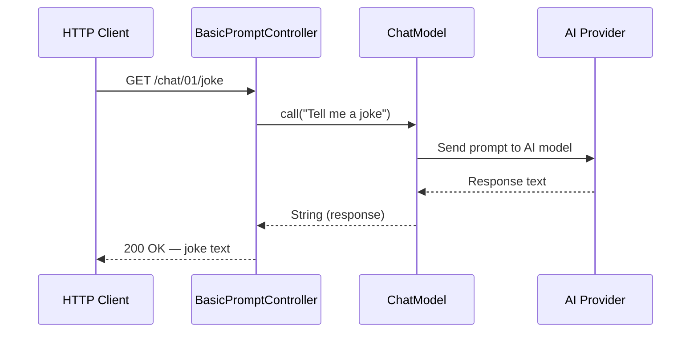

### Key Code

```java
private final ChatModel chatModel;

@GetMapping("joke")
public String getJoke() {
    return this.chatModel.call("Tell me a joke");
}
```

> **Takeaway:** `ChatModel.call(String)` is the absolute minimum API. It hides all the complexity of Prompt/ChatResponse/Generation behind a single method call.

---

## Demo 02a — ChatClient Fluent API

**Endpoint:** `GET /chat/02/client/joke?topic={topic}`
**Source:** `chat_02/ChatClientController.java`

### Description

Introduces `ChatClient`, the fluent builder API that Spring AI recommends for most use cases. Demonstrates the full response object hierarchy: `ChatResponse` → `Generation` → `AssistantMessage` → `getText()`, and the shorthand `.call().content()`.

### Spring AI Components

- `ChatClient` — fluent API built from `ChatClient.Builder` (auto-configured by Spring Boot)
- `ChatResponse` — response wrapper
- `Generation` — single model result
- `AssistantMessage` — the AI's output message

### Flow Diagram

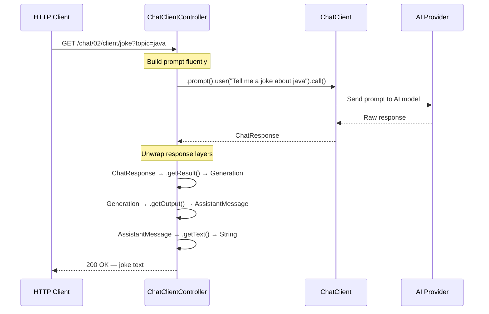

### Key Code

```java
// Full response chain (verbose)
ChatResponse response = chatClient.prompt()
    .user("Tell me a joke about " + topic)
    .call()
    .chatResponse();
Generation generation = response.getResult();
AssistantMessage assistantMessage = generation.getOutput();
return assistantMessage.getText();

// Shorthand (preferred)
String joke = chatClient.prompt().user("Tell me a short joke").call().content();
```

> **Takeaway:** `ChatClient` is to `ChatModel` what Spring Data JPA is to JDBC. Use `.call().content()` for quick string results, or `.call().chatResponse()` when you need metadata (token counts, model info).

---

## Demo 02b — ChatModel with Prompt Object

**Endpoint:** `GET /chat/02/model/joke?topic={topic}`
**Source:** `chat_02/ChatModelController.java`

### Description

Shows the low-level `ChatModel` API with explicit `Prompt` objects. Same result as Demo 02a, but reveals how the underlying request/response model works. Useful for understanding what `ChatClient` does internally.

### Spring AI Components

- `ChatModel` — low-level interface
- `Prompt` — request wrapper around a message string
- `ChatResponse`, `Generation`, `AssistantMessage` — response hierarchy

### Flow Diagram

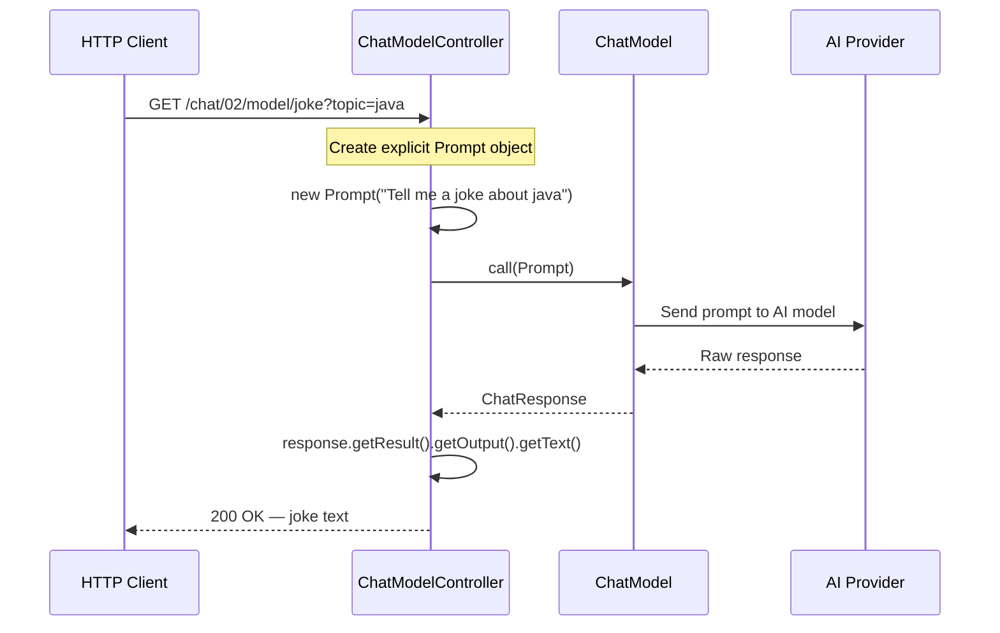

### Key Code

```java
Prompt prompt = new Prompt("Tell me a joke about " + topic);
ChatResponse response = chatModel.call(prompt);
return response.getResult().getOutput().getText();
```

> **Takeaway:** `Prompt` wraps one or more `Message` objects. The `ChatResponse` → `Generation` → `AssistantMessage` chain is the same regardless of whether you use `ChatModel` or `ChatClient`.

---

## Demo 03 — Prompt Templates

**Endpoint:** `GET /chat/03/joke?topic={topic}` | `GET /chat/03/plays?author={author}`
**Source:** `chat_03/PromptTemplateController.java`

### Description

Introduces safe variable substitution using `{variable}` placeholders in prompt text. Shows two approaches: inline template parameters via the fluent API, and loading templates from external files (`prompts/plays.st` on the classpath).

### Spring AI Components

- `ChatClient` — fluent API with `.param()` for template substitution
- `ClassPathResource` — Spring's resource loader for external template files

### Flow Diagram

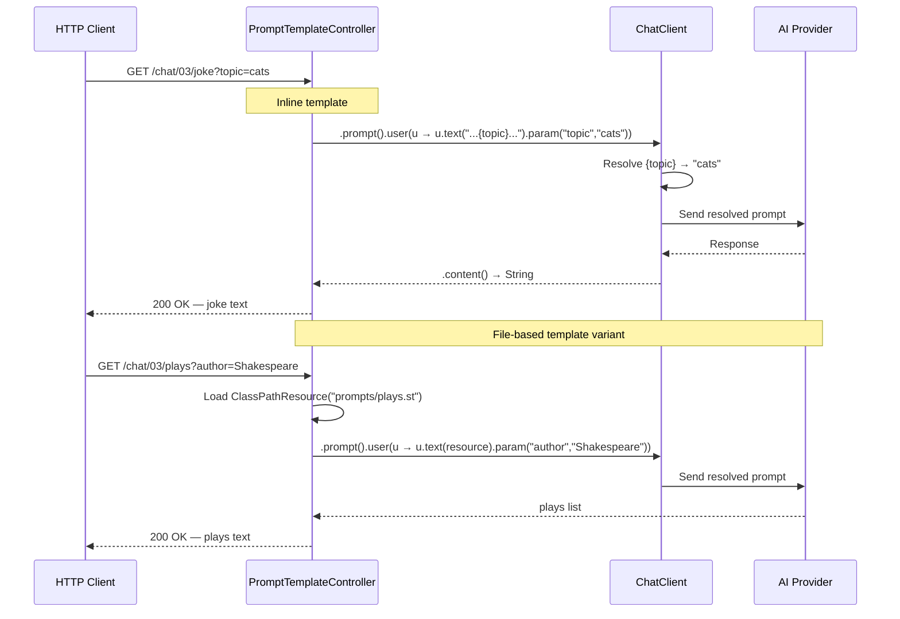

### Key Code

```java
// Inline template
chatClient.prompt()
    .user(u -> u.text("Tell me a joke about {topic}").param("topic", topic))
    .call().content();

// File-based template (prompts/plays.st)
chatClient.prompt()
    .user(u -> u.text(new ClassPathResource("prompts/plays.st")).param("author", topic))
    .call().content();
```

**Template file** `prompts/plays.st`:
```
Provide a list of the plays written by {author}.
Provide only the list no other commentary
```

> **Takeaway:** Always use `{variable}` placeholders with `.param()` instead of string concatenation. It's cleaner, supports external template files, and separates prompt structure from runtime data.

---

## Demo 04 — Structured Output

**Endpoints:**
- `GET /chat/04/plays/list` — returns `List<String>`
- `GET /chat/04/plays/map` — returns `Map<String, Object>`
- `GET /chat/04/plays/object` — returns `Play[]` (Java records)

**Source:** `chat_04/StructuredOutputConverterController.java`

### Description

Demonstrates parsing AI text responses into typed Java objects. Three converters show increasing type safety: `ListOutputConverter` for simple lists, `MapOutputConverter` for key-value structures, and direct `.entity(Class)` for fully typed Java records.

### Spring AI Components

- `ChatClient` — fluent API with `.entity()` for structured output
- `ListOutputConverter` — converts AI response to `List<String>`
- `MapOutputConverter` — converts AI response to `Map<String, Object>`
- `BeanOutputConverter` (implicit) — used internally by `.entity(Play[].class)` for record mapping

### Flow Diagram

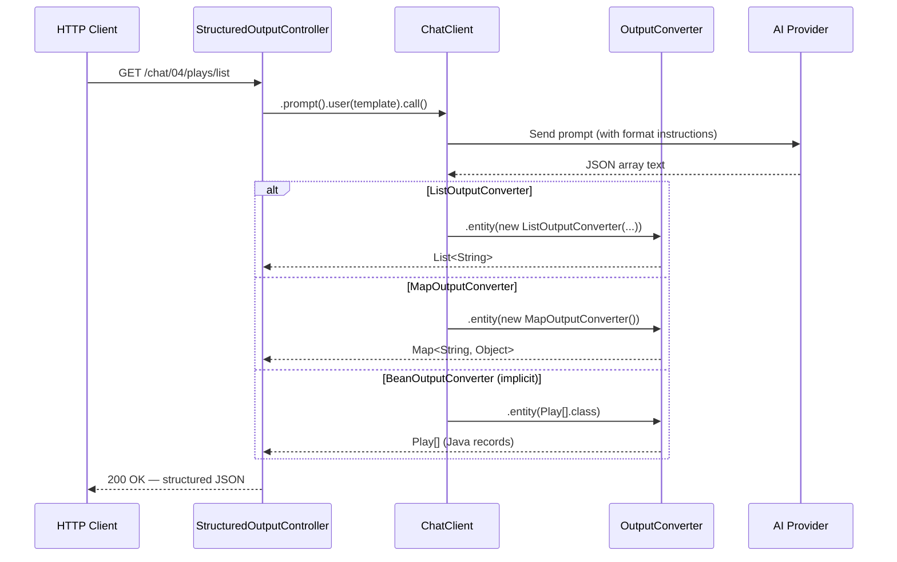

### Key Code

```java
// List<String>
chatClient.prompt().user(u -> u.text("...").param("author", topic))
    .call().entity(new ListOutputConverter(new DefaultConversionService()));

// Map<String, Object>
chatClient.prompt().user(u -> u.text("...").param("author", topic))
    .call().entity(new MapOutputConverter());

// Java record array
chatClient.prompt().user(u -> u.text("...").param("author", topic))
    .call().entity(Play[].class);

// Supporting record
record Play(String author, String title, Integer publicationYear) {}
```

> **Takeaway:** `.entity(Class)` is the simplest way to get typed output. Spring AI automatically generates JSON schema instructions and appends them to the prompt, then deserializes the AI's JSON response into your Java type.

---

## Demo 05a — Tool Calling with @Tool Annotation

**Endpoint:** `GET /chat/05/time?city={city}`
**Source:** `chat_05/ToolController.java`, `chat_05/tool/annotations/TimeTools.java`

### Description

The AI model can call your Java methods when it needs external data. Here, a `@Tool`-annotated method returns the current time for a timezone. The model decides when to call the tool based on the user's question, executes it, then incorporates the result into its answer.

### Spring AI Components

- `ChatClient` — fluent API with `.tools()` for registering tool instances
- `@Tool` — annotation marking a method as AI-callable
- `@ToolParam` — annotation describing tool method parameters

### Flow Diagram

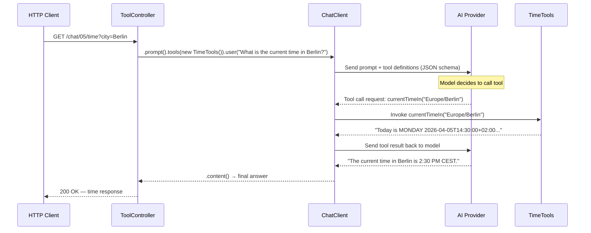

### Key Code

```java
// Controller
chatClient.prompt()
    .tools(new TimeTools())
    .user(u -> u.text("What is the current time in {city}?").param("city", city))
    .call().content();

// Tool class
public class TimeTools {
    @Tool(description = "Returns the current time in a specific timezone...", returnDirect = false)
    public String currentTimeIn(
        @ToolParam(required = false, description = "IANA time zone identifiers") String timeZone) {
        ZonedDateTime now = (timeZone == null) ? ZonedDateTime.now() : ZonedDateTime.now(ZoneId.of(timeZone));
        return "Today is " + now.getDayOfWeek() + " " + now.format(DateTimeFormatter.ISO_DATE_TIME) + "...";
    }
}
```

> **Takeaway:** The AI model does NOT execute code directly. Spring AI sends the tool's JSON schema to the model, the model returns a tool call request, Spring AI invokes your Java method, then sends the result back. This is a multi-turn conversation managed by `ChatClient`.

---

## Demo 05b — Tool Calling with FunctionToolCallback Bean

**Endpoint:** `GET /chat/05/weather?city={city}`
**Source:** `chat_05/ToolController.java`, `chat_05/tool/function/FunctionConfiguration.java`, `chat_05/tool/function/WeatherService.java`

### Description

An alternative to `@Tool` annotations: register tools programmatically as Spring beans using `FunctionToolCallback`. The tool wraps an existing `WeatherService` and is referenced by bean name (`"weatherFunction"`) instead of passing an instance.

### Spring AI Components

- `ChatClient` — fluent API with `.toolNames()` for bean-based tool references
- `FunctionToolCallback` — programmatic tool registration with builder pattern
- `WeatherService` — plain Spring `@Service` (no Spring AI dependency)

### Flow Diagram

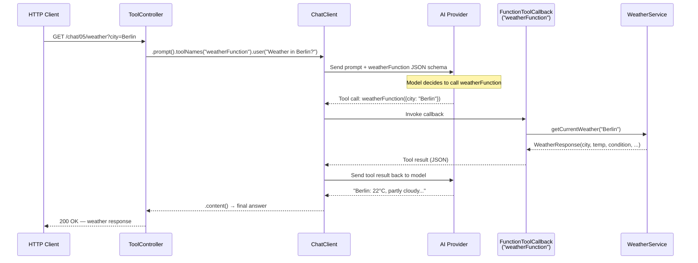

### Key Code

```java
// Controller — reference by bean name
chatClient.prompt()
    .toolNames("weatherFunction")
    .user(u -> u.text("What is the current weather in {city}?").param("city", city))
    .call().content();

// Configuration — register tool as Spring bean
@Configuration
class FunctionConfiguration {
    @Bean
    public FunctionToolCallback weatherFunctionCallback(WeatherService weatherService) {
        return FunctionToolCallback.builder(
                "weatherFunction",
                (WeatherRequest request) -> weatherService.getCurrentWeather(request.city()))
            .inputType(WeatherRequest.class)
            .description("Get the weather in location")
            .build();
    }
}

// Plain service — no Spring AI imports
@Service
class WeatherService {
    public WeatherResponse getCurrentWeather(String city) { /* random weather data */ }
}
```

> **Takeaway:** `FunctionToolCallback` lets you wrap existing services as tools without modifying them. Use `.toolNames("beanName")` when the tool is registered as a Spring bean, vs `.tools(instance)` for ad-hoc tool instances.

---

## Demo 05c — Tool Calling with returnDirect

**Endpoint:** `GET /chat/05/search?query={query}`
**Source:** `chat_05/ToolController.java`, `chat_05/tool/return_direct/RestaurantSearch.java`

### Description

Demonstrates `returnDirect = true`: the tool's result is returned directly to the caller, bypassing the model's post-processing step. This is useful when the tool returns structured data (like a list of restaurants) that shouldn't be summarized by the AI.

### Spring AI Components

- `ChatClient` — fluent API with multiple `.tools()` instances
- `@Tool(returnDirect = true)` — skips the final LLM summarization step
- `@ToolParam` — rich parameter descriptions for the model

### Flow Diagram

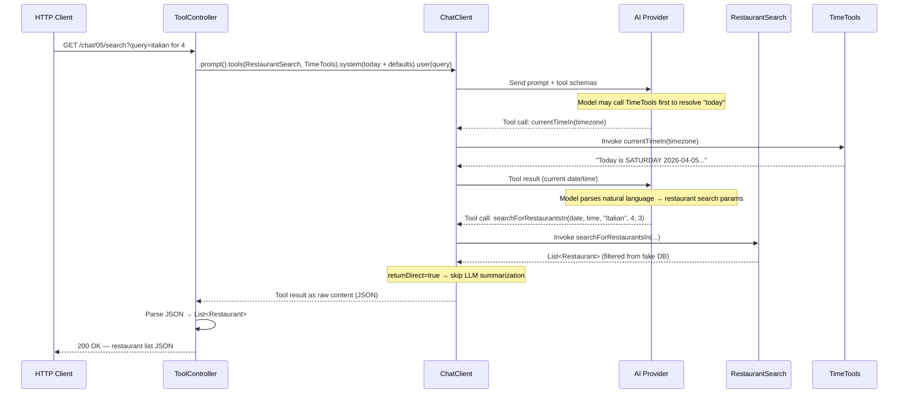

### Key Code

```java
// Controller — multiple tools, system context
this.chatClient.prompt()
    .tools(new RestaurantSearch(), new TimeTools())
    .system("Today is " + LocalDate.now() + ". Default time is 12:00. Default star rating is 3.")
    .user(query)
    .call().content();

// Tool with returnDirect
@Tool(description = "Search for restaurants that match the cuisine and party size", returnDirect = true)
public List<Restaurant> searchForRestaurantsIn(
    @ToolParam(description = "The date...") String date,
    @ToolParam(description = "The time...") String time,
    @ToolParam(description = "The type of cuisine...") String cuisine,
    @ToolParam(description = "The number of people...") Integer partySize,
    @ToolParam(description = "star rating between 1 and 5") Integer starRating) {
    return FAKE_DATABASE.stream()
        .filter(r -> r.cuisine().equalsIgnoreCase(cuisine))
        .filter(r -> r.capacity() >= partySize)
        .collect(Collectors.toList());
}
```

> **Takeaway:** `returnDirect = true` is ideal when you want the tool's structured output returned as-is. The model's role is reduced to parameter extraction — it parses the user's natural language into the tool's parameters but doesn't summarize the result.

---

## Demo 06 — System Roles

**Endpoints:** `GET /chat/06/fruit` | `GET /chat/06/veg`
**Source:** `chat_06/RoleController.java`

### Description

Shows how system prompts define the AI's persona and behavioral constraints. The `ChatClient` is built with a `defaultSystem` message that restricts the AI to only answer questions about fruits. When asked about vegetables, the AI refuses — demonstrating how system roles constrain behavior.

### Spring AI Components

- `ChatClient.Builder.defaultSystem()` — sets a persistent system prompt for all requests
- `ChatClient` — fluent API (system prompt injected automatically)

### Flow Diagram

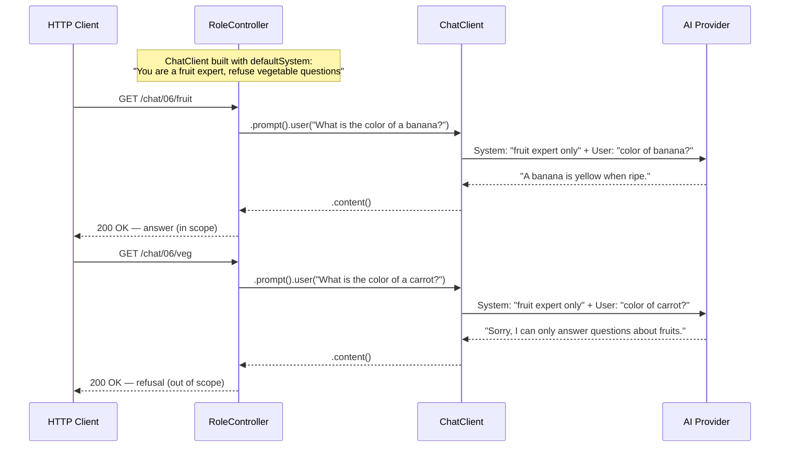

### Key Code

```java
public RoleController(ChatClient.Builder builder) {
    this.chatClient = builder
        .defaultSystem("""
            You are a helpful experts on plants, however you are not allowed
            to answers any question about vegetables you can only
            answer questions about fruits.
            """)
        .build();
}

@GetMapping("/fruit")
public String fruitQuestion() {
    return chatClient.prompt().user("What is the color of a banana?").call().content();
}

@GetMapping("/veg")
public String vegetableQuestion() {
    return chatClient.prompt().user("What is the color of a carrot?").call().content();
}
```

> **Takeaway:** `defaultSystem()` on `ChatClient.Builder` sets a system prompt that applies to every request. System prompts are the primary mechanism for defining AI behavior, personas, and guardrails.

---

## Demo 07 — Multimodal Input

**Endpoint:** `GET /chat/07/explain`
**Source:** `chat_07/MultiModalController.java`

### Description

Sends an image alongside a text prompt for the AI to describe. Demonstrates the `.media()` method on the user message builder, runtime model selection via `ChatOptions`, and automatic model switching for Ollama (which uses `llava` for vision tasks instead of `qwen3`/`llama3.2`).

### Spring AI Components

- `ChatClient` — fluent API with `.media()` for attaching binary content
- `ChatOptions` — runtime model override (e.g., switch to a vision-capable model)
- `MimeTypeUtils` — Spring's MIME type constants for content type declaration
- `Resource` — Spring's resource abstraction for the image file

### Flow Diagram

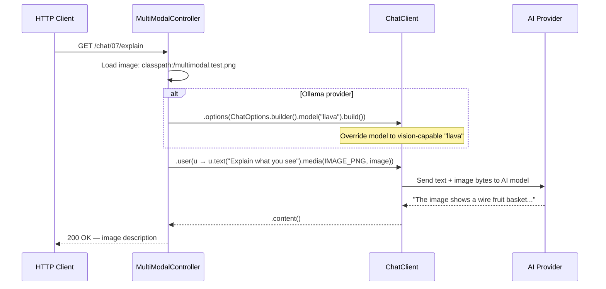

### Key Code

```java
@Value("classpath:/multimodal.test.png")
private Resource image;

@Value("${spring.ai.ollama.chat.model:#{null}}")
private String ollamaModel;

@GetMapping("/explain")
public String explain() throws IOException {
    var prompt = chatClient.prompt();

    // Switch to llava for Ollama (vision-capable model)
    if (ollamaModel != null) {
        prompt = prompt.options(ChatOptions.builder().model("llava").build());
    }

    return prompt
        .user(u -> u.text("Explain what do you see in this picture?")
                     .media(MimeTypeUtils.IMAGE_PNG, image))
        .call().content();
}
```

> **Takeaway:** `.media(mimeType, resource)` attaches binary content to a user message. The same API works across providers (OpenAI, Anthropic, Google), but each provider has different vision-capable models. Use `ChatOptions.builder().model()` to switch models at runtime.

---

## Demo 08 — Streaming Responses

**Endpoint:** `GET /chat/08/essay?topic={topic}`
**Source:** `chat_08/StreamingChatModelController.java`

### Description

Returns a reactive `Flux<String>` that streams tokens as they are generated, delivered to the browser as Server-Sent Events (SSE). Uses the `StreamingChatModel` interface and `PromptTemplate` for variable substitution.

### Spring AI Components

- `StreamingChatModel` — streaming variant of ChatModel, returns `Flux<String>`
- `PromptTemplate` — template engine with `{variable}` substitution and `.render()`

### Flow Diagram

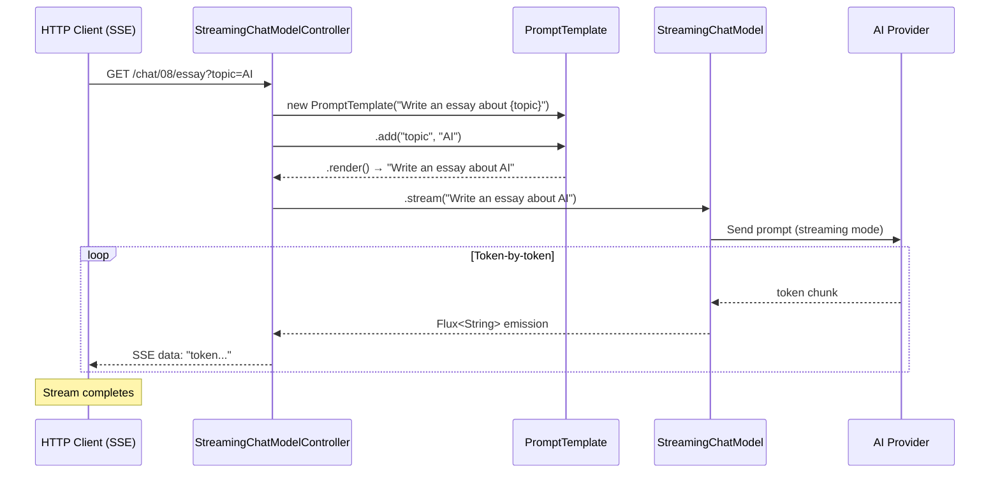

### Key Code

```java
private final StreamingChatModel chatModel;

@GetMapping("/essay")
public Flux<String> getJoke(@RequestParam(value = "topic", defaultValue = "Impact of AI on Society") String topic) {
    var promptTemplate = new PromptTemplate("Write an essay about {topic} ");
    promptTemplate.add("topic", topic);
    return chatModel.stream(promptTemplate.render());
}
```

> **Takeaway:** `StreamingChatModel.stream()` returns a `Flux<String>` — each element is a token chunk from the AI. Combined with Spring WebFlux/MVC's SSE support, the browser receives text as it's generated instead of waiting for the full response.

---

## Stage 1 Progression

The following diagram shows how each demo builds on previous concepts:

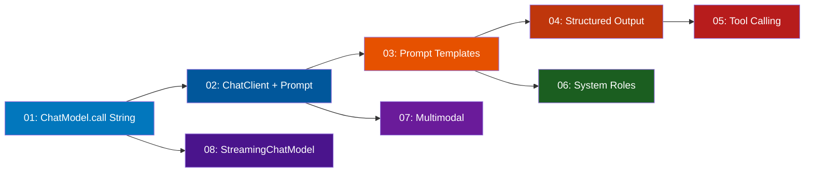

### API Layer Summary

| API Level | Interface | Input | Output | When to Use |
|-----------|-----------|-------|--------|-------------|
| Lowest | `ChatModel.call(String)` | Plain string | Plain string | Quick prototyping |
| Low | `ChatModel.call(Prompt)` | `Prompt` object | `ChatResponse` | Need metadata, multi-message prompts |
| **Recommended** | **`ChatClient` fluent API** | Builder chain | `.content()`, `.entity()`, `.chatResponse()` | **Most use cases** |
| Streaming | `StreamingChatModel.stream()` | String | `Flux<String>` | Long responses, real-time UX |

### Tool Calling Approaches

| Approach | Registration | Reference | Best For |
|----------|-------------|-----------|----------|
| `@Tool` + `@ToolParam` | Annotate methods | `.tools(new Instance())` | Simple, self-contained tools |
| `FunctionToolCallback` | Spring `@Bean` | `.toolNames("beanName")` | Wrapping existing services |
| `returnDirect = true` | Either approach | Same | Structured data bypass |
