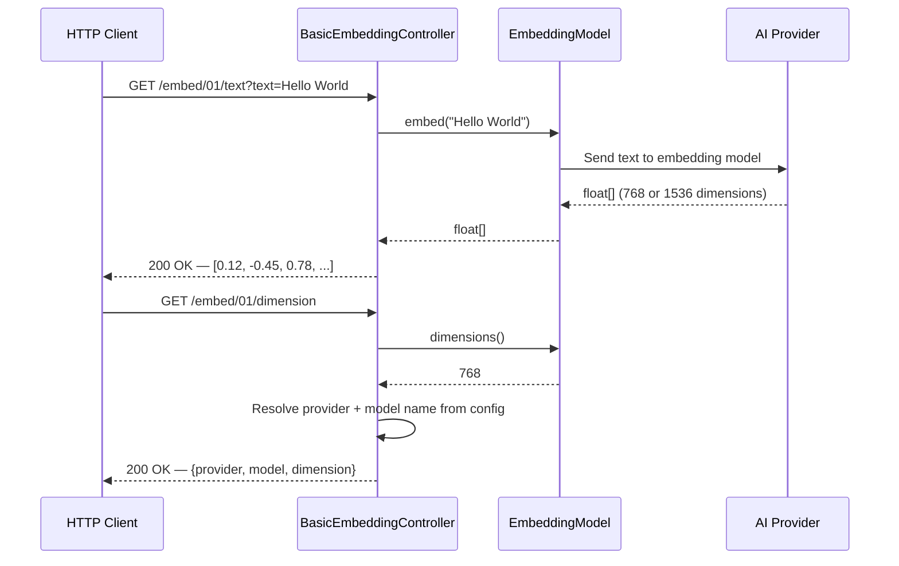
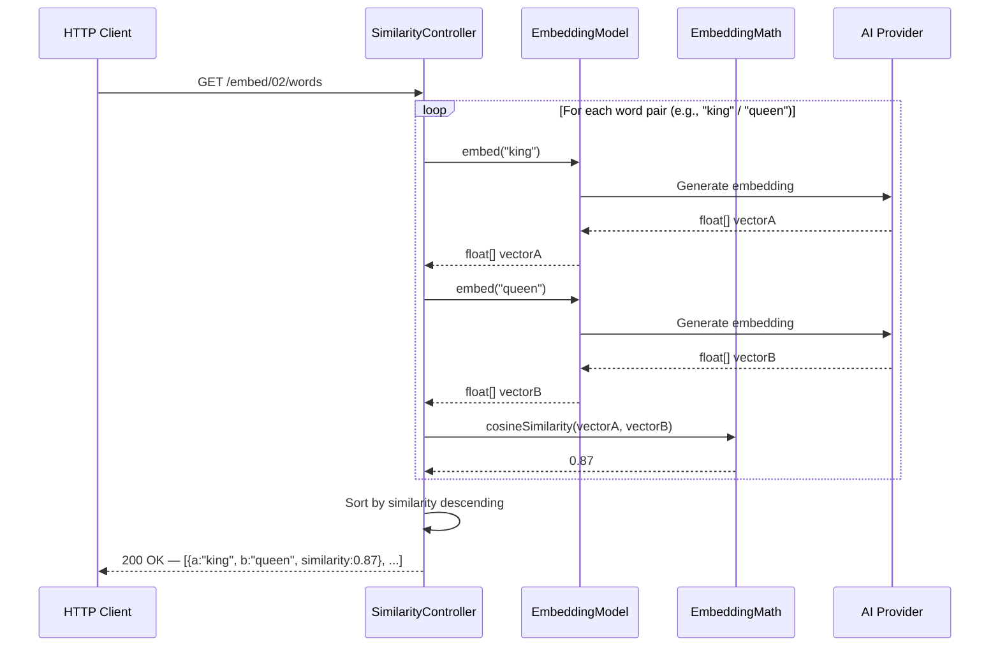
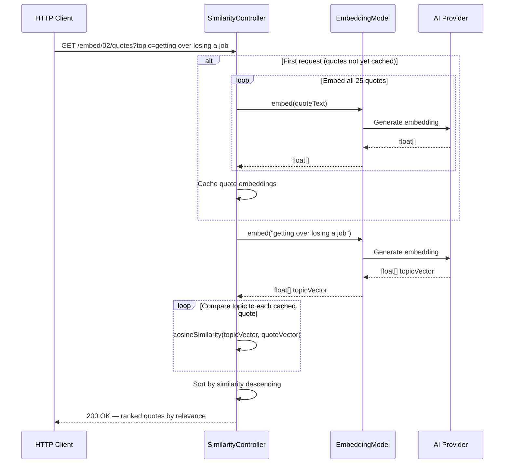
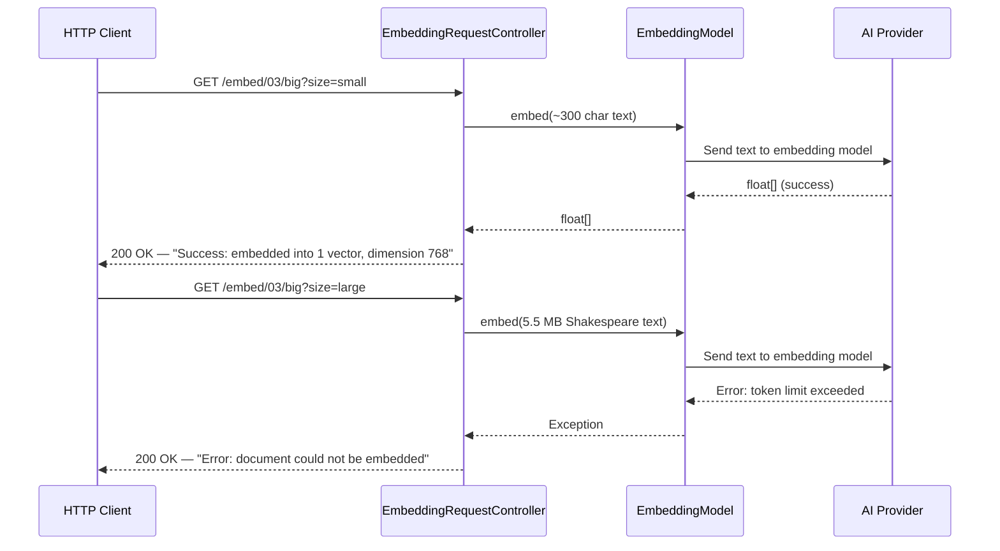
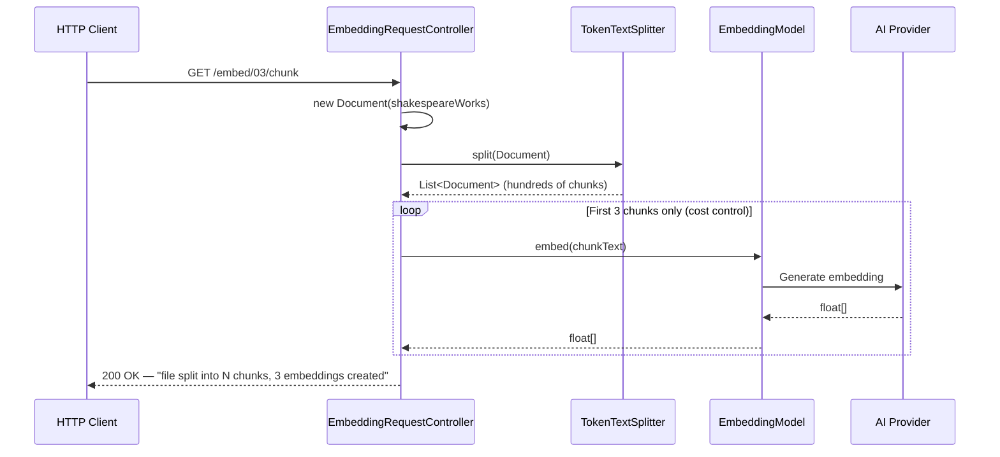
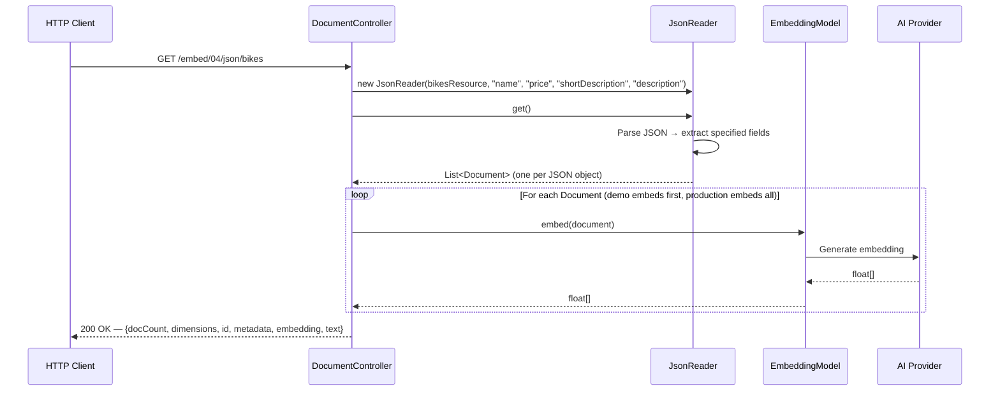
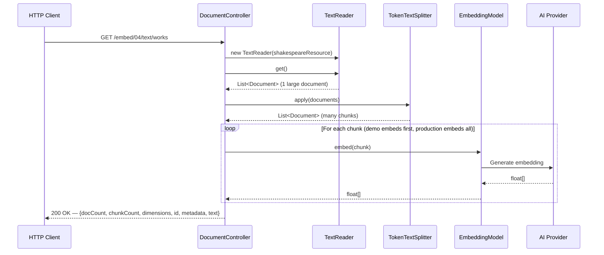
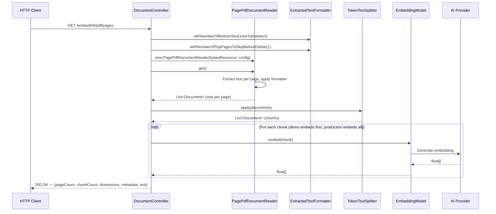
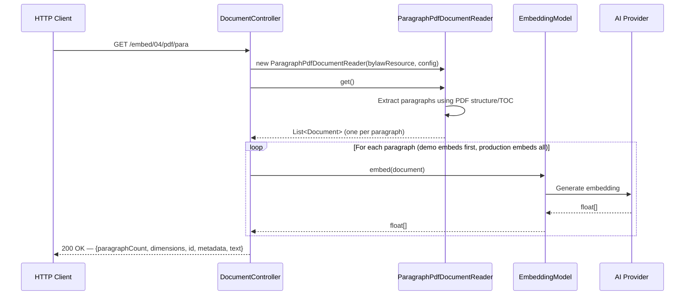

# Stage 2: Embeddings

**Module:** `components/apis/embedding/`
**Maven Artifacts:** `spring-ai-client-chat`, `spring-ai-vector-store`, `spring-ai-pdf-document-reader`
**Package Base:** `com.example.embed_01` through `com.example.embed_04`

---

## Overview

Stage 2 introduces **embeddings** — the process of converting text into dense float vectors in high-dimensional space. Similar texts produce vectors that are close together, which is the foundation of semantic search, retrieval-augmented generation (RAG), and many other AI patterns.

The demos progress from generating a single embedding vector, through cosine similarity comparisons, to handling large documents with chunking strategies and multi-format document readers (JSON, text, PDF).

### Learning Objectives

After completing this stage, developers will be able to:

- Generate embedding vectors from text using `EmbeddingModel`
- Understand embedding dimensions and their relationship to the model
- Compute cosine similarity to measure semantic closeness between texts
- Handle large documents that exceed model context windows using `TokenTextSplitter`
- Parse JSON, plain text, and PDF files into `Document` objects using Spring AI document readers
- Understand the Document → Chunk → Embed pipeline that feeds vector stores

### Prerequisites

> **Background reading:** See [SPRING_AI_INTRODUCTION.md](SPRING_AI_INTRODUCTION.md) for a general introduction to Spring AI, provider compatibility, and the workshop architecture.

- A running AI provider with an embedding model (Ollama with `nomic-embed-text` is the simplest to start)
- Maven dependencies: `spring-ai-client-chat`, `spring-ai-vector-store`, `spring-ai-pdf-document-reader` (managed by `spring-ai-bom`)

---

## What Are Embeddings?

An **embedding** is a fixed-length float array (vector) that captures the semantic meaning of a piece of text. The embedding model maps text into a high-dimensional space where:

- **Semantically similar texts** produce vectors that are **close together** (high cosine similarity)
- **Unrelated texts** produce vectors that are **far apart** (low cosine similarity)

```
"king" ────────▶ [0.12, -0.45, 0.78, 0.33, ...]   ┐
                                                      ├─ close (high similarity)
"queen" ───────▶ [0.14, -0.42, 0.75, 0.31, ...]   ┘

"banana" ──────▶ [-0.67, 0.22, 0.11, -0.89, ...]  ── far from king/queen
```

### Embedding Dimensions

The number of floats in the vector is the model's **dimension**. Different models produce different-sized vectors:

| Model | Provider | Dimensions |
|-------|----------|------------|
| `nomic-embed-text` | Ollama | 768 |
| `text-embedding-ada-002` | OpenAI | 1536 |
| `text-embedding-3-small` | OpenAI | 1536 |
| `text-embedding-3-large` | OpenAI | 3072 |

Higher dimensions can capture more nuance but use more memory and compute.

### Cosine Similarity

Cosine similarity measures the angle between two vectors, returning a value between -1 and 1:

| Score | Meaning |
|-------|---------|
| **1.0** | Identical meaning |
| **0.7 – 0.9** | Highly similar |
| **0.3 – 0.7** | Somewhat related |
| **< 0.3** | Unrelated |

---

## Spring AI Component Reference

| Component | FQN | Purpose |
|-----------|-----|---------|
| `EmbeddingModel` | `o.s.ai.embedding.EmbeddingModel` | Core interface: `embed(String)`, `embed(Document)`, `dimensions()` |
| `Document` | `o.s.ai.document.Document` | Wrapper for text content with id, metadata, and embedding |
| `DocumentReader` | `o.s.ai.document.DocumentReader` | Interface for reading documents from various formats |
| `JsonReader` | `o.s.ai.reader.JsonReader` | Reads JSON files into Document objects with field selection |
| `TextReader` | `o.s.ai.reader.TextReader` | Reads plain text files into Document objects |
| `PagePdfDocumentReader` | `o.s.ai.reader.pdf.PagePdfDocumentReader` | Reads PDF files — one Document per page |
| `ParagraphPdfDocumentReader` | `o.s.ai.reader.pdf.ParagraphPdfDocumentReader` | Reads PDF files — one Document per paragraph |
| `PdfDocumentReaderConfig` | `o.s.ai.reader.pdf.config.PdfDocumentReaderConfig` | Configuration for PDF reading (pages per doc, text formatting) |
| `ExtractedTextFormatter` | `o.s.ai.reader.ExtractedTextFormatter` | Controls header/footer removal from extracted PDF text |
| `TokenTextSplitter` | `o.s.ai.transformer.splitter.TokenTextSplitter` | Splits large documents into token-bounded chunks |
| `SimpleVectorStore.EmbeddingMath` | `o.s.ai.vectorstore.SimpleVectorStore.EmbeddingMath` | Utility for cosine similarity calculation |

> **Notation:** `o.s.ai` = `org.springframework.ai`

---

## Demo 01 — Generating Embeddings

**Endpoints:** `GET /embed/01/text?text={text}` | `GET /embed/01/dimension`
**Source:** `embed_01/BasicEmbeddingController.java`

### Description

The simplest embedding interaction. Converts a text string into a float vector using `EmbeddingModel.embed(String)`. The dimension endpoint returns metadata about the configured embedding model — its name, provider, and vector dimensions.

### Spring AI Components

- `EmbeddingModel` — core interface for generating embedding vectors

### Flow Diagram



### Key Code

```java
private final EmbeddingModel embeddingModel;

@GetMapping("/text")
public float[] getEmbedding(@RequestParam(value = "text", defaultValue = "Hello World") String text) {
    return embeddingModel.embed(text);
}

@GetMapping("/dimension")
public Map<String, Object> getDimension() {
    String provider = embeddingModel.getClass().getSimpleName();
    int dimension = embeddingModel.dimensions();
    return Map.of("provider", provider, "model", modelName, "dimension", dimension);
}
```

> **Takeaway:** `EmbeddingModel.embed(String)` returns a `float[]` — the raw vector representation. `dimensions()` tells you the vector size, which must match your vector store configuration.

---

## Demo 02a — Word Similarity

**Endpoint:** `GET /embed/02/words`
**Source:** `embed_02/SimilarityController.java`

### Description

Demonstrates cosine similarity between word pairs. Pre-defined pairs like "man/woman", "king/queen", "banana/car" are embedded and compared. The results reveal how embedding models capture semantic relationships — related words score high, unrelated words score low.

### Spring AI Components

- `EmbeddingModel` — generates vectors for each word
- `SimpleVectorStore.EmbeddingMath` — utility class for cosine similarity calculation

### Flow Diagram



### Key Code

```java
private Score similarity(String a, String b) {
    float[] embeddingA = embeddingModel.embed(a);
    float[] embeddingB = embeddingModel.embed(b);
    double similarity = SimpleVectorStore.EmbeddingMath.cosineSimilarity(embeddingA, embeddingB);
    return new Score(a, b, similarity);
}

record Score(String a, String b, double similarity) {}
```

> **Takeaway:** Cosine similarity is the foundation of semantic search. `SimpleVectorStore.EmbeddingMath.cosineSimilarity()` computes it from two float arrays. In production, vector stores handle this at scale.

---

## Demo 02b — Semantic Quote Search

**Endpoint:** `GET /embed/02/quotes?topic={topic}`
**Source:** `embed_02/SimilarityController.java`

### Description

A practical semantic search example. 25 inspirational quotes are embedded and cached on first request. When a user provides a topic (e.g., "getting over losing a job"), the topic is embedded and compared against all cached quote embeddings. Results are ranked by similarity — this is the manual version of what vector stores automate.

### Spring AI Components

- `EmbeddingModel` — embeds topic and quotes
- `SimpleVectorStore.EmbeddingMath` — cosine similarity for ranking

### Flow Diagram



### Key Code

```java
@GetMapping("/quotes")
public List<Score> quotes(@RequestParam(value = "topic", defaultValue = "getting over losing a job") String topic) {
    // Cache embeddings on first call
    if (this.quotes == null) {
        synchronized (this) {
            this.quotes = QUOTES.stream()
                .map(q -> new Quote(q, embeddingModel.embed(q)))
                .toList();
        }
    }
    float[] topicEmbedding = embeddingModel.embed(topic);
    return this.quotes.stream()
        .map(q -> new Score(topic, q.text(),
            SimpleVectorStore.EmbeddingMath.cosineSimilarity(topicEmbedding, q.embedding())))
        .sorted(Comparator.comparingDouble(Score::similarity).reversed())
        .toList();
}
```

> **Takeaway:** This is a manual semantic search implementation. In Stage 3, `VectorStore` automates this: store documents, call `similaritySearch()`, get ranked results — same concept, production-ready.

---

## Demo 03a — Embedding Large Documents

**Endpoint:** `GET /embed/03/big?size={small|large}`
**Source:** `embed_03/EmbeddingRequestController.java`

### Description

Demonstrates the **context window limitation** of embedding models. A small text (~300 chars) embeds successfully. Shakespeare's complete works (~5.5 MB) exceeds the model's token limit and fails. This motivates the chunking strategy shown in Demo 03b.

### Spring AI Components

- `EmbeddingModel` — attempts to embed the full text

### Flow Diagram



### Key Code

```java
@GetMapping("/big")
public String bigFile(@RequestParam(value = "size", defaultValue = "large") String size) {
    String text = size.equals("small") ? smallText : shakespeareWorks;
    try {
        float[] embedding = embeddingModel.embed(text);
        return "Success: document of length " + text.length() + " was embedded into 1 vector with dimension " + embedding.length;
    } catch (Exception e) {
        return "Error: document of length " + text.length() + " could not be embedded\nException: " + e.getMessage();
    }
}
```

> **Takeaway:** Embedding models have context window limits (e.g., 8192 tokens for `nomic-embed-text`). Documents exceeding this limit must be split into smaller chunks before embedding.

---

## Demo 03b — Chunking with TokenTextSplitter

**Endpoint:** `GET /embed/03/chunk`
**Source:** `embed_03/EmbeddingRequestController.java`

### Description

Solves the context window problem from Demo 03a. Uses `TokenTextSplitter` to split Shakespeare's complete works into token-bounded chunks, then embeds the first 3 chunks as a demonstration. This is the standard pattern for handling large documents in Spring AI.

### Spring AI Components

- `TokenTextSplitter` — splits text into chunks that fit within the model's token limit
- `Document` — wraps text content for the splitter
- `EmbeddingModel` — embeds individual chunks

### Flow Diagram



### Key Code

```java
@GetMapping("/chunk")
public String chunkFile() {
    var tokenTextSplitter = new TokenTextSplitter();
    List<Document> chunks = tokenTextSplitter.split(new Document(shakespeareWorks));
    List<String> chunkTexts = chunks.stream().map(Document::getText).toList();
    embeddingModel.embed(chunkTexts.subList(0, 3));  // Only embed first 3
    return "file split into " + chunks.size() + " chunks, 3 embeddings created\n"
         + "because we don't want to waste money by embedding every chunk";
}
```

> **Takeaway:** `TokenTextSplitter` splits documents into chunks that fit within the embedding model's context window. The pattern is: **Read → Split → Embed → Store**. This is the ETL pipeline that feeds vector stores.

---

## Demo 04a — JSON Document Reader

**Endpoint:** `GET /embed/04/json/bikes`
**Source:** `embed_04/DocumentController.java`

### Description

Reads a JSON file (`bikes.json`) into Spring AI `Document` objects using `JsonReader`. You specify which JSON fields to extract as the document text. The resulting documents include metadata (source, field names) and can be directly embedded.

### Spring AI Components

- `JsonReader` — parses JSON arrays into `Document` objects with field selection
- `Document` — wraps text with id and metadata
- `EmbeddingModel` — embeds the parsed document

### Flow Diagram



### Key Code

```java
@GetMapping("/json/bikes")
public String bikeJsonToDocs() {
    JsonReader reader = new JsonReader(dataFiles.getBikesResource(),
        "name", "price", "shortDescription", "description");
    List<Document> documents = reader.get();
    Document document = documents.get(0);
    float[] embedding = embeddingModel.embed(document);
    return "documents: " + documents.size() + "\ndimension: " + embedding.length
         + "\nid: " + document.getId() + "\nmetadata: " + document.getMetadata()
         + "\nembedding: " + Arrays.toString(embedding) + "\ntext: " + document.getText();
}
```

> **Takeaway:** `JsonReader` extracts specified fields from each JSON object and concatenates them into the `Document` text. The metadata tracks the source file. This is how you ingest structured data for vector search.

---

## Demo 04b — Text Document Reader

**Endpoint:** `GET /embed/04/text/works`
**Source:** `embed_04/DocumentController.java`

### Description

Reads a plain text file (Shakespeare's complete works) using `TextReader`, then chunks it with `TokenTextSplitter` before embedding. Demonstrates the full **Read → Split → Embed** pipeline for unstructured text.

### Spring AI Components

- `TextReader` — reads plain text files into `Document` objects
- `TokenTextSplitter` — splits large documents into chunks
- `Document` — wraps text content
- `EmbeddingModel` — embeds individual chunks

### Flow Diagram



### Key Code

```java
@GetMapping("/text/works")
public String getShakespeareWorks() {
    TextReader textReader = new TextReader(dataFiles.getShakespeareWorksResource());
    List<Document> documents = textReader.get();

    TokenTextSplitter tokenTextSplitter = new TokenTextSplitter();
    List<Document> chunks = tokenTextSplitter.apply(documents);

    Document document = chunks.get(0);
    float[] embedding = embeddingModel.embed(document);
    // return summary with document count, chunk count, embedding dimensions...
}
```

> **Takeaway:** `TextReader` loads the entire file as a single `Document`. For files exceeding the embedding model's context window, always apply `TokenTextSplitter` before embedding. This is the standard ETL pattern.

---

## Demo 04c — PDF Page Reader

**Endpoint:** `GET /embed/04/pdf/pages`
**Source:** `embed_04/DocumentController.java`

### Description

Reads a PDF file at page granularity using `PagePdfDocumentReader`. Each page becomes one `Document`. Demonstrates text formatting options (removing headers/footers) and the full pipeline: Read PDF → Clean text → Chunk → Embed.

### Spring AI Components

- `PagePdfDocumentReader` — reads PDF files, one `Document` per page
- `PdfDocumentReaderConfig` — configuration for page extraction
- `ExtractedTextFormatter` — removes headers/footers from extracted text
- `TokenTextSplitter` — further chunks pages if needed
- `EmbeddingModel` — embeds document chunks

### Flow Diagram



### Key Code

```java
@GetMapping("/pdf/pages")
public String getBylaw() {
    PagePdfDocumentReader pdfReader = new PagePdfDocumentReader(
        dataFiles.getBylawResource(),
        PdfDocumentReaderConfig.builder()
            .withExtractedTextFormatter(
                ExtractedTextFormatter.builder()
                    .withNumberOfBottomTextLinesToDelete(3)   // remove footer
                    .withNumberOfTopPagesToSkipBeforeDelete(1) // skip first page header
                    .build())
            .withPagesPerDocument(1)  // one Document per page
            .build());

    List<Document> documents = pdfReader.get();
    TokenTextSplitter splitter = new TokenTextSplitter();
    List<Document> chunks = splitter.apply(documents);
    float[] embedding = embeddingModel.embed(chunks.get(0));
    // return summary...
}
```

> **Takeaway:** `PagePdfDocumentReader` extracts text page-by-page. Use `ExtractedTextFormatter` to clean headers/footers that would add noise to embeddings. Each page's metadata includes the page number and source file.

---

## Demo 04d — PDF Paragraph Reader

**Endpoint:** `GET /embed/04/pdf/para`
**Source:** `embed_04/DocumentController.java`

### Description

An alternative PDF reading strategy: `ParagraphPdfDocumentReader` extracts text at paragraph granularity using the PDF's internal structure (TOC/bookmarks). This produces more semantically coherent chunks than page-based splitting, but requires the PDF to have a well-structured table of contents.

### Spring AI Components

- `ParagraphPdfDocumentReader` — reads PDF files, one `Document` per paragraph/section
- `PdfDocumentReaderConfig` — configuration builder
- `EmbeddingModel` — embeds paragraph documents

### Flow Diagram



### Key Code

```java
@GetMapping("/pdf/para")
public String paragraphs() {
    ParagraphPdfDocumentReader pdfReader = new ParagraphPdfDocumentReader(
        dataFiles.getBylawResource(),
        PdfDocumentReaderConfig.builder().build());

    List<Document> documents = pdfReader.get();
    float[] embedding = embeddingModel.embed(documents.get(0));
    // return summary with paragraph count, dimensions, metadata...
}
```

> **Takeaway:** `ParagraphPdfDocumentReader` uses the PDF's internal structure to produce semantically meaningful chunks. Compare: `PagePdfDocumentReader` splits mechanically by page, `ParagraphPdfDocumentReader` splits logically by content. Choose based on your PDF's structure quality.

---

## Stage 2 Progression


### The ETL Pipeline

All demos in this stage build toward the standard document ingestion pipeline used in Stages 3 and 4:


| Step | Component | Purpose |
|------|-----------|---------|
| **Read** | `JsonReader`, `TextReader`, `PagePdfDocumentReader` | Parse source data into `Document` objects |
| **Split** | `TokenTextSplitter` | Break large documents into chunks within the model's token limit |
| **Embed** | `EmbeddingModel` | Convert each chunk into a float vector |
| **Store** | `VectorStore` (Stage 3) | Persist vectors for efficient similarity search |

### Document Reader Comparison

| Reader | Input | Granularity | Best For |
|--------|-------|-------------|----------|
| `JsonReader` | JSON array | One `Document` per JSON object | Structured product/catalog data |
| `TextReader` | Plain text file | One `Document` for entire file (needs splitting) | Books, articles, logs |
| `PagePdfDocumentReader` | PDF file | One `Document` per page | Any PDF, reliable splitting |
| `ParagraphPdfDocumentReader` | PDF file | One `Document` per paragraph/section | Well-structured PDFs with TOC |
