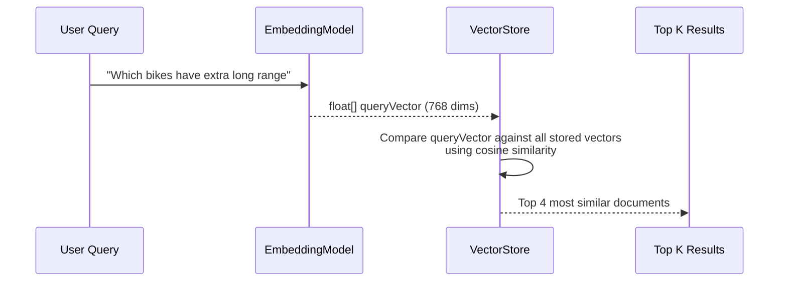
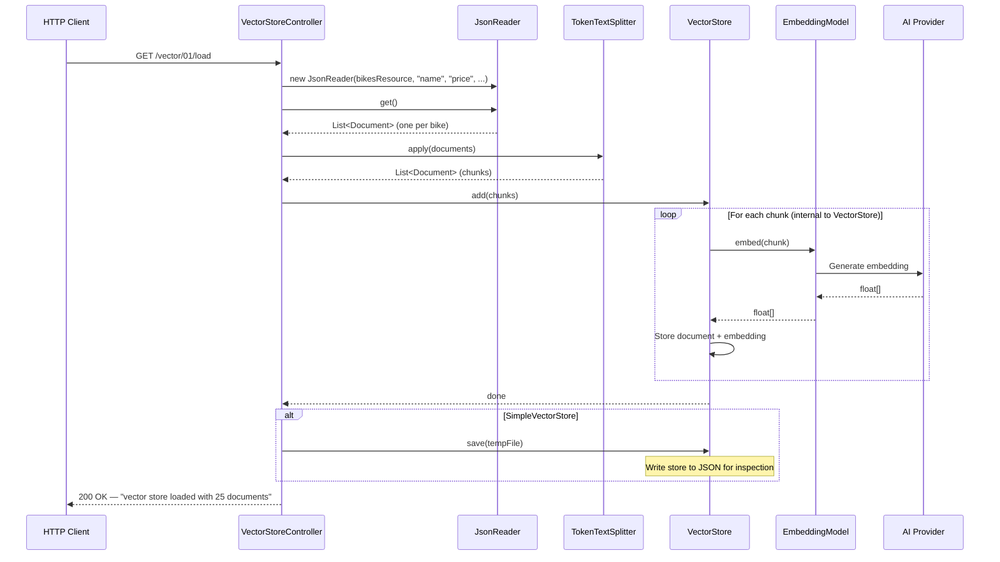
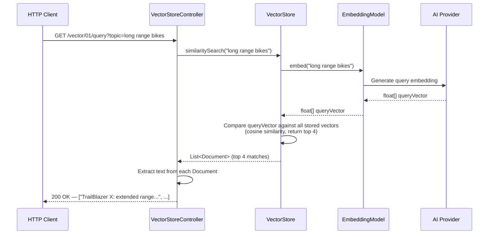
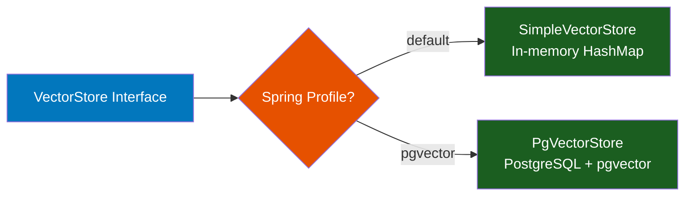

# Stage 3: Vector Stores

**Module:** `components/apis/vector-store/`, `components/config-pgvector/`
**Maven Artifacts:** `spring-ai-vector-store`, `spring-ai-pdf-document-reader`, `spring-ai-starter-vector-store-pgvector`
**Package Base:** `com.example.vector_01`

---

## Overview

Stage 3 introduces **vector stores** — the persistence and search layer for embeddings. Building on the ETL pipeline from Stage 2 (Read → Split → Embed), this stage adds the final step: **Store** and **Search**. The same controller code works with two completely different backends — an in-memory `SimpleVectorStore` and a PostgreSQL-backed `PgVectorStore` — demonstrating Spring AI's portable abstraction.

### Learning Objectives

After completing this stage, developers will be able to:

- Load documents into a vector store using `VectorStore.add()`
- Perform semantic similarity search using `VectorStore.similaritySearch()`
- Understand the difference between in-memory (`SimpleVectorStore`) and persistent (`PgVectorStore`) backends
- Switch vector store backends using Spring profiles without code changes
- Understand the complete document ingestion pipeline: Read → Split → Embed → Store → Search

### Prerequisites

> **Background reading:** See [SPRING_AI_INTRODUCTION.md](SPRING_AI_INTRODUCTION.md) for a general introduction to Spring AI, and [SPRING_AI_STAGE_2.md](SPRING_AI_STAGE_2.md) for the document/embedding foundations this stage builds on.

- A running AI provider with an embedding model (Ollama with `nomic-embed-text`)
- For PgVector: Docker with PostgreSQL + pgvector (`docker compose -f docker/postgres/docker-compose.yaml up -d`)

---

## What Is a Vector Store?

A **vector store** is a database optimized for storing and searching embedding vectors. Instead of matching keywords (like SQL `LIKE`), it finds documents whose vector representations are semantically closest to a query vector.

```
Traditional Search:  "long range bike"  →  keyword match  →  exact matches only
Semantic Search:     "long range bike"  →  embed query    →  cosine similarity  →  "extended battery ebikes"
```

### How Similarity Search Works



### Two Backends, One API

Spring AI's `VectorStore` interface provides a portable abstraction. This workshop demonstrates two implementations:

| | SimpleVectorStore | PgVectorStore |
|-|-------------------|---------------|
| **Profile** | Default (no profile) | `pgvector` |
| **Storage** | In-memory (Java HashMap) | PostgreSQL + pgvector extension |
| **Persistence** | Lost on restart (can save to JSON file) | Persistent across restarts |
| **Search Algorithm** | Brute-force cosine similarity | HNSW index (approximate nearest neighbor) |
| **Infrastructure** | None | PostgreSQL with pgvector |
| **Use Case** | Development, testing, small datasets | Production, large datasets |

---

## Spring AI Component Reference

| Component | FQN | Purpose |
|-----------|-----|---------|
| `VectorStore` | `o.s.ai.vectorstore.VectorStore` | Core interface: `add()`, `similaritySearch()` |
| `SimpleVectorStore` | `o.s.ai.vectorstore.SimpleVectorStore` | In-memory implementation with optional JSON persistence |
| `PgVectorStore` | (auto-configured) | PostgreSQL + pgvector implementation |
| `Document` | `o.s.ai.document.Document` | Text content with id, metadata, and embedding |
| `JsonReader` | `o.s.ai.reader.JsonReader` | Reads JSON files into Document objects |
| `TokenTextSplitter` | `o.s.ai.transformer.splitter.TokenTextSplitter` | Splits documents into token-bounded chunks |
| `EmbeddingModel` | `o.s.ai.embedding.EmbeddingModel` | Used internally by VectorStore to embed documents and queries |

> **Notation:** `o.s.ai` = `org.springframework.ai`

---

## Demo 01a — Loading Documents into a Vector Store

**Endpoint:** `GET /vector/01/load`
**Source:** `vector_01/VectorStoreController.java`

### Description

Executes the full ETL pipeline: reads bike product data from JSON, chunks the documents with `TokenTextSplitter`, and stores them in the vector store via `VectorStore.add()`. The vector store internally calls `EmbeddingModel.embed()` for each chunk — you don't need to embed manually. If using `SimpleVectorStore`, the store is optionally saved to a temp JSON file for inspection.

### Spring AI Components

- `JsonReader` — reads `bikes.json` into `Document` objects
- `TokenTextSplitter` — chunks documents to fit the embedding model's context window
- `VectorStore` — stores chunked documents (embeds them internally)
- `SimpleVectorStore` — optional: saves store contents to a JSON file

### Flow Diagram



### Key Code

```java
private final VectorStore vectorStore;

@GetMapping("/load")
public String load() throws IOException {
    // Read JSON into documents
    DocumentReader reader = new JsonReader(
        this.dataFiles.getBikesResource(), "name", "price", "shortDescription", "description");
    List<Document> documents = reader.get();

    // Chunk to fit embedding model context window
    TokenTextSplitter splitter = new TokenTextSplitter();
    List<Document> chunks = splitter.apply(documents);

    // Add to vector store (embedding happens internally)
    this.vectorStore.add(chunks);

    // Optional: save SimpleVectorStore to disk
    if (vectorStore instanceof SimpleVectorStore) {
        var file = File.createTempFile("bike_vector_store", ".json");
        ((SimpleVectorStore) this.vectorStore).save(file);
    }

    return "vector store loaded with %s documents".formatted(documents.size());
}
```

> **Takeaway:** `VectorStore.add()` handles embedding internally — you pass `Document` objects and the store calls `EmbeddingModel` for you. This is a key difference from Stage 2 where you called `embed()` manually. The store is now the orchestrator.

---

## Demo 01b — Semantic Similarity Search

**Endpoint:** `GET /vector/01/query?topic={topic}`
**Source:** `vector_01/VectorStoreController.java`

### Description

Performs a semantic search against the loaded vector store. The user's query is embedded and compared against all stored document vectors using cosine similarity. Returns the top 4 most relevant documents. This is the core operation that powers RAG (Retrieval-Augmented Generation) in Stage 4.

### Spring AI Components

- `VectorStore` — performs similarity search (embeds query internally)
- `Document` — returned results containing matched text and metadata

### Flow Diagram



### Key Code

```java
@GetMapping("query")
public List<String> query(
    @RequestParam(value = "topic", defaultValue = "Which bikes have extra long range") String topic) {

    List<Document> topMatches = this.vectorStore.similaritySearch(topic);
    return topMatches.stream().map(document -> document.getText()).toList();
}
```

> **Takeaway:** `VectorStore.similaritySearch()` embeds your query, searches the store, and returns the top matching documents — all in one call. The default returns 4 results. This is the building block for RAG: retrieve relevant context, then pass it to the chat model.

---

## Vector Store Configuration

### SimpleVectorStore (Default Profile)

When no `pgvector` profile is active, `SimpleVectorStoreConfig` creates an in-memory store:

**Source:** `config-pgvector/SimpleVectorStoreConfig.java`

```java
@Configuration
@Profile("!pgvector")
@EnableAutoConfiguration(excludeName = {
    "...PgVectorStoreAutoConfiguration",
    "...DataSourceAutoConfiguration",
    "...FlywayAutoConfiguration"
})
public class SimpleVectorStoreConfig {
    @Bean
    VectorStore vectorStore(EmbeddingModel embeddingModel) {
        return SimpleVectorStore.builder(embeddingModel).build();
    }
}
```

- Excludes PgVector, DataSource, and Flyway auto-configuration (not needed for in-memory)
- Creates `SimpleVectorStore` backed by the provider's `EmbeddingModel`

### PgVectorStore (pgvector Profile)

When the `pgvector` profile is active, Spring Boot auto-configures `PgVectorStore`:

```bash
./mvnw spring-boot:run -pl applications/provider-ollama -Dspring-boot.run.profiles=pgvector
```

- Requires PostgreSQL with the `pgvector` extension (provided by Docker)
- Uses Flyway for schema migration (creates `vector_store` table)
- HNSW index for fast approximate nearest-neighbor search
- Persistent across application restarts



> **Important:** If you switch embedding models (e.g., from `nomic-embed-text` to OpenAI's `text-embedding-3-small`), the vector dimensions change. With PgVector, you must drop the `vector_store` table and reload.

---

## Stage 3 Progression


### The Complete ETL + Search Pipeline


### Connection to Other Stages

| Stage | Relationship |
|-------|-------------|
| **Stage 2** (Embeddings) | Taught how embeddings and chunking work manually — Stage 3 automates this inside `VectorStore` |
| **Stage 4** (AI Patterns) | Uses `similaritySearch()` results as context for the chat model (RAG pattern) |
| **Stage 8** (Observability) | Vector store operations produce traces and metrics visible in Grafana |

### VectorStore API Summary

| Method | Purpose | When to Use |
|--------|---------|-------------|
| `add(List<Document>)` | Embed and store documents | Data ingestion / ETL |
| `similaritySearch(String)` | Find top 4 similar documents | Simple semantic search |
| `similaritySearch(SearchRequest)` | Search with filters, top-K, threshold | Advanced queries (Stage 4) |
| `delete(List<String>)` | Remove documents by ID | Data management |
