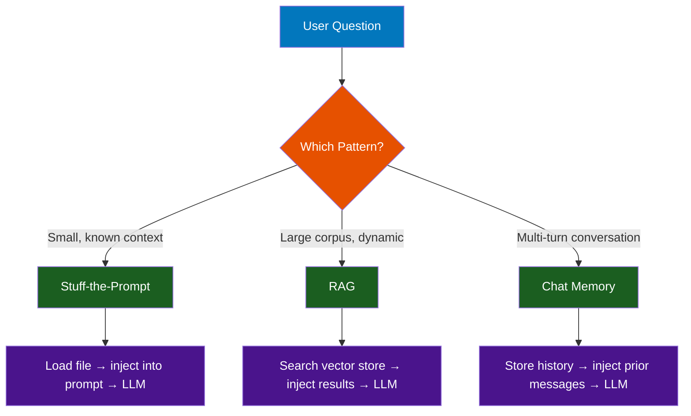
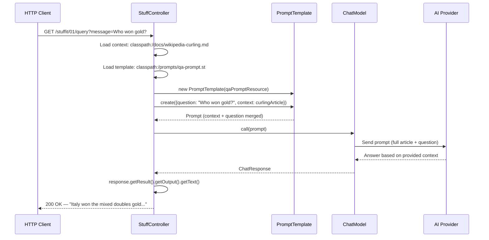
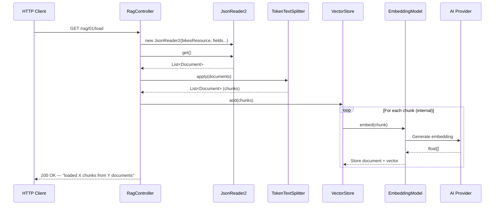
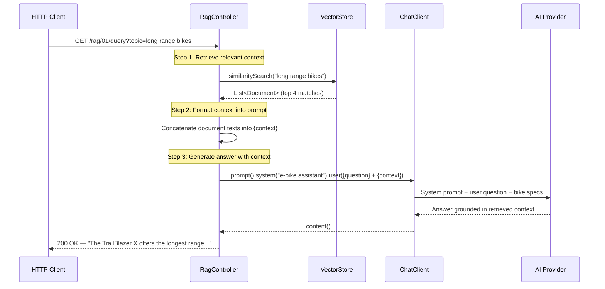
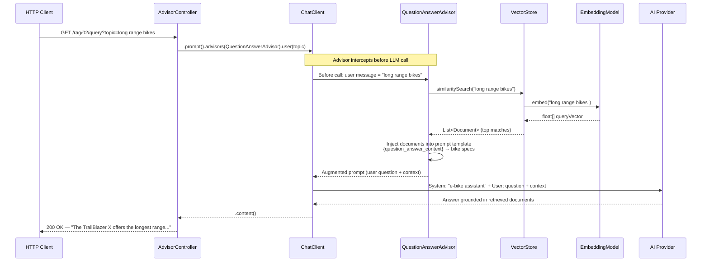
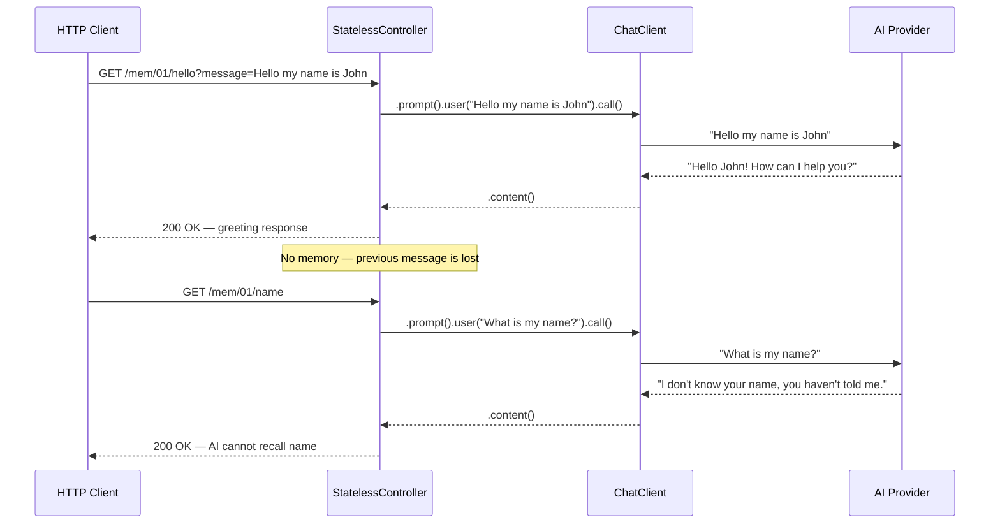
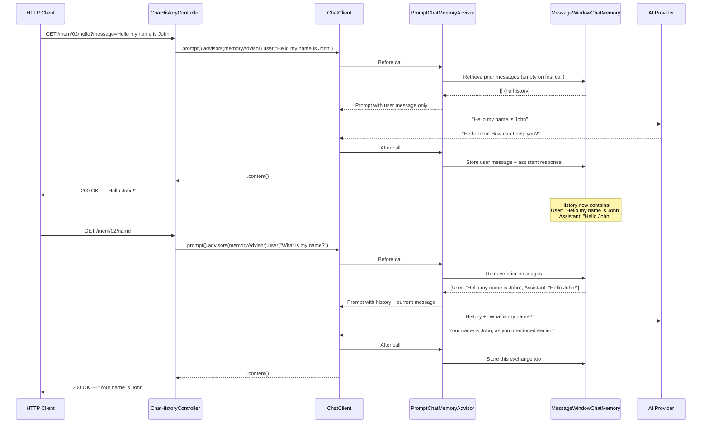
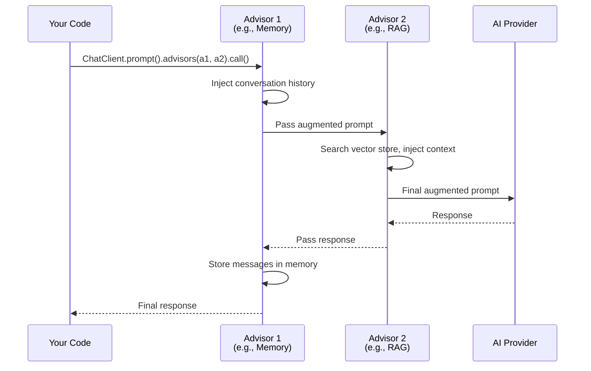
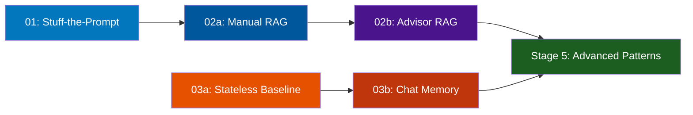

# Stage 4: AI Patterns

**Modules:** `components/patterns/01-stuff-the-prompt/`, `02-retrieval-augmented-generation/`, `03-chat-memory/`
**Maven Artifacts:** `spring-ai-client-chat`, `spring-ai-vector-store`, `spring-ai-advisors-vector-store`
**Package Base:** `com.example.stuff_01`, `com.example.rag_01`, `com.example.rag_02`, `com.example.mem_01`, `com.example.mem_02`

---

## Overview

Stage 4 introduces three foundational AI application patterns that build on the chat, embedding, and vector store foundations from Stages 1–3:

1. **Stuff-the-Prompt** — Inject context data directly into the prompt
2. **Retrieval-Augmented Generation (RAG)** — Search a vector store for relevant context, then generate an answer
3. **Chat Memory** — Maintain conversation history across multiple requests

These patterns solve the core challenge of LLMs: **they only know what's in their training data**. By augmenting prompts with external data (stuff-the-prompt, RAG) or conversation history (chat memory), you ground the AI's responses in real, relevant information.

### Learning Objectives

After completing this stage, developers will be able to:

- Inject external context into prompts using the stuff-the-prompt pattern
- Build manual RAG pipelines: search → format → prompt → generate
- Use `QuestionAnswerAdvisor` for declarative, advisor-based RAG
- Understand Spring AI's advisor architecture for prompt augmentation
- Add conversation memory with `PromptChatMemoryAdvisor` and `MessageWindowChatMemory`
- Compare stateless vs. stateful chat interactions

### Prerequisites

> **Background reading:** See [SPRING_AI_INTRODUCTION.md](SPRING_AI_INTRODUCTION.md) for Spring AI fundamentals, [SPRING_AI_STAGE_2.md](SPRING_AI_STAGE_2.md) for embeddings, and [SPRING_AI_STAGE_3.md](SPRING_AI_STAGE_3.md) for vector stores.

- A running AI provider (Ollama with `qwen3` + `nomic-embed-text`)
- For RAG demos: vector store populated via `/load` endpoints

---

## Pattern Overview



---

## Spring AI Component Reference

| Component | FQN | Purpose |
|-----------|-----|---------|
| `ChatModel` | `o.s.ai.chat.model.ChatModel` | Low-level chat API (used in stuff-the-prompt) |
| `ChatClient` | `o.s.ai.chat.client.ChatClient` | Fluent chat API with advisor support |
| `Prompt` | `o.s.ai.chat.prompt.Prompt` | Request wrapper for messages |
| `PromptTemplate` | `o.s.ai.chat.prompt.PromptTemplate` | Template engine with `{variable}` substitution |
| `VectorStore` | `o.s.ai.vectorstore.VectorStore` | Similarity search for RAG context retrieval |
| `Document` | `o.s.ai.document.Document` | Text with metadata, used in vector search results |
| `TokenTextSplitter` | `o.s.ai.transformer.splitter.TokenTextSplitter` | Chunks documents for vector store ingestion |
| `QuestionAnswerAdvisor` | `o.s.ai.chat.client.advisor.vectorstore.QuestionAnswerAdvisor` | Advisor that automates RAG: search + prompt augmentation |
| `PromptChatMemoryAdvisor` | `o.s.ai.chat.client.advisor.PromptChatMemoryAdvisor` | Advisor that injects conversation history into prompts |
| `MessageWindowChatMemory` | `o.s.ai.chat.memory.MessageWindowChatMemory` | Sliding-window conversation memory |
| `InMemoryChatMemoryRepository` | `o.s.ai.chat.memory.InMemoryChatMemoryRepository` | In-memory storage for chat history |

> **Notation:** `o.s.ai` = `org.springframework.ai`

---

## Demo 01 — Stuff-the-Prompt

**Endpoint:** `GET /stuffit/01/query?message={question}`
**Source:** `stuff_01/StuffController.java`

### Description

The simplest context augmentation pattern. Loads an entire document (Wikipedia article on 2022 Olympics curling) from the classpath and injects it directly into the prompt alongside the user's question. The LLM answers based on the provided context rather than its training data. This works well for small, well-defined contexts but doesn't scale to large corpora.

### Spring AI Components

- `ChatModel` — low-level chat API
- `PromptTemplate` — loads template from classpath file (`prompts/qa-prompt.st`)
- `Prompt` — wraps the rendered template into a request

### Flow Diagram



### Key Code

```java
@Value("classpath:/docs/wikipedia-curling.md")
private Resource docsToStuffResource;

@Value("classpath:/prompts/qa-prompt.st")
private Resource qaPromptResource;

@GetMapping("/query")
public String query(@RequestParam(value = "message", defaultValue = "...") String message) {
    PromptTemplate promptTemplate = new PromptTemplate(qaPromptResource);
    Map<String, Object> map = new HashMap<>();
    map.put("question", message);
    map.put("context", docsToStuffResource);
    Prompt prompt = promptTemplate.create(map);
    return chatModel.call(prompt).getResult().getOutput().getText();
}
```

**Prompt template** (`prompts/qa-prompt.st`):
```
Use the following pieces of context to answer the question at the end.
If you don't know the answer, just say that you don't know, don't try to make up an answer.

{context}

Question: {question}
Helpful Answer:
```

> **Takeaway:** Stuff-the-prompt is the simplest RAG-like pattern — no embeddings or vector stores needed. Just load a document and inject it. The limitation: the entire document must fit in the LLM's context window. For larger corpora, use real RAG (Demo 02).

---

## Demo 02a — Manual RAG

**Endpoints:** `GET /rag/01/load` | `GET /rag/01/query?topic={topic}`
**Source:** `rag_01/RagController.java`

### Description

A full manual RAG implementation where you control every step: load documents into a vector store, search for relevant context, format it into the prompt, and generate an answer. This gives maximum visibility and control over the retrieval-generation pipeline.

### Spring AI Components

- `ChatClient` — fluent API with system prompt and template variables
- `VectorStore` — similarity search for retrieving relevant bike documents
- `JsonReader2` / `TokenTextSplitter` — document ingestion pipeline (same as Stage 3)
- `Document` — search results containing bike specifications

### Flow Diagram — Load



### Flow Diagram — Query



### Key Code

```java
@GetMapping("query")
public String query(@RequestParam(value = "topic", defaultValue = "Which bikes have extra long range") String topic) {
    // Step 1: Retrieve
    List<Document> topMatches = this.vectorStore.similaritySearch(topic);

    // Step 2: Format context
    String specs = topMatches.stream()
        .map(document -> "\n===\n" + document.getText() + "\n===\n")
        .collect(Collectors.joining());

    // Step 3: Generate
    return chatClient.prompt()
        .system("You are a helpful assistant at an e-bike store...")
        .user(u -> u.text("""
            Answer the question in <question></question> section based on the
            context in the <context></context> section
            <question>{question}</question>
            <context>{context}</context>
            """)
            .param("question", topic)
            .param("context", specs))
        .call().content();
}
```

> **Takeaway:** Manual RAG gives you full control: you choose how many documents to retrieve, how to format the context, and how to structure the prompt. The tradeoff is more code — the advisor-based approach (Demo 02b) automates this.

---

## Demo 02b — Advisor-Based RAG

**Endpoints:** `GET /rag/02/load` | `GET /rag/02/query?topic={topic}`
**Source:** `rag_02/AdvisorController.java`

### Description

The same RAG pipeline as Demo 02a, but automated using `QuestionAnswerAdvisor`. The advisor intercepts the ChatClient request, searches the vector store, injects the results into the prompt using a template, and passes everything to the LLM — all in a single declarative call.

### Spring AI Components

- `ChatClient` — fluent API with `.advisors()` for pluggable behavior
- `QuestionAnswerAdvisor` — automates vector search + prompt augmentation
- `VectorStore` — searched automatically by the advisor
- `PromptTemplate` — custom template for the advisor's context injection

### Flow Diagram — Query



### Key Code

```java
// System prompt set at build time
public AdvisorController(VectorStore vectorStore, DataFiles dataFiles, ChatClient.Builder builder) {
    this.chatClient = builder
        .defaultSystem("You are a helpful assistant at an e-bike store...")
        .build();
}

// Custom advisor prompt template
private static final String USER_TEXT_ADVISE = """
    Given the context information below, surrounded ---------------------, and provided
    history information and not prior knowledge, reply to the user comment.
    If the answer is not in the context, inform the user that you can't answer the question.

    ---------------------
    {question_answer_context}
    ---------------------
    """;

@GetMapping("query")
public String query(@RequestParam(value = "topic", defaultValue = "Which bikes have extra long range") String topic) {
    return this.chatClient.prompt()
        .advisors(
            QuestionAnswerAdvisor.builder(vectorStore)
                .promptTemplate(new PromptTemplate(USER_TEXT_ADVISE))
                .build())
        .user(topic)
        .call().content();
}
```

> **Takeaway:** `QuestionAnswerAdvisor` reduces the RAG pipeline to a single line of advisor configuration. It handles search, context formatting, and prompt augmentation automatically. Use manual RAG when you need custom retrieval logic; use the advisor for standard RAG flows.

---

## Demo 03a — Stateless Chat (Baseline)

**Endpoints:** `GET /mem/01/hello?message={message}` | `GET /mem/01/name`
**Source:** `mem_01/StatelessController.java`

### Description

The baseline for understanding why chat memory matters. Two separate requests are made: first the user introduces themselves ("Hello my name is John"), then asks "What is my name?". Without memory, the second request has no context — the AI cannot recall the user's name.

### Spring AI Components

- `ChatClient` — fluent API (no advisors, no memory)

### Flow Diagram



### Key Code

```java
@GetMapping("/hello")
public String query(@RequestParam(value = "message",
    defaultValue = "Hello my name is John, what is the capital of France?") String message) {
    return chatClient.prompt().user(message).call().content();
}

@GetMapping("/name")
public String name() {
    return chatClient.prompt().user("What is my name?").call().content();
}
```

> **Takeaway:** By default, each `ChatClient` call is independent — no conversation history is maintained. The LLM sees only the current message. This is the problem that chat memory solves.

---

## Demo 03b — Chat Memory with Advisor

**Endpoints:** `GET /mem/02/hello?message={message}` | `GET /mem/02/name`
**Source:** `mem_02/ChatHistoryController.java`

### Description

Adds conversation memory using `PromptChatMemoryAdvisor`. The advisor stores each message in a `MessageWindowChatMemory` backed by `InMemoryChatMemoryRepository`, and injects prior messages into subsequent prompts. Now when the user asks "What is my name?", the AI recalls the name from the stored conversation history.

### Spring AI Components

- `ChatClient` — fluent API with `.advisors()` for memory injection
- `PromptChatMemoryAdvisor` — advisor that injects conversation history into prompts
- `MessageWindowChatMemory` — sliding-window memory (keeps the last N messages)
- `InMemoryChatMemoryRepository` — in-memory storage backend for conversation history

### Flow Diagram



### Key Code

```java
public ChatHistoryController(ChatClient.Builder builder) {
    this.chatClient = builder.build();

    // Build memory stack: repository → memory → advisor
    var memory = MessageWindowChatMemory.builder()
        .chatMemoryRepository(new InMemoryChatMemoryRepository())
        .build();
    this.promptChatMemoryAdvisor = PromptChatMemoryAdvisor.builder(memory).build();
}

@GetMapping("/hello")
public String query(@RequestParam(value = "message",
    defaultValue = "Hello my name is John, what is the capital of France?") String message) {
    return this.chatClient.prompt()
        .advisors(promptChatMemoryAdvisor)
        .user(message)
        .call().content();
}

@GetMapping("/name")
public String name() {
    return this.chatClient.prompt()
        .advisors(promptChatMemoryAdvisor)
        .user("What is my name?")
        .call().content();
}
```

> **Takeaway:** Chat memory is implemented as an advisor that intercepts the ChatClient call. The memory stack has three layers: `InMemoryChatMemoryRepository` (storage) → `MessageWindowChatMemory` (windowing strategy) → `PromptChatMemoryAdvisor` (prompt injection). Adding `.advisors(memoryAdvisor)` is the only code change from stateless to stateful.

---

## The Advisor Architecture

Spring AI advisors are interceptors that modify prompts before they reach the LLM and/or process responses after. They follow the same pattern as Spring MVC interceptors or servlet filters:



### Advisors Used in This Stage

| Advisor | Purpose | Intercepts |
|---------|---------|------------|
| `QuestionAnswerAdvisor` | Searches vector store, injects results into prompt | Before call |
| `PromptChatMemoryAdvisor` | Injects conversation history, stores new messages | Before + after call |

Advisors are composable — you can chain memory + RAG in a single request:
```java
chatClient.prompt()
    .advisors(memoryAdvisor, ragAdvisor)
    .user("What bikes did we discuss?")
    .call().content();
```

---

## Stage 4 Progression



### Pattern Comparison

| Pattern | Context Source | Scalability | Complexity | Best For |
|---------|---------------|-------------|------------|----------|
| **Stuff-the-Prompt** | Static file on classpath | Limited by LLM context window | Low | Small, known documents |
| **Manual RAG** | Vector store search | Scales to millions of documents | Medium | Custom retrieval logic |
| **Advisor RAG** | Vector store (automatic) | Same as manual RAG | Low | Standard RAG with defaults |
| **Chat Memory** | Conversation history | Bounded by window size | Low | Multi-turn conversations |

### Memory Stack Architecture

```
┌────────────────────────────────┐
│    PromptChatMemoryAdvisor     │  ← Injects history into prompt
├────────────────────────────────┤
│    MessageWindowChatMemory     │  ← Sliding window (last N messages)
├────────────────────────────────┤
│  InMemoryChatMemoryRepository  │  ← Storage backend (in-memory)
└────────────────────────────────┘
         Could also be:
    JdbcChatMemoryRepository (persistent)
    RedisChatMemoryRepository (distributed)
```
