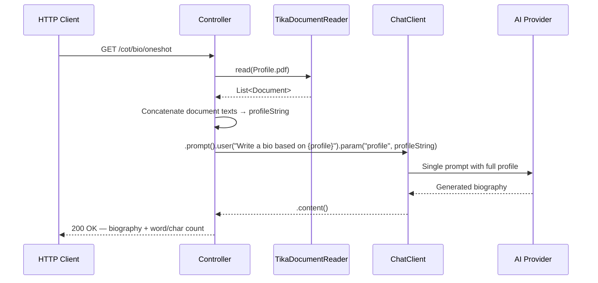
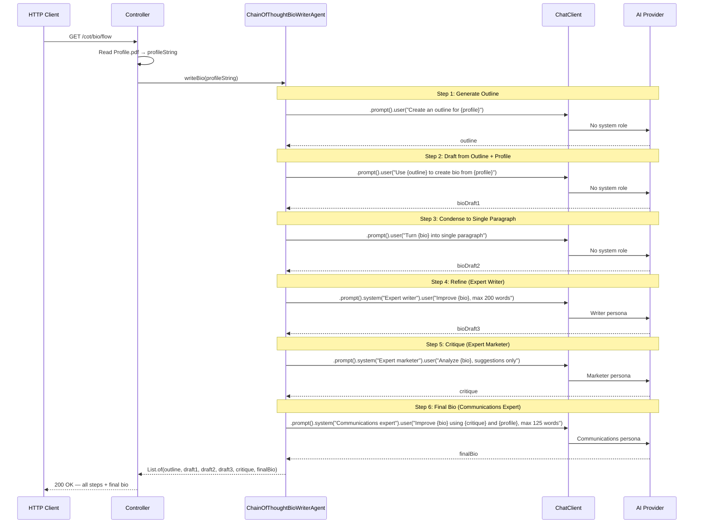
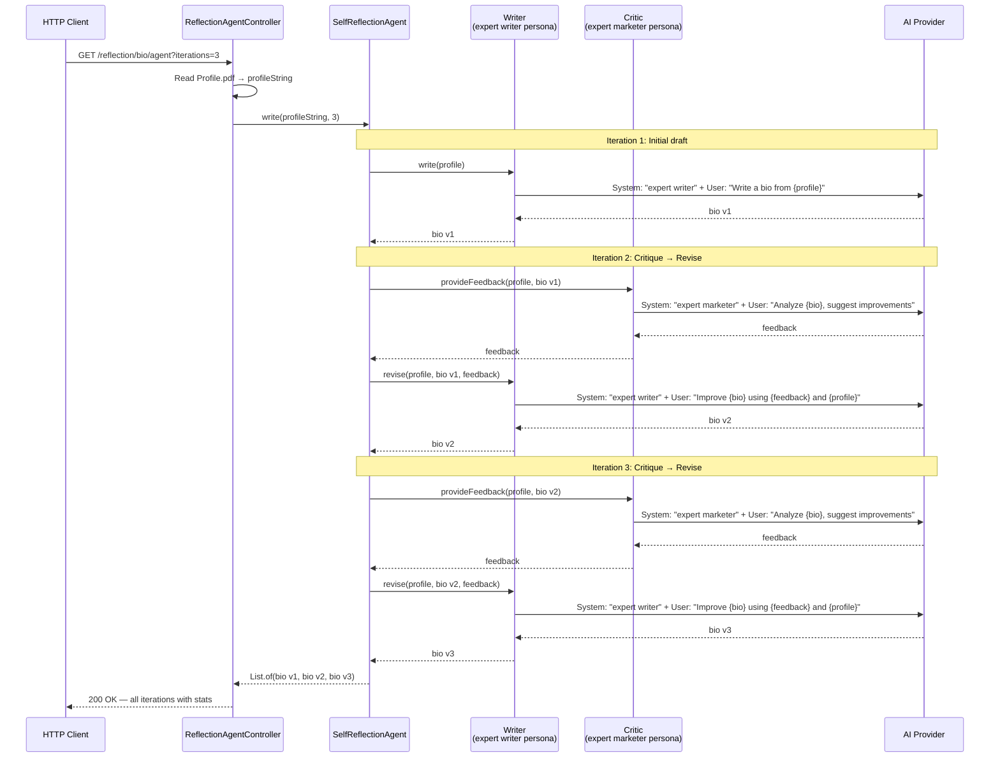
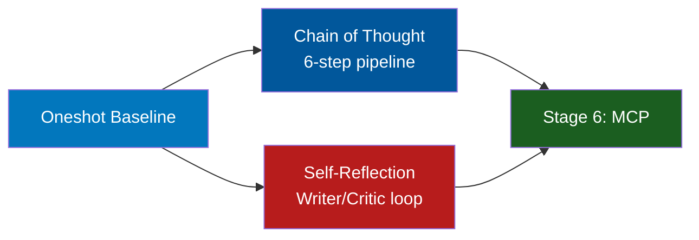

# Stage 5: Advanced Agent Patterns

**Modules:** `components/patterns/chain-of-thought/`, `components/patterns/self-reflection-agent/`
**Maven Artifacts:** `spring-ai-client-chat`, `spring-ai-tika-document-reader`
**Package Base:** `com.example.agent.cot`, `com.example.agent.reflection`

---

## Overview

Stage 5 introduces two advanced agentic patterns that go beyond single-prompt interactions. Instead of one LLM call producing one answer, these patterns use **multiple sequential LLM calls** where each step builds on previous outputs:

1. **Chain of Thought** — A fixed pipeline of 6 steps, each with a different persona/perspective, progressively refining a biography
2. **Self-Reflection** — A Writer/Critic feedback loop that iteratively improves output through explicit critique and revision

Both patterns demonstrate that complex AI tasks are best solved by decomposing them into smaller, focused sub-tasks — each with a specialized system prompt.

### Learning Objectives

After completing this stage, developers will be able to:

- Decompose complex generation tasks into multi-step pipelines
- Use different system prompts to assign specialized roles/personas to each step
- Implement iterative Writer/Critic feedback loops
- Read PDF documents using `TikaDocumentReader`
- Understand the tradeoff between single-shot generation and multi-step refinement

### Prerequisites

> **Background reading:** See [SPRING_AI_INTRODUCTION.md](SPRING_AI_INTRODUCTION.md) for Spring AI fundamentals. Stage 5 builds on the `ChatClient` fluent API from [SPRING_AI_STAGE_1.md](SPRING_AI_STAGE_1.md).

- A running AI provider (Ollama with `qwen3`)
- `Profile.pdf` in the classpath (included in the repository at `src/main/resources/info/Profile.pdf`)

---

## Pattern Comparison


| Aspect | Chain of Thought | Self-Reflection |
|--------|-----------------|-----------------|
| **Structure** | Fixed linear pipeline (6 steps) | Iterative loop (configurable N iterations) |
| **LLM Calls** | Exactly 6 | 1 + 2 × (N-1) |
| **System Prompts** | Different persona per step | Fixed per role (Writer / Critic) |
| **Architecture** | Single service class | Agent with inner role classes |
| **Best For** | Multi-perspective refinement | Iterative quality improvement |

---

## Spring AI Component Reference

| Component | FQN | Purpose |
|-----------|-----|---------|
| `ChatClient` | `o.s.ai.chat.client.ChatClient` | Fluent API for multi-step LLM interactions |
| `ChatClient.Builder` | `o.s.ai.chat.client.ChatClient.Builder` | Builds ChatClient with `defaultSystem()` for role assignment |
| `TikaDocumentReader` | `o.s.ai.reader.tika.TikaDocumentReader` | Reads PDF files into Document objects via Apache Tika |
| `Document` | `o.s.ai.document.Document` | Text wrapper for PDF content |

> **Notation:** `o.s.ai` = `org.springframework.ai`

---

## Demo 01a — Single-Shot Biography (Baseline)

**Endpoint:** `GET /cot/bio/oneshot` | `GET /reflection/bio/oneshot`
**Source:** `cot/ChainOfThoughtController.java`, `reflection/ReflectionAgentController.java`

### Description

A baseline for comparison. Reads a LinkedIn profile from PDF and generates a biography in a single LLM call. The output is usable but lacks the refinement that multi-step approaches produce. Both modules include this endpoint for side-by-side comparison.

### Spring AI Components

- `ChatClient` — single fluent call with `{profile}` template variable
- `TikaDocumentReader` — reads `Profile.pdf` into `Document` objects

### Flow Diagram



### Key Code

```java
@Value("classpath:/info/Profile.pdf")
private Resource profile;

@GetMapping("/oneshot")
public String oneshot() {
    var linkedProfile = new LinkedProfile(profile);
    String profileString = linkedProfile.getProfileAsString();

    String bio = this.chatClient.prompt()
        .user(u -> u.text("""
            Write a one paragraph professional biography suitable for a conference
            presentation based on the content below

            {profile}
            """).param("profile", profileString))
        .call().content();

    return bio + "\n\nCharacters: " + bio.length() + " Words: " + bio.split(" ").length;
}
```

> **Takeaway:** A single LLM call produces a reasonable result, but multi-step approaches (Demos 01b and 02) consistently produce higher-quality, more polished output.

---

## Demo 01b — Chain of Thought

**Endpoint:** `GET /cot/bio/flow`
**Source:** `cot/ChainOfThoughtController.java`, `cot/ChainOfThoughtBioWriterAgent.java`

### Description

A 6-step pipeline where each step uses a different system prompt (persona) to progressively refine a biography. The output of each step feeds into the next. This demonstrates how decomposing a complex task into smaller, specialized sub-tasks produces better results than a single prompt.

### Spring AI Components

- `ChatClient` — fluent API, called 6 times with different system prompts
- `TikaDocumentReader` — reads `Profile.pdf` (via `LinkedProfile` helper)

### The 6 Steps

| Step | Role/Persona | Input | Output |
|------|-------------|-------|--------|
| 1 | *(none)* | Profile | Outline |
| 2 | *(none)* | Outline + Profile | Bio Draft 1 |
| 3 | *(none)* | Bio Draft 1 | Bio Draft 2 (single paragraph) |
| 4 | **Expert Writer** | Bio Draft 2 | Bio Draft 3 (refined, max 200 words) |
| 5 | **Expert Marketer** | Bio Draft 3 | Critique (suggestions only) |
| 6 | **Communications Expert** | Bio Draft 3 + Critique + Profile | Final Bio (max 125 words) |

### Flow Diagram



### Key Code

```java
@Service
public class ChainOfThoughtBioWriterAgent {
    private final ChatClient chatClient;

    public List<String> writeBio(String profile) {
        // Step 1: Outline
        String outline = chatClient.prompt()
            .user(u -> u.text("Create an outline for a professional biography based on:\n\n{profile}")
                .param("profile", profile))
            .call().content();

        // Step 2-3: Draft and condense (similar pattern)
        // ...

        // Step 4: Refine with expert persona
        String bioDraft3 = chatClient.prompt()
            .system("You are a friendly expert writer who helps professionals create impactful biographies...")
            .user(u -> u.text("Evaluate and improve the biography below, max 200 words:\n\n{bio}")
                .param("bio", bioDraft2))
            .call().content();

        // Step 5: Critique with different persona
        String critique = chatClient.prompt()
            .system("You are an expert marketer who helps clients improve communications quality...")
            .user(u -> u.text("Analyze the biography, identify issues, provide suggestions only:\n\n{bio}")
                .param("bio", bioDraft3))
            .call().content();

        // Step 6: Final synthesis
        String finalBio = chatClient.prompt()
            .system("You are a communications expert who makes biographies better...")
            .user(u -> u.text("Improve the bio using the critique and profile, max 125 words:\n\n{bio}\n{critique}\n{profile}")
                .param("bio", bioDraft3).param("critique", critique).param("profile", profile))
            .call().content();

        return List.of(outline, bioDraft1, bioDraft2, bioDraft3, critique, finalBio);
    }
}
```

> **Takeaway:** Chain of Thought decomposes a complex task into steps with different perspectives. Each step focuses on one aspect (structure, content, conciseness, marketing appeal). The `.system()` prompt changes the AI's role per step — the same model behaves differently based on its assigned persona.

---

## Demo 02 — Self-Reflection Agent

**Endpoint:** `GET /reflection/bio/agent?iterations={n}`
**Source:** `reflection/ReflectionAgentController.java`, `reflection/SelfReflectionAgent.java`

### Description

An iterative Writer/Critic feedback loop. The Writer generates a biography, the Critic analyzes it and provides improvement suggestions (without rewriting it), then the Writer revises based on the feedback. This cycle repeats for N iterations, with each round producing a more refined result.

### Spring AI Components

- `ChatClient` — two instances, each with a different `defaultSystem()` persona
- `TikaDocumentReader` — reads `Profile.pdf` (via `LinkedProfile` helper)

### Architecture

The `SelfReflectionAgent` uses two inner classes, each with its own `ChatClient` and persistent system prompt:

```
SelfReflectionAgent
├── Writer (ChatClient with "expert writer" system prompt)
│   ├── write(profile) → initial bio
│   └── revise(profile, bio, feedback) → improved bio
└── Critic (ChatClient with "expert marketer" system prompt)
    └── provideFeedback(profile, bio) → improvement suggestions
```

### Flow Diagram



### Key Code

```java
protected class Writer {
    private final ChatClient chatClient;

    public Writer(ChatClient.Builder chatClientBuilder) {
        this.chatClient = chatClientBuilder
            .defaultSystem("You are a friendly expert writer who helps professionals create impactful biographies...")
            .build();
    }

    public String write(String linkedProfile) {
        return chatClient.prompt()
            .user(u -> u.text("Write a one paragraph professional biography...\n\n{profile}")
                .param("profile", linkedProfile))
            .call().content();
    }

    public String revise(String linkedProfile, String biography, String feedback) {
        return chatClient.prompt()
            .user(u -> u.text("Improve the biography using the feedback...\n\n<bio>{bio}</bio>\n<feedback>{feedback}</feedback>\n<profile>{profile}</profile>")
                .param("bio", biography).param("feedback", feedback).param("profile", linkedProfile))
            .call().content();
    }
}

protected class Critic {
    private final ChatClient chatClient;

    public Critic(ChatClient.Builder chatClientBuilder) {
        this.chatClient = chatClientBuilder
            .defaultSystem("You are an expert marketer who helps clients improve communications quality...")
            .build();
    }

    public String provideFeedback(String linkedProfile, String biography) {
        return chatClient.prompt()
            .user(u -> u.text("Analyze the biography, identify issues, provide suggestions only...\n\n<bio>{bio}</bio>\n<profile>{profile}</profile>")
                .param("bio", biography).param("profile", linkedProfile))
            .call().content();
    }
}

// Main loop
protected List<String> write(String linkedProfile, int iterations) {
    List<String> results = new ArrayList<>();
    String bio = writer.write(linkedProfile);
    results.add(bio);

    for (int i = 1; i < iterations; i++) {
        String feedback = critic.provideFeedback(linkedProfile, bio);
        bio = writer.revise(linkedProfile, bio, feedback);
        results.add(bio);
    }
    return results;
}
```

> **Takeaway:** The self-reflection pattern separates generation from evaluation. The Critic's job is to find problems, not fix them — this prevents the model from being both judge and participant. Each iteration measurably improves the output. The `iterations` parameter lets you trade compute time for quality.

---

## PDF Document Reading

Both modules use `TikaDocumentReader` to read `Profile.pdf`:

```java
public class LinkedProfile {
    private List<Document> documents;

    public LinkedProfile(Resource profile) {
        TikaDocumentReader tikaDocumentReader = new TikaDocumentReader(profile);
        this.documents = tikaDocumentReader.read();
    }

    String getProfileAsString() {
        return documents.stream().map(Document::getText).collect(Collectors.joining());
    }
}
```

`TikaDocumentReader` uses Apache Tika under the hood, which supports PDF, DOCX, HTML, and many other document formats. It's an alternative to `PagePdfDocumentReader` (Stage 2) when you need format-agnostic reading.

| Reader | Dependency | Granularity | Formats |
|--------|-----------|-------------|---------|
| `PagePdfDocumentReader` | `spring-ai-pdf-document-reader` | Per page | PDF only |
| `ParagraphPdfDocumentReader` | `spring-ai-pdf-document-reader` | Per paragraph | PDF only |
| `TikaDocumentReader` | `spring-ai-tika-document-reader` | Entire document | PDF, DOCX, HTML, 1000+ formats |

---

## Stage 5 Progression



### Key Design Principles

| Principle | How It's Applied |
|-----------|-----------------|
| **Task decomposition** | Break complex generation into focused sub-tasks |
| **Role specialization** | Each step uses a different system prompt / persona |
| **Output chaining** | Output of step N becomes input for step N+1 |
| **Separation of concerns** | Critic evaluates, Writer creates — never both at once |
| **Iterative refinement** | Each pass improves quality measurably |
| **Configurable depth** | Self-reflection accepts `iterations` parameter for quality/cost tradeoff |
