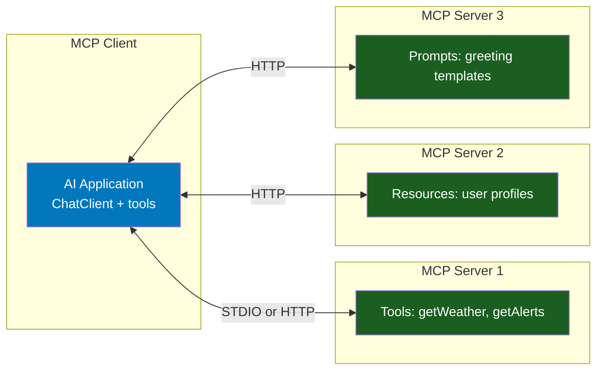
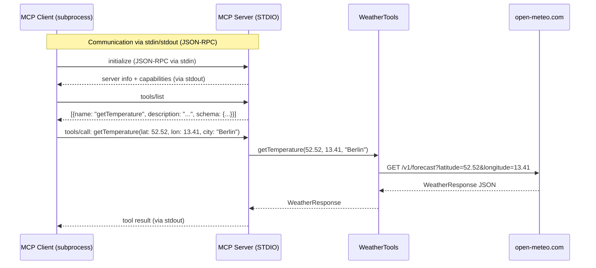
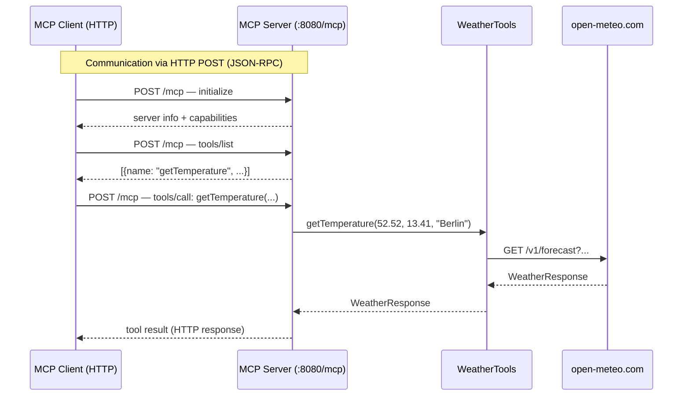
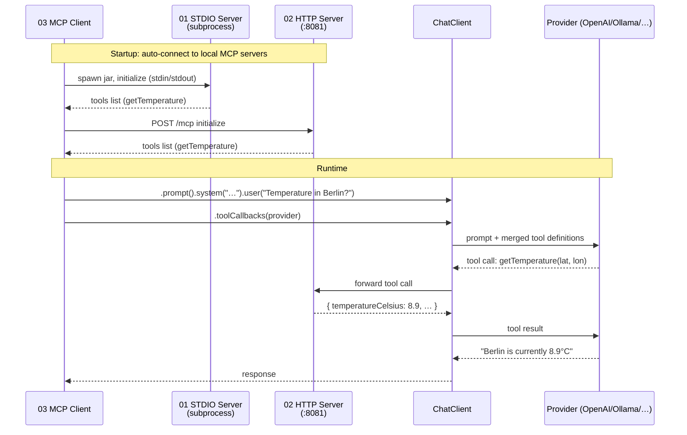
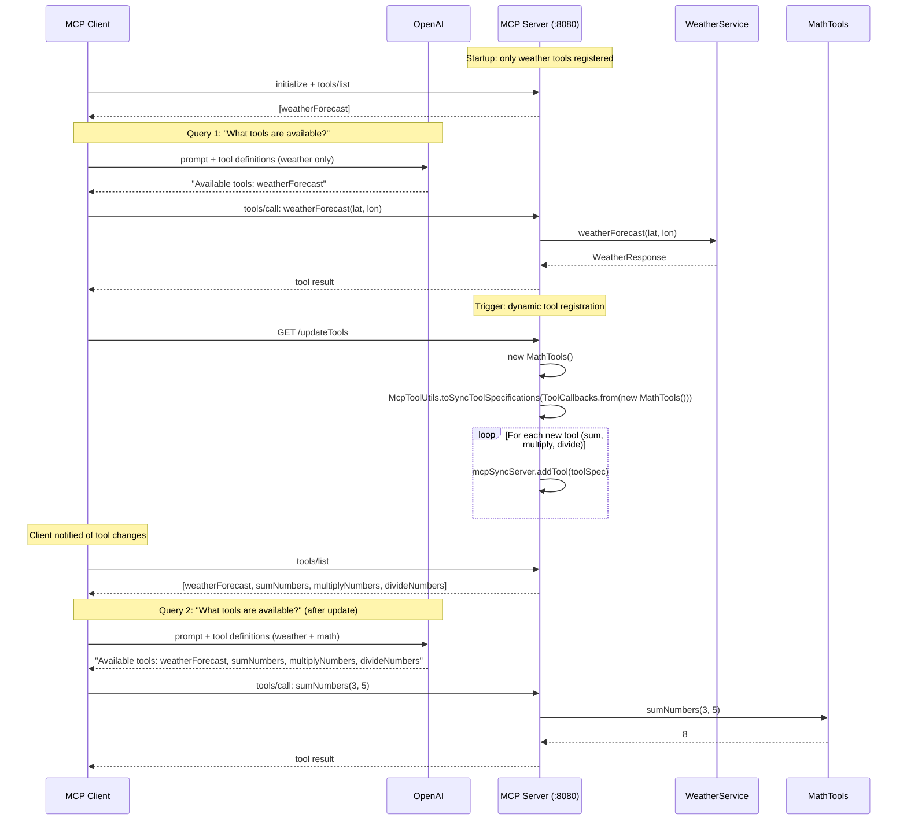
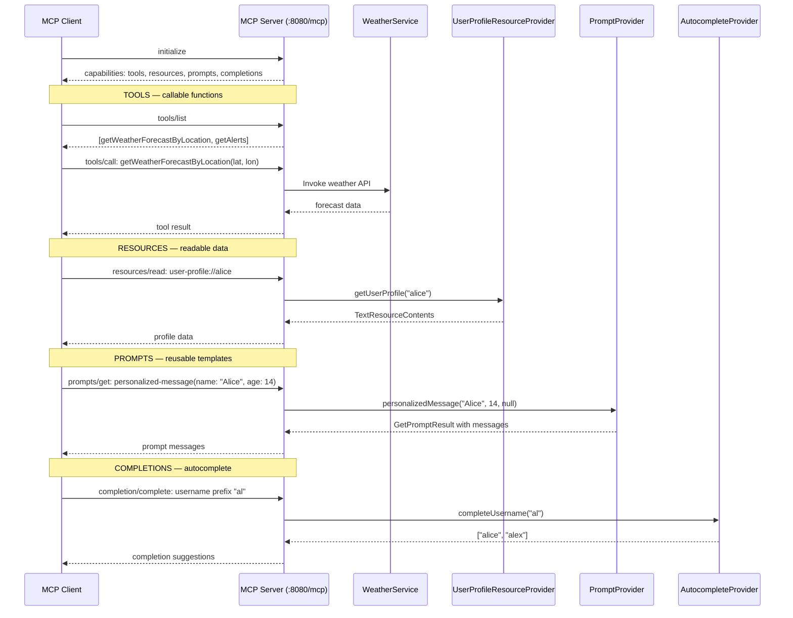

# Stage 6: Model Context Protocol (MCP)

> 👉 **Looking for the attendee walkthrough?** See [`WHATS_NEW_STAGE_06_MCP.md`](../../WHATS_NEW_STAGE_06_MCP.md) — a concise tour covering the recommended demo order, trainer notes, and what to click when. This document is the deep-dive reference; the walkthrough is the quickstart.

**Modules:** `mcp/01-mcp-stdio-server/`, `mcp/02-mcp-http-server/`, `mcp/03-mcp-client/`, `mcp/04-dynamic-tool-calling/`, `mcp/05-mcp-capabilities/`
**Maven Artifacts:** `spring-ai-starter-mcp-server`, `spring-ai-starter-mcp-server-webmvc`, `spring-ai-starter-mcp-client`, `spring-ai-mcp-annotations`
**Package Base:** `com.example`, `org.springframework.ai.mcp.sample.server`, `org.springframework.ai.mcp.samples.client`, `mcp.capabilities`

---

## Overview

Stage 6 introduces the **Model Context Protocol (MCP)** — an open standard for connecting AI models to external tools, data sources, and prompts. MCP defines a client-server architecture where:

- **MCP Servers** expose tools, resources, and prompts via a standardized protocol
- **MCP Clients** discover and invoke these capabilities at runtime

Spring AI provides first-class MCP support through auto-configured starters for both servers and clients, using two transport options: **STDIO** (subprocess-based) and **Streamable HTTP** (network-based).

### Run from the UI

Navigate to **http://localhost:8080/dashboard/stage/6**. The page shows five demo cards with live status pills. For HTTP demos (02, 04, 05), start the servers first via:

```bash
./workshop.sh mcp start all      # builds 01 jar + starts 02/04/05
./workshop.sh mcp status         # check which demos are up
./workshop.sh mcp stop all       # stop when done
```

Each card has **List tools**, **Invoke**, and (for 05) **List resources / List prompts** buttons that call the servers through the dashboard's built-in MCP client. The **Docs** button on each card opens this document.

### Run from the CLI

Classic one-demo-at-a-time workflow:

```bash
./mvnw spring-boot:run -pl mcp/02-mcp-http-server
./mvnw spring-boot:run -pl mcp/04-dynamic-tool-calling/server
./mvnw spring-boot:run -pl mcp/05-mcp-capabilities
./mvnw spring-boot:run -pl mcp/03-mcp-client                       # local mode (default)
./mvnw spring-boot:run -pl mcp/03-mcp-client \
    -Dspring-boot.run.profiles=mcp-external                        # Brave + filesystem
```

### Port Allocation

| Module | Port | Notes |
|---|---|---|
| provider app | 8080 | main dashboard |
| gateway (spy) | 7777 | MCP traffic does NOT flow through the spy gateway |
| MCP 01 stdio | — | stdio transport |
| MCP 02 http | 8081 | `/mcp` |
| MCP 04 server | 8082 | `/mcp` + `/updateTools` |
| MCP 05 capabilities | 8083 | `/mcp` |

### Learning Objectives

After completing this stage, developers will be able to:

- Build MCP servers that expose `@Tool`-annotated methods via STDIO or HTTP transport
- Connect MCP clients to servers for automatic tool discovery
- Register tools dynamically at runtime using `McpSyncServer.addTool()`
- Expose MCP resources (`@McpResource`), prompts (`@McpPrompt`), and completions (`@McpComplete`)
- Understand the MCP protocol flow: initialize → discover → invoke

### Prerequisites

> Background: see [SPRING_AI_INTRODUCTION.md](SPRING_AI_INTRODUCTION.md) and [Stage 1 §Tool calling](SPRING_AI_STAGE_1.md#tool-calling).

- Java 25 + Maven wrapper
- For HTTP demos: ports 8081/8082/8083 free
- For Demo 03 local mode: the 01 STDIO jar must be built (`./workshop.sh mcp build-01`) and 02 running
- For Demo 03 external mode: `BRAVE_API_KEY` + Node.js/npx

> **Note on the `spy` profile:** The gateway at `:7777` only inspects chat/embedding traffic to provider APIs. MCP clients talk JSON-RPC over Streamable HTTP and are not routed through the gateway. Use the dashboard's inspector panel to observe MCP request/response bodies instead.

---

## What Is MCP?

The **Model Context Protocol** is an open standard (by Anthropic) that standardizes how AI applications interact with external tools, data sources, and prompt templates. Instead of each application building custom integrations, MCP provides a universal interface.

### MCP Architecture



### MCP Capabilities

| Capability | Annotation | Purpose |
|------------|-----------|---------|
| **Tools** | `@Tool` | Executable functions the AI can call |
| **Resources** | `@McpResource` | Data sources the AI can read (like a file system) |
| **Prompts** | `@McpPrompt` | Reusable prompt templates |
| **Completions** | `@McpComplete` | Autocomplete suggestions for resource/prompt arguments |

### Transport Options

| Transport | Starter | Communication | Use Case |
|-----------|---------|--------------|----------|
| **STDIO** | `spring-ai-starter-mcp-server` | stdin/stdout (JSON-RPC) | Local tools, CLI apps, subprocess-based |
| **Streamable HTTP** | `spring-ai-starter-mcp-server-webmvc` | HTTP POST to `/mcp` | Remote servers, networked access |

---

## Spring AI Component Reference

| Component | FQN | Purpose |
|-----------|-----|---------|
| `@Tool` | `o.s.ai.tool.annotation.Tool` | Marks a method as an MCP-callable tool |
| `@ToolParam` | `o.s.ai.tool.annotation.ToolParam` | Describes tool method parameters |
| `ToolCallbackProvider` | `o.s.ai.tool.ToolCallbackProvider` | Provides tool callbacks for registration |
| `MethodToolCallbackProvider` | `o.s.ai.tool.method.MethodToolCallbackProvider` | Creates tool callbacks from annotated methods |
| `McpToolUtils` | `o.s.ai.mcp.McpToolUtils` | Converts tool callbacks to MCP tool specifications |
| `ToolCallbacks` | `o.s.ai.support.ToolCallbacks` | Utility for creating tool callbacks from instances |
| `McpSyncServer` | `io.modelcontextprotocol.server.McpSyncServer` | MCP server (synchronous) for dynamic tool management |
| `McpClient` | `io.modelcontextprotocol.client.McpClient` | MCP client for connecting to servers |
| `McpClientCustomizer` | `o.s.ai.mcp.customizer.McpClientCustomizer` | Customization callback for MCP client setup |
| `@McpResource` | `o.s.ai.mcp.annotation.McpResource` | Exposes a method as an MCP resource |
| `@McpPrompt` | `o.s.ai.mcp.annotation.McpPrompt` | Exposes a method as an MCP prompt template |
| `@McpComplete` | `o.s.ai.mcp.annotation.McpComplete` | Provides autocomplete for resource/prompt arguments |
| `@McpArg` | `o.s.ai.mcp.annotation.McpArg` | Describes MCP prompt/completion arguments |
| `SyncMcpAnnotationProviders` | `o.s.ai.mcp.annotation.spring.SyncMcpAnnotationProviders` | Collects annotated methods into MCP specification beans |

> **Notation:** `o.s.ai` = `org.springframework.ai`

---

## Demo 01 — MCP Server via STDIO

**Module:** `mcp/01-mcp-stdio-server/`
**Source:** `BasicStdioMcpServerApplication.java`, `WeatherTools.java`

**Dashboard endpoints:**
- `GET /dashboard/mcp/01/status` — status + build hint
- `GET /dashboard/mcp/01/tools` — list tools (spawns subprocess per request)
- `POST /dashboard/mcp/01/invoke` — call a tool

### Description

The simplest MCP server: a Spring Boot application that exposes `@Tool`-annotated weather methods over STDIO (stdin/stdout). Communication happens via JSON-RPC messages piped through the process's standard streams. This transport is ideal for local tools spawned as subprocesses by the client.

### Spring AI Components

- `@Tool` / `@ToolParam` — annotates the weather service method
- `MethodToolCallbackProvider` — creates tool callbacks from the annotated service
- `ToolCallbackProvider` — registered as a Spring bean for MCP auto-configuration

### Flow Diagram



### Key Code

```java
// Application — register tools as MCP-exposed beans
@Bean
ToolCallbackProvider weatherToolsProvider(WeatherTools weatherTools) {
    return MethodToolCallbackProvider.builder().toolObjects(weatherTools).build();
}

// Weather service — @Tool annotation (same as Stage 1)
@Service
public class WeatherTools {
    @Tool(description = "Get the temperature (in celsius) for a specific location")
    public WeatherResponse getTemperature(
        @ToolParam(description = "The latitude") double latitude,
        @ToolParam(description = "The longitude") double longitude,
        @ToolParam(description = "The city name") String city) {
        return restClient.get()
            .uri("/v1/forecast?latitude={lat}&longitude={lon}&current=temperature_2m", latitude, longitude)
            .retrieve().body(WeatherResponse.class);
    }
}
```

**Configuration** (`application.yaml`):
```yaml
spring:
  ai:
    mcp:
      server:
        stdio: true                    # Use stdin/stdout transport
        name: basic-stdio-mcp-server
        version: 1.0.0
        type: SYNC
  main:
    banner-mode: off                   # Keep stdout clean for JSON-RPC
logging:
  pattern:
    console: ""                        # Suppress log output on stdout
```

### Curl equivalents

All 01 interactions go through the dashboard (which spawns the jar as a subprocess per request). There's no long-running port to hit directly.

```bash
# Status (shows jar-present + build hint)
curl -s http://localhost:8080/dashboard/mcp/01/status

# List tools — spawns the jar, lists, closes (~1–2s cold)
curl -s http://localhost:8080/dashboard/mcp/01/tools

# Invoke getTemperature (city-only geocodes; lat+lon goes straight to the weather API)
curl -s -X POST http://localhost:8080/dashboard/mcp/01/invoke \
  -H 'Content-Type: application/json' \
  -d '{"tool":"getTemperature","args":{"city":"Berlin"}}'

# Invoke with coordinates
curl -s -X POST http://localhost:8080/dashboard/mcp/01/invoke \
  -H 'Content-Type: application/json' \
  -d '{"tool":"getTemperature","args":{"latitude":52.52,"longitude":13.41}}'
```

> **Takeaway:** STDIO MCP servers must keep stdout clean — only JSON-RPC messages. Disable Spring Boot banner and console logging. The client spawns the server as a subprocess and communicates via piped stdin/stdout.

---

## Demo 02 — MCP Server via HTTP

**Module:** `mcp/02-mcp-http-server/`
**Source:** `BasicHttpMcpServerApplication.java`, `WeatherTools.java`

**Dashboard endpoints:**
- `GET /dashboard/mcp/02/status`
- `GET /dashboard/mcp/02/tools`
- `POST /dashboard/mcp/02/invoke`

### Description

Same weather tools as Demo 01, but exposed over **Streamable HTTP** instead of STDIO. The server listens on `/mcp` endpoint and clients connect via HTTP POST. This transport enables remote tool access over the network.

### Spring AI Components

- Same as Demo 01: `@Tool`, `MethodToolCallbackProvider`, `ToolCallbackProvider`
- Uses `spring-ai-starter-mcp-server-webmvc` instead of `spring-ai-starter-mcp-server`

### Flow Diagram



### Key Configuration Difference

```yaml
spring:
  ai:
    mcp:
      server:
        name: basic-http-mcp-server
        version: 1.0.0
        type: SYNC
        protocol: STREAMABLE          # HTTP transport (not STDIO)
        streamable-http:
          mcp-endpoint: /mcp           # HTTP endpoint path
```

### Curl equivalents

02 is reachable two ways: through the dashboard's REST wrapper on `:8080`, OR directly as raw MCP JSON-RPC on `:8081/mcp`. The dashboard wrapper is easier to hand-roll; the raw protocol requires a session-aware Streamable HTTP handshake and is usually driven by an MCP client SDK.

```bash
# Status
curl -s http://localhost:8080/dashboard/mcp/02/status

# List tools (via dashboard — uses the long-lived McpClient instance)
curl -s http://localhost:8080/dashboard/mcp/02/tools

# Invoke getTemperature (city auto-geocode)
curl -s -X POST http://localhost:8080/dashboard/mcp/02/invoke \
  -H 'Content-Type: application/json' \
  -d '{"tool":"getTemperature","args":{"city":"Hamburg"}}'

# Invoke with coordinates
curl -s -X POST http://localhost:8080/dashboard/mcp/02/invoke \
  -H 'Content-Type: application/json' \
  -d '{"tool":"getTemperature","args":{"latitude":35.6762,"longitude":139.6503,"city":"Tokyo"}}'

# Spring Boot Actuator health (port 8081 directly)
curl -s http://localhost:8081/actuator/health
```

> **Takeaway:** Switching from STDIO to HTTP requires changing the starter dependency (`spring-ai-starter-mcp-server` → `spring-ai-starter-mcp-server-webmvc`) and the config (`stdio: true` → `protocol: STREAMABLE`). The tool code stays identical.

---

## Demo 03 — MCP Client

**Module:** `mcp/03-mcp-client/`
**Source:** `BasicMcpClientApplication.java`, `McpClientDemoRunner.java`

**Dashboard endpoints:**
- `POST /dashboard/mcp/03/run?mode=local` — runs the demo against whichever of 01 (STDIO) and 02 (HTTP) are currently live. Tool callbacks are assembled on-demand from those servers.
- `GET /dashboard/mcp/03/status` — informational only (03 is a CLI, not a server).

> **External mode is CLI-only.** The dashboard's `/03/run` endpoint accepts only `mode=local`. Running against external MCP servers (Brave Search + filesystem, via `npx` subprocesses) is not supported from the UI and returns HTTP 400 pointing at the CLI command. See [External mode (CLI)](#external-mode-cli) below.

### Description

An MCP client that connects to MCP servers, discovers their tools, and exposes them to a `ChatClient` via `ToolCallbackProvider`. From the model's perspective the tools look like local Java methods — MCP is the transport.

Demo 03 ships two configurations:

| Mode | Servers | Config file | Runnable from |
|------|---------|-------------|---------------|
| **local** (default) | 01 STDIO jar + 02 HTTP :8081 | `mcp-servers-local.json` | CLI + Dashboard |
| **external** | Brave Search + filesystem (via `npx`) | `mcp-servers-external.json` | CLI only (profile `mcp-external`) |

### Spring AI Components

- `ChatClient` — fluent API with `.toolCallbacks(...)` for MCP tool injection
- `ToolCallbackProvider` — auto-configured from classpath MCP client connections (CLI) **or** constructed on-demand from live `McpSyncClient` instances via `SyncMcpToolCallbackProvider` (Dashboard)
- `McpClientDemoRunner` — reusable bean extracted from the CLI's `CommandLineRunner`, called by either the CLI runner or the dashboard handler

### Flow Diagram — local mode (default)



### Key Code — the reusable runner

```java
@Component
public class McpClientDemoRunner {
  private final ChatClient.Builder chatClientBuilder;
  private final ToolCallbackProvider tools;

  public Result run(String mode) {
    String question = "external".equals(mode) ? "Does Spring IO 2026 have MCP sessions?"
                                              : "Temperature in Berlin?";
    String response = chatClientBuilder.build().prompt()
        .system("You are a useful assistant that can call MCP tools.")
        .user(question)
        .toolCallbacks(tools)
        .call().content();
    return new Result(mode, question, response);
  }
}
```

**CLI entry point** (`BasicMcpClientApplication.java`) — thin `CommandLineRunner` that reads `MCP_DEMO_MODE` env var and delegates:

```java
@Bean
public CommandLineRunner chatbot(McpClientDemoRunner runner) {
  return args -> {
    String mode = System.getenv("MCP_DEMO_MODE");
    if (mode == null || mode.isBlank()) mode = "local";
    runner.run(mode);
  };
}
```

**Dashboard path** (`McpInspectorController#run03`) — does NOT rely on the autowired `ToolCallbackProvider`. Instead it inspects which MCP servers are live via `McpClientRegistry` + `McpStdioInvoker`, assembles a `List<McpSyncClient>`, and constructs a `SyncMcpToolCallbackProvider` fresh per request. STDIO subprocess is closed in `finally`.

### Local config — `mcp-servers-local.json`

```json
{
  "mcpServers": {
    "local-stdio": {
      "command": "java",
      "args": [
        "-Dspring.ai.mcp.server.stdio=true",
        "-Dspring.main.web-application-type=none",
        "-Dlogging.pattern.console=",
        "-jar", "mcp/01-mcp-stdio-server/target/01-mcp-stdio-server-0.0.1-SNAPSHOT.jar"
      ]
    }
  }
}
```

Plus a Streamable HTTP connection to 02 in `application.yaml`:

```yaml
spring:
  ai:
    mcp:
      client:
        stdio:
          servers-configuration: classpath:/mcp-servers-local.json
        http:
          connections:
            local-http:
              url: http://localhost:8081
```

### External mode (CLI)

For the full MCP ecosystem experience (Brave Search, filesystem), activate the `mcp-external` profile:

```bash
export BRAVE_API_KEY=...         # required
./mvnw spring-boot:run -pl mcp/03-mcp-client \
    -Dspring-boot.run.profiles=mcp-external
```

Config (`mcp-servers-external.json`):

```json
{
  "mcpServers": {
    "brave-search": {
      "command": "npx",
      "args": ["-y", "@modelcontextprotocol/server-brave-search"]
    },
    "filesystem": {
      "command": "npx",
      "args": ["-y", "@modelcontextprotocol/server-filesystem", "./mcp/03-mcp-client/target"]
    }
  }
}
```

This mode is CLI-only: the dashboard can't spawn `npx` subprocesses for arbitrary external servers, and reaching those servers requires creds (`BRAVE_API_KEY`) the dashboard doesn't manage.

### Curl equivalents

03 is a client, not a server. The dashboard's `/03/run` endpoint runs the ChatClient demo against whichever of 01/02 are live.

```bash
# Status (informational — 03 is a CLI, not a bound port)
curl -s http://localhost:8080/dashboard/mcp/03/status

# Run demo in local mode (uses 01 STDIO subprocess + 02 HTTP)
# Response contains { mode, question, response, toolsFrom }
curl -s -X POST 'http://localhost:8080/dashboard/mcp/03/run?mode=local'

# External mode is rejected from the dashboard — returns 400 pointing at the CLI
curl -s -X POST 'http://localhost:8080/dashboard/mcp/03/run?mode=external'
# → {"error":"external mode not available from the dashboard","hint":"./mvnw spring-boot:run -pl mcp/03-mcp-client -Dspring-boot.run.profiles=mcp-external",...}
```

> **Takeaway:** MCP clients treat tools from any server the same way — the `ChatClient.toolCallbacks(...)` API doesn't care whether a tool lives in a local STDIO subprocess, a local HTTP server, or an external npx-spawned service. Swapping between local and external is purely a config change. This is the power of MCP: plug any tool ecosystem into any AI application.

---

## Demo 04 — Dynamic Tool Registration

**Modules:** `mcp/04-dynamic-tool-calling/server/`, `mcp/04-dynamic-tool-calling/client/`
**Source:** `ServerApplication.java`, `ClientApplication.java`, `WeatherService.java`, `MathTools.java`

**Dashboard endpoints:**
- `GET /dashboard/mcp/04/status`
- `GET /dashboard/mcp/04/tools`
- `POST /dashboard/mcp/04/invoke`
- `POST /dashboard/mcp/04/update-tools` — triggers `McpSyncServer.addTool()` registration (one-shot per process)

### Description

Demonstrates adding tools to a running MCP server at runtime. The server starts with weather tools, then dynamically registers math tools when triggered via an HTTP endpoint. The client detects the new tools via `McpClientCustomizer` and can immediately use them.

### Spring AI Components

- `McpSyncServer` — server instance for `addTool()` at runtime
- `McpToolUtils` — converts `ToolCallbacks` to MCP tool specifications
- `ToolCallbacks` — creates callbacks from plain tool instances
- `McpClientCustomizer` — client-side callback for tool change notifications
- `ToolContext` — injected into tool methods for contextual metadata

### Flow Diagram



### Key Code — Server

```java
// Dynamic registration via CommandLineRunner
@Bean
CommandLineRunner commandRunner(McpSyncServer mcpSyncServer) {
    return args -> {
        latch.await(); // Wait for /updateTools trigger

        // Create new tools at runtime
        List<SyncToolSpecification> newTools =
            McpToolUtils.toSyncToolSpecifications(ToolCallbacks.from(new MathTools()));

        // Register each tool with the running server
        for (SyncToolSpecification newTool : newTools) {
            mcpSyncServer.addTool(newTool);
        }
    };
}

// Trigger endpoint
@GetMapping("/updateTools")
public String updateTools() {
    latch.countDown(); // Signal the CommandLineRunner
    return "Update signal received!";
}
```

### Key Code — Client

```java
// Customizer callback — notified when MCP client setup changes
@Bean
McpClientCustomizer<?> customizeMcpClient() {
    return (name, spec) -> {
        logger.info("MCP Client '{}' customized", name);
        latch.countDown();
    };
}
```

### Curl equivalents

```bash
# Status
curl -s http://localhost:8080/dashboard/mcp/04/status

# List tools — initially shows only weatherForecast
curl -s http://localhost:8080/dashboard/mcp/04/tools

# Trigger dynamic registration (one-shot per server process)
# After this call, MathTools (sumNumbers, multiplyNumbers, divideNumbers) are registered
curl -s -X POST http://localhost:8080/dashboard/mcp/04/update-tools
# → {"signal":"Update signal received!"}

# List tools again — now shows 4 tools
curl -s http://localhost:8080/dashboard/mcp/04/tools

# Invoke the weather forecast (Berlin)
curl -s -X POST http://localhost:8080/dashboard/mcp/04/invoke \
  -H 'Content-Type: application/json' \
  -d '{"tool":"weatherForecast","args":{"latitude":52.52,"longitude":13.41}}'

# Invoke the newly-registered math tool
curl -s -X POST http://localhost:8080/dashboard/mcp/04/invoke \
  -H 'Content-Type: application/json' \
  -d '{"tool":"sumNumbers","args":{"number1":3,"number2":5}}'

# Call the server's own /updateTools endpoint directly (bypass the dashboard)
curl -s http://localhost:8082/updateTools
```

> **Takeaway:** `McpSyncServer.addTool()` enables runtime tool registration without restarting the server. `McpToolUtils.toSyncToolSpecifications()` bridges Spring AI's `ToolCallback` abstraction to MCP's protocol format. This supports plugin architectures where tools are loaded dynamically.

---

## Demo 05 — Full MCP Capabilities

**Module:** `mcp/05-mcp-capabilities/`
**Source:** `McpServerApplication.java`, `WeatherService.java`, `PromptProvider.java`, `UserProfileResourceProvider.java`, `AutocompleteProvider.java`

**Dashboard endpoints:**
- `GET /dashboard/mcp/05/status`
- `GET /dashboard/mcp/05/tools`, `POST /dashboard/mcp/05/invoke`
- `GET /dashboard/mcp/05/resources` — calls BOTH `resources/list` (concrete URIs) and `resources/templates/list` (templated URIs) against the server and merges them. The 05 server ships only templates, so a naive `resources/list` alone would return an empty list — the dashboard's **List resources** button papers over this split.
- `GET /dashboard/mcp/05/resources/read?uri=user-profile://alice`
- `GET /dashboard/mcp/05/prompts`, `POST /dashboard/mcp/05/prompts/get`

**Server endpoints (MCP JSON-RPC on `:8083/mcp`):**

| MCP Method | Purpose | Spring AI binding |
|------------|---------|-------------------|
| `initialize` | Handshake + capability negotiation | auto |
| `tools/list` | Enumerate callable tools | `@Tool` methods |
| `tools/call` | Invoke a tool by name + args | `@Tool` method dispatch |
| `resources/list` | Fixed-URI resources (none in 05) | `@McpResource` without `{}` placeholders |
| `resources/templates/list` | Parameterized URIs advertised as templates | `@McpResource(uri = "…/{x}")` |
| `resources/read` | Read a (possibly template-instantiated) URI | `@McpResource` method dispatch |
| `prompts/list` | Enumerate reusable prompts | `@McpPrompt` methods |
| `prompts/get` | Render a prompt with supplied args | `@McpPrompt` method dispatch |
| `completion/complete` | Autocomplete suggestions for resource args | `@McpComplete` methods |

### Description

A comprehensive showcase of all four MCP capabilities: **Tools**, **Resources**, **Prompts**, and **Completions**. Uses Spring AI MCP annotations (`@McpResource`, `@McpPrompt`, `@McpComplete`) to declaratively define each capability, registered via `SyncMcpAnnotationProviders`.

### Spring AI Components

- `@Tool` — weather forecast and alerts
- `@McpResource` — user data exposed as URI templates (`user-profile://{username}`)
- `@McpPrompt` — reusable prompt templates with `@McpArg` parameters
- `@McpComplete` — autocomplete suggestions for resource URIs and prompt arguments
- `SyncMcpAnnotationProviders` — collects annotated methods into MCP specifications

### Flow Diagram



### Resource Catalog

`UserProfileResourceProvider` registers **nine** `@McpResource` URI templates. All of them accept the demo usernames `john`, `jane`, `bob`, `alice` (everything else returns a default/empty response). The dashboard's **List resources** button renders them with a `template` badge; clicking **Read** fills in the selected username and calls `resources/read`.

| URI template | Purpose | Example | Return type |
|---|---|---|---|
| `user-profile://{username}` | Formatted profile (name/email/age/location) | `user-profile://alice` | `ReadResourceResult` with text |
| `user-profile://{username}` (variant) | Same URI, URI-variable-only method signature | `user-profile://bob` | `ReadResourceResult` |
| `user-attribute://{username}/{attribute}` | One field from a profile (name, email, age, location) | `user-attribute://alice/email` | `ReadResourceResult` |
| `user-profile-exchange://{username}` | Profile with `McpSyncServerExchange` context (used for logging) | `user-profile-exchange://john` | `ReadResourceResult` |
| `user-connections://{username}` | Synthetic connections list (any username) | `user-connections://alice` | `List<String>` |
| `user-notifications://{username}` | Synthetic notification list | `user-notifications://bob` | `List<ResourceContents>` |
| `user-status://{username}` | Icon-style status (🟢 Online, 🟠 Away, ⚪ Offline, 🔴 Busy) | `user-status://jane` | `ResourceContents` |
| `user-location://{username}` | City only | `user-location://bob` → `"Tokyo"` | `String` |
| `user-avatar://{username}` | Placeholder "base64 avatar" (mimeType `image/png`) | `user-avatar://alice` | `String` |

> **Concrete vs template:** The MCP spec exposes these through two different JSON-RPC methods. Concrete resources (fixed URIs, no placeholders) are advertised via `resources/list`; templates with `{placeholders}` live in `resources/templates/list`. Demo 05 only has templates — the concrete list is empty. The dashboard calls both and merges the results for the UI.

### Key Code — Resources

```java
@Service
public class UserProfileResourceProvider {

    // URI with {username} placeholder → advertised as a TEMPLATE via resources/templates/list
    @McpResource(uri = "user-profile://{username}",
                 name = "User Profile",
                 description = "Provides user profile information. Valid usernames: john, jane, "
                             + "bob, alice. Example URI: user-profile://alice")
    public ReadResourceResult getUserProfile(ReadResourceRequest request, String username) {
        String content = formatProfileInfo(userProfiles.get(username.toLowerCase()));
        return new ReadResourceResult(List.of(
            new TextResourceContents(request.uri(), "text/plain", content)));
    }

    // Multiple URI variables — Spring AI binds them by parameter name
    @McpResource(uri = "user-attribute://{username}/{attribute}",
                 name = "User Attribute",
                 description = "One attribute (name, email, age, location) from a user's profile")
    public ReadResourceResult getUserAttribute(String username, String attribute) { /* … */ }

    // Returns a richer type (ResourceContents) for an icon-scale status
    @McpResource(uri = "user-status://{username}",
                 name = "User Status",
                 description = "Current status icon (john=🟢, jane=🟠, bob=⚪, alice=🔴)")
    public ResourceContents getUserStatus(ReadResourceRequest request, String username) { /* … */ }

    // BLOB mimeType — treats the returned String as base64-encoded image data
    @McpResource(uri = "user-avatar://{username}",
                 name = "User Avatar",
                 description = "Placeholder base64 avatar (any username)",
                 mimeType = "image/png")
    public String getUserAvatar(ReadResourceRequest request, String username) { /* … */ }
}
```

Spring AI supports multiple method signatures for `@McpResource`: return type can be `ReadResourceResult`, `ResourceContents`, `List<ResourceContents>`, `List<String>`, or plain `String`. Parameters can include `ReadResourceRequest`, `McpSyncServerExchange` (for logging/progress), the URI variables themselves, or any combination.

### Key Code — Prompts

```java
@Service
public class PromptProvider {

    @McpPrompt(name = "greeting", description = "A simple greeting prompt")
    public GetPromptResult greetingPrompt(
        @McpArg(name = "name", description = "The name to greet", required = true) String name) {
        return new GetPromptResult("Greeting", List.of(
            new PromptMessage(Role.USER, new TextContent("Hello, " + name + "!"))));
    }
}
```

### Key Code — Completions

```java
@Service
public class AutocompleteProvider {

    @McpComplete(uri = "user-status://{username}")
    public List<String> completeUsername(String usernamePrefix) {
        return usernameDatabase.keySet().stream()
            .filter(u -> u.startsWith(usernamePrefix))
            .toList();
    }
}
```

### Key Code — Application Wiring

```java
@Bean("customResourceSpecs")
List<SyncResourceSpecification> resourceSpecs() {
    return SyncMcpAnnotationProviders.resourceSpecifications(
        List.of(new UserProfileResourceProvider()));
}

@Bean("customPromptSpecs")
List<SyncPromptSpecification> promptSpecs() {
    return SyncMcpAnnotationProviders.promptSpecifications(
        List.of(new PromptProvider()));
}

@Bean("customCompletionSpecs")
List<SyncCompletionSpecification> completionSpecs() {
    return SyncMcpAnnotationProviders.completeSpecifications(
        List.of(new AutocompleteProvider()));
}
```

### Curl equivalents

```bash
# Status
curl -s http://localhost:8080/dashboard/mcp/05/status

# ── TOOLS ──────────────────────────────────────────
curl -s http://localhost:8080/dashboard/mcp/05/tools

# Invoke getAlerts (valid two-letter US code; returns active NWS alerts)
curl -s -X POST http://localhost:8080/dashboard/mcp/05/invoke \
  -H 'Content-Type: application/json' \
  -d '{"tool":"getAlerts","args":{"state":"CA"}}'

# Invoke getWeatherForecastByLocation (US coordinates — api.weather.gov is US-only)
curl -s -X POST http://localhost:8080/dashboard/mcp/05/invoke \
  -H 'Content-Type: application/json' \
  -d '{"tool":"getWeatherForecastByLocation","args":{"latitude":47.6062,"longitude":-122.3321}}'

# ── RESOURCES ──────────────────────────────────────
# The dashboard merges resources/list (concrete) and resources/templates/list
curl -s http://localhost:8080/dashboard/mcp/05/resources

# Read a templated URI — substitute a known username: john, jane, bob, alice
curl -s --get 'http://localhost:8080/dashboard/mcp/05/resources/read' \
  --data-urlencode 'uri=user-profile://alice'

# Specific attribute (name, email, age, location)
curl -s --get 'http://localhost:8080/dashboard/mcp/05/resources/read' \
  --data-urlencode 'uri=user-attribute://alice/email'

# Status icon (🟢 🟠 ⚪ 🔴)
curl -s --get 'http://localhost:8080/dashboard/mcp/05/resources/read' \
  --data-urlencode 'uri=user-status://jane'

# ── PROMPTS ────────────────────────────────────────
curl -s http://localhost:8080/dashboard/mcp/05/prompts

# Get a rendered prompt with arguments
curl -s -X POST http://localhost:8080/dashboard/mcp/05/prompts/get \
  -H 'Content-Type: application/json' \
  -d '{"name":"personalized-message","args":{"name":"Alice","age":28,"interests":"AI, hiking"}}'

# Get a simpler prompt
curl -s -X POST http://localhost:8080/dashboard/mcp/05/prompts/get \
  -H 'Content-Type: application/json' \
  -d '{"name":"greeting","args":{"name":"Bob"}}'
```

> **Takeaway:** MCP is more than just tools. Resources expose data, prompts provide reusable templates, and completions enable IDE-like autocomplete. Spring AI's `@Mcp*` annotations make all four capabilities declarative — annotate methods and register the providers as beans.

---

## Stage 6 Progression


### MCP Transport Comparison

| | STDIO | Streamable HTTP |
|-|-------|-----------------|
| **Starter** | `spring-ai-starter-mcp-server` | `spring-ai-starter-mcp-server-webmvc` |
| **Communication** | stdin/stdout (JSON-RPC) | HTTP POST to `/mcp` |
| **Deployment** | Subprocess spawned by client | Standalone web server |
| **Network** | Local only | Remote accessible |
| **Use Case** | CLI tools, local integrations | Shared services, microservices |
| **Logging** | Must suppress console output | Normal logging |

### MCP Capability Summary

| Capability | Annotation | Registration | Client Method |
|------------|-----------|--------------|---------------|
| **Tools** | `@Tool` | `MethodToolCallbackProvider` → `ToolCallbackProvider` bean | `tools/call` |
| **Resources** | `@McpResource` | `SyncMcpAnnotationProviders.resourceSpecifications()` | `resources/read` |
| **Prompts** | `@McpPrompt` | `SyncMcpAnnotationProviders.promptSpecifications()` | `prompts/get` |
| **Completions** | `@McpComplete` | `SyncMcpAnnotationProviders.completeSpecifications()` | `completion/complete` |
| **Dynamic Tools** | `@Tool` + runtime | `McpSyncServer.addTool()` | `tools/call` (after re-discovery) |
