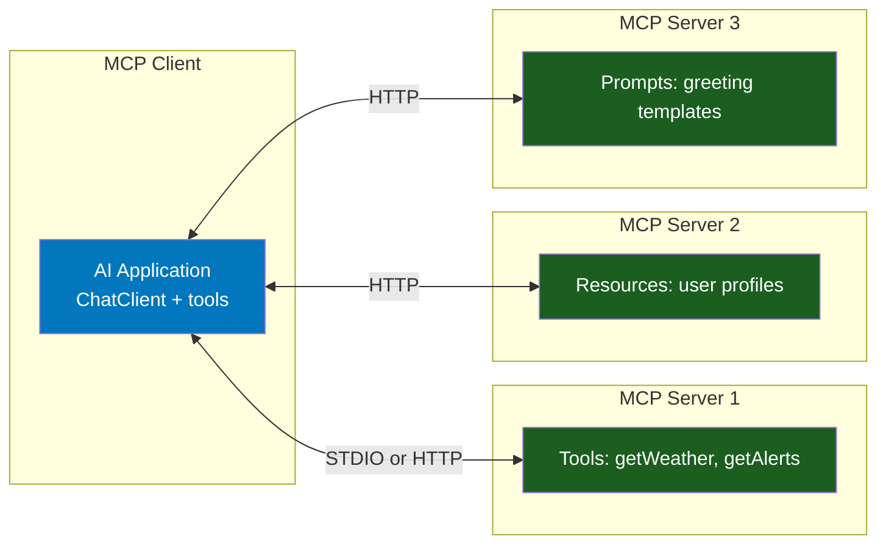
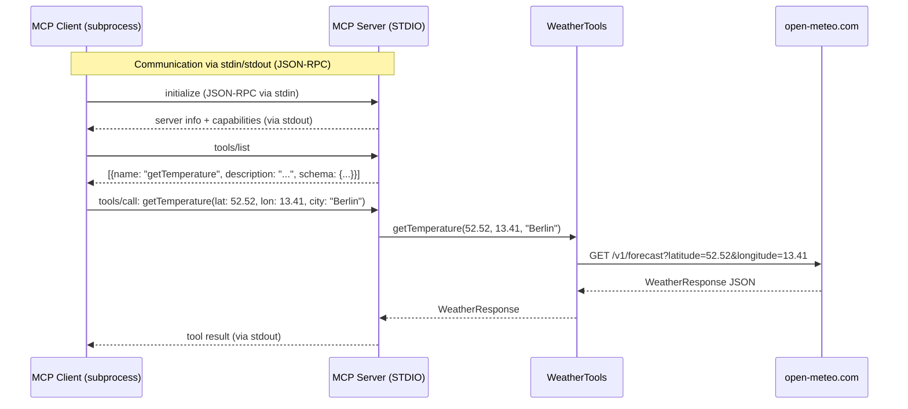
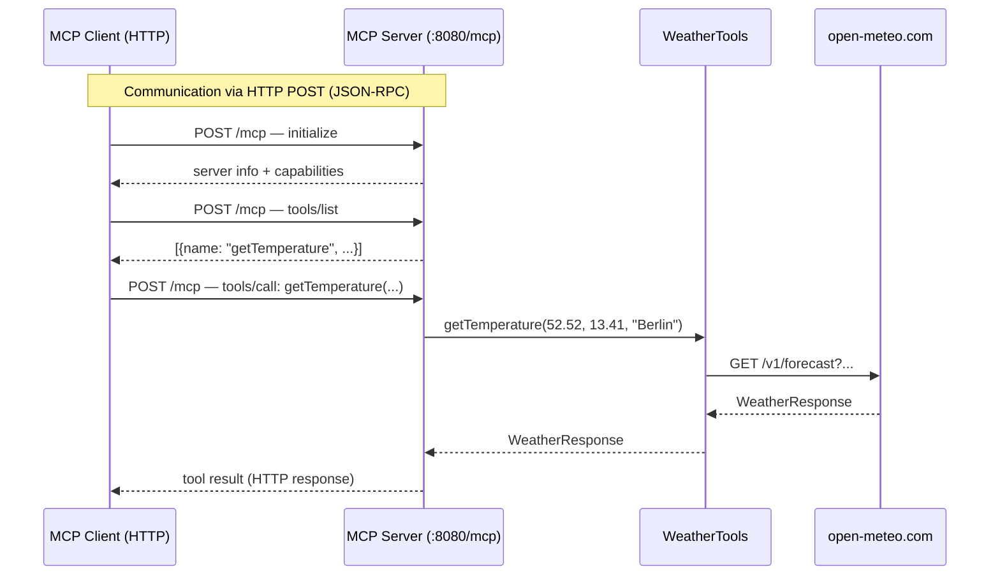
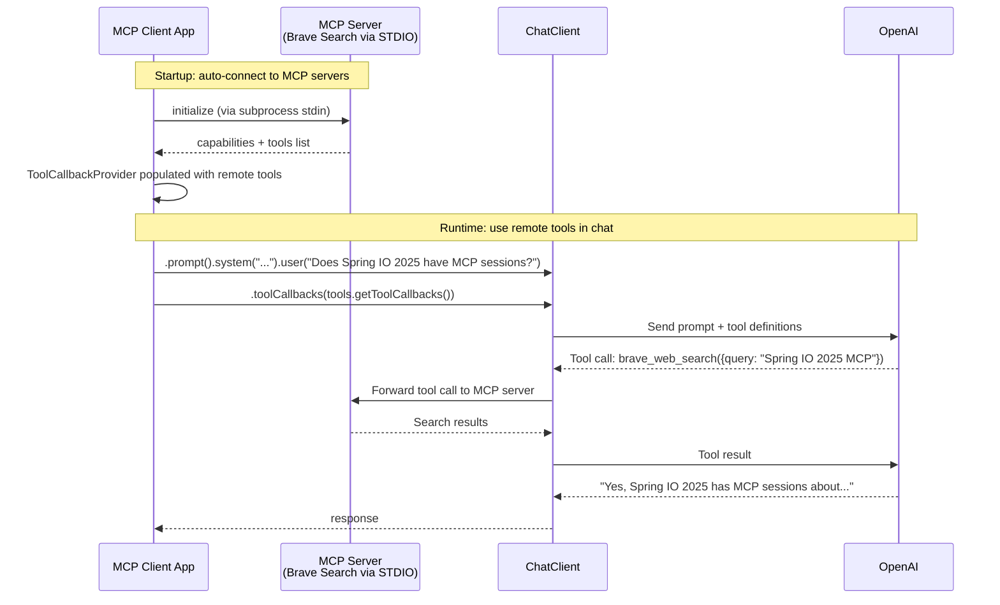
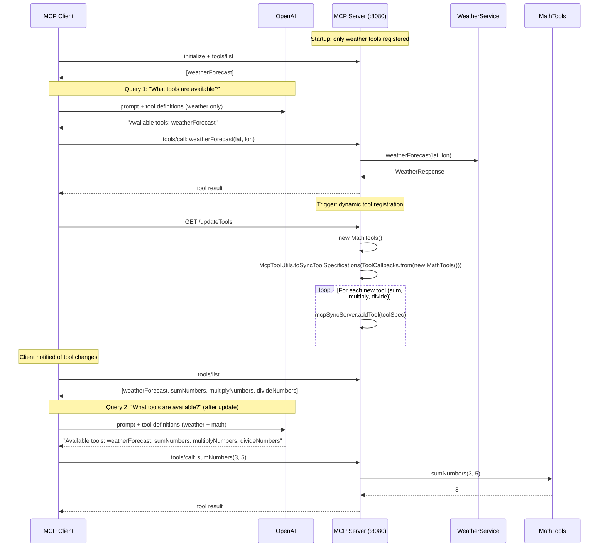
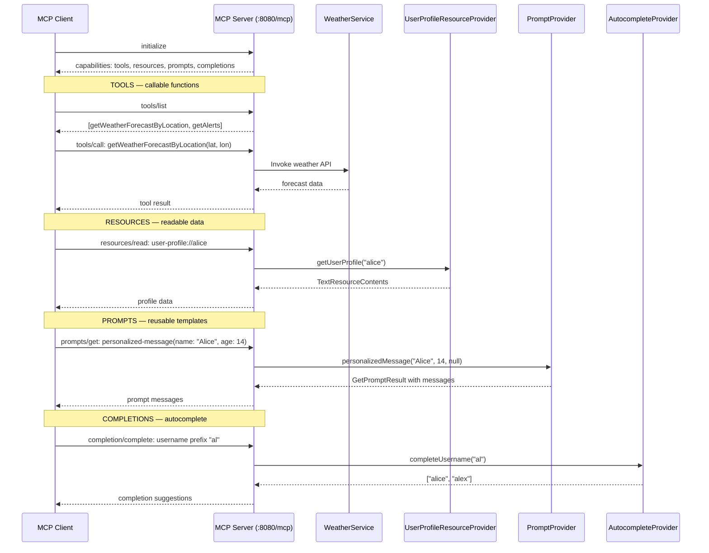

# Stage 6: Model Context Protocol (MCP)

**Modules:** `mcp/01-mcp-stdio-server/`, `02-mcp-http-server/`, `03-mcp-client/`, `04-dynamic-tool-calling/`, `05-mcp-capabilities/`
**Maven Artifacts:** `spring-ai-starter-mcp-server`, `spring-ai-starter-mcp-server-webmvc`, `spring-ai-starter-mcp-client`, `spring-ai-mcp-annotations`
**Package Base:** `com.example`, `org.springframework.ai.mcp.sample.server`, `org.springframework.ai.mcp.samples.client`, `mcp.capabilities`

---

## Overview

Stage 6 introduces the **Model Context Protocol (MCP)** — an open standard for connecting AI models to external tools, data sources, and prompts. MCP defines a client-server architecture where:

- **MCP Servers** expose tools, resources, and prompts via a standardized protocol
- **MCP Clients** discover and invoke these capabilities at runtime

Spring AI provides first-class MCP support through auto-configured starters for both servers and clients, with two transport options (STDIO and Streamable HTTP). The demos progress from basic servers to dynamic tool registration and the full MCP capabilities showcase.

### Learning Objectives

After completing this stage, developers will be able to:

- Build MCP servers that expose `@Tool`-annotated methods via STDIO or HTTP transport
- Connect MCP clients to servers for automatic tool discovery
- Register tools dynamically at runtime using `McpSyncServer.addTool()`
- Expose MCP resources (`@McpResource`), prompts (`@McpPrompt`), and completions (`@McpComplete`)
- Understand the MCP protocol flow: initialize → discover → invoke

### Prerequisites

> **Background reading:** See [SPRING_AI_INTRODUCTION.md](SPRING_AI_INTRODUCTION.md) for Spring AI fundamentals and [SPRING_AI_STAGE_1.md](SPRING_AI_STAGE_1.md) for the `@Tool` annotation basics.

- For STDIO server: Java runtime
- For HTTP server: available port (default 8080)
- For MCP client (module 03): OpenAI API key, Node.js/npx for external MCP servers

---

## What Is MCP?

The **Model Context Protocol** is an open standard (by Anthropic) that standardizes how AI applications interact with external tools, data sources, and prompt templates. Instead of each application building custom integrations, MCP provides a universal interface.

### MCP Architecture



### MCP Capabilities

| Capability | Annotation | Purpose |
|------------|-----------|---------|
| **Tools** | `@Tool` | Executable functions the AI can call |
| **Resources** | `@McpResource` | Data sources the AI can read (like a file system) |
| **Prompts** | `@McpPrompt` | Reusable prompt templates |
| **Completions** | `@McpComplete` | Autocomplete suggestions for resource/prompt arguments |

### Transport Options

| Transport | Starter | Communication | Use Case |
|-----------|---------|--------------|----------|
| **STDIO** | `spring-ai-starter-mcp-server` | stdin/stdout (JSON-RPC) | Local tools, CLI apps, subprocess-based |
| **Streamable HTTP** | `spring-ai-starter-mcp-server-webmvc` | HTTP POST to `/mcp` | Remote servers, networked access |

---

## Spring AI Component Reference

| Component | FQN | Purpose |
|-----------|-----|---------|
| `@Tool` | `o.s.ai.tool.annotation.Tool` | Marks a method as an MCP-callable tool |
| `@ToolParam` | `o.s.ai.tool.annotation.ToolParam` | Describes tool method parameters |
| `ToolCallbackProvider` | `o.s.ai.tool.ToolCallbackProvider` | Provides tool callbacks for registration |
| `MethodToolCallbackProvider` | `o.s.ai.tool.method.MethodToolCallbackProvider` | Creates tool callbacks from annotated methods |
| `McpToolUtils` | `o.s.ai.mcp.McpToolUtils` | Converts tool callbacks to MCP tool specifications |
| `ToolCallbacks` | `o.s.ai.support.ToolCallbacks` | Utility for creating tool callbacks from instances |
| `McpSyncServer` | `io.modelcontextprotocol.server.McpSyncServer` | MCP server (synchronous) for dynamic tool management |
| `McpClient` | `io.modelcontextprotocol.client.McpClient` | MCP client for connecting to servers |
| `McpClientCustomizer` | `o.s.ai.mcp.customizer.McpClientCustomizer` | Customization callback for MCP client setup |
| `@McpResource` | `o.s.ai.mcp.annotation.McpResource` | Exposes a method as an MCP resource |
| `@McpPrompt` | `o.s.ai.mcp.annotation.McpPrompt` | Exposes a method as an MCP prompt template |
| `@McpComplete` | `o.s.ai.mcp.annotation.McpComplete` | Provides autocomplete for resource/prompt arguments |
| `@McpArg` | `o.s.ai.mcp.annotation.McpArg` | Describes MCP prompt/completion arguments |
| `SyncMcpAnnotationProviders` | `o.s.ai.mcp.annotation.spring.SyncMcpAnnotationProviders` | Collects annotated methods into MCP specification beans |

> **Notation:** `o.s.ai` = `org.springframework.ai`

---

## Demo 01 — MCP Server via STDIO

**Module:** `mcp/01-basic-stdio-mcp-server/`
**Source:** `BasicStdioMcpServerApplication.java`, `WeatherTools.java`

### Description

The simplest MCP server: a Spring Boot application that exposes `@Tool`-annotated weather methods over STDIO (stdin/stdout). Communication happens via JSON-RPC messages piped through the process's standard streams. This transport is ideal for local tools spawned as subprocesses by the client.

### Spring AI Components

- `@Tool` / `@ToolParam` — annotates the weather service method
- `MethodToolCallbackProvider` — creates tool callbacks from the annotated service
- `ToolCallbackProvider` — registered as a Spring bean for MCP auto-configuration

### Flow Diagram



### Key Code

```java
// Application — register tools as MCP-exposed beans
@Bean
ToolCallbackProvider weatherToolsProvider(WeatherTools weatherTools) {
    return MethodToolCallbackProvider.builder().toolObjects(weatherTools).build();
}

// Weather service — @Tool annotation (same as Stage 1)
@Service
public class WeatherTools {
    @Tool(description = "Get the temperature (in celsius) for a specific location")
    public WeatherResponse getTemperature(
        @ToolParam(description = "The latitude") double latitude,
        @ToolParam(description = "The longitude") double longitude,
        @ToolParam(description = "The city name") String city) {
        return restClient.get()
            .uri("/v1/forecast?latitude={lat}&longitude={lon}&current=temperature_2m", latitude, longitude)
            .retrieve().body(WeatherResponse.class);
    }
}
```

**Configuration** (`application.yaml`):
```yaml
spring:
  ai:
    mcp:
      server:
        stdio: true                    # Use stdin/stdout transport
        name: basic-stdio-mcp-server
        version: 1.0.0
        type: SYNC
  main:
    banner-mode: off                   # Keep stdout clean for JSON-RPC
logging:
  pattern:
    console: ""                        # Suppress log output on stdout
```

> **Takeaway:** STDIO MCP servers must keep stdout clean — only JSON-RPC messages. Disable Spring Boot banner and console logging. The client spawns the server as a subprocess and communicates via piped stdin/stdout.

---

## Demo 02 — MCP Server via HTTP

**Module:** `mcp/02-basic-http-mcp-server/`
**Source:** `BasicHttpMcpServerApplication.java`, `WeatherTools.java`

### Description

Same weather tools as Demo 01, but exposed over **Streamable HTTP** instead of STDIO. The server listens on `/mcp` endpoint and clients connect via HTTP POST. This transport enables remote tool access over the network.

### Spring AI Components

- Same as Demo 01: `@Tool`, `MethodToolCallbackProvider`, `ToolCallbackProvider`
- Uses `spring-ai-starter-mcp-server-webmvc` instead of `spring-ai-starter-mcp-server`

### Flow Diagram



### Key Configuration Difference

```yaml
spring:
  ai:
    mcp:
      server:
        name: basic-http-mcp-server
        version: 1.0.0
        type: SYNC
        protocol: STREAMABLE          # HTTP transport (not STDIO)
        streamable-http:
          mcp-endpoint: /mcp           # HTTP endpoint path
```

> **Takeaway:** Switching from STDIO to HTTP requires changing the starter dependency (`spring-ai-starter-mcp-server` → `spring-ai-starter-mcp-server-webmvc`) and the config (`stdio: true` → `protocol: STREAMABLE`). The tool code stays identical.

---

## Demo 03 — MCP Client

**Module:** `mcp/03-basic-mcp-client/`
**Source:** `BasicMcpClientApplication.java`

### Description

An MCP client that connects to external MCP servers (Brave Search, filesystem) via STDIO, discovers their tools, and makes them available to `ChatClient`. The client uses `ToolCallbackProvider` to inject discovered tools into the AI conversation — the model can then call these remote tools.

### Spring AI Components

- `ChatClient` — fluent API with `.toolCallbacks()` for MCP tool injection
- `ToolCallbackProvider` — auto-configured with tools from connected MCP servers
- MCP server connections configured via `mcp-servers-config.json`

### Flow Diagram



### Key Code

```java
@Bean
CommandLineRunner chatbot(ChatClient.Builder chatClientBuilder, ToolCallbackProvider tools) {
    return args -> {
        var chatClient = chatClientBuilder.build();
        String response = chatClient.prompt()
            .system("You are useful assistant and can perform web searches")
            .user("Does Spring IO 2025 have MCP sessions?")
            .toolCallbacks(tools.getToolCallbacks())
            .call().content();
        logger.info("Response: {}", response);
    };
}
```

**MCP servers configuration** (`mcp-servers-config.json`):
```json
{
  "mcpServers": {
    "brave-search": {
      "command": "npx",
      "args": ["-y", "@modelcontextprotocol/server-brave-search"]
    },
    "filesystem": {
      "command": "npx",
      "args": ["-y", "@modelcontextprotocol/server-filesystem", "./mcp/03-basic-mcp-client/target"]
    }
  }
}
```

> **Takeaway:** MCP clients treat remote tools the same as local tools. `ToolCallbackProvider` abstracts the source — the `ChatClient` doesn't know whether a tool runs locally or on a remote MCP server. This is the power of MCP: plug any tool ecosystem into any AI application.

---

## Demo 04 — Dynamic Tool Registration

**Modules:** `mcp/04-dynamic-tool-calling/server/`, `mcp/04-dynamic-tool-calling/client/`
**Source:** `ServerApplication.java`, `ClientApplication.java`, `WeatherService.java`, `MathTools.java`

### Description

Demonstrates adding tools to a running MCP server at runtime. The server starts with weather tools, then dynamically registers math tools when triggered via an HTTP endpoint. The client detects the new tools via `McpClientCustomizer` and can immediately use them.

### Spring AI Components

- `McpSyncServer` — server instance for `addTool()` at runtime
- `McpToolUtils` — converts `ToolCallbacks` to MCP tool specifications
- `ToolCallbacks` — creates callbacks from plain tool instances
- `McpClientCustomizer` — client-side callback for tool change notifications
- `ToolContext` — injected into tool methods for contextual metadata

### Flow Diagram



### Key Code — Server

```java
// Dynamic registration via CommandLineRunner
@Bean
CommandLineRunner commandRunner(McpSyncServer mcpSyncServer) {
    return args -> {
        latch.await(); // Wait for /updateTools trigger

        // Create new tools at runtime
        List<SyncToolSpecification> newTools =
            McpToolUtils.toSyncToolSpecifications(ToolCallbacks.from(new MathTools()));

        // Register each tool with the running server
        for (SyncToolSpecification newTool : newTools) {
            mcpSyncServer.addTool(newTool);
        }
    };
}

// Trigger endpoint
@GetMapping("/updateTools")
public String updateTools() {
    latch.countDown(); // Signal the CommandLineRunner
    return "Update signal received!";
}
```

### Key Code — Client

```java
// Customizer callback — notified when MCP client setup changes
@Bean
McpClientCustomizer<?> customizeMcpClient() {
    return (name, spec) -> {
        logger.info("MCP Client '{}' customized", name);
        latch.countDown();
    };
}
```

> **Takeaway:** `McpSyncServer.addTool()` enables runtime tool registration without restarting the server. `McpToolUtils.toSyncToolSpecifications()` bridges Spring AI's `ToolCallback` abstraction to MCP's protocol format. This supports plugin architectures where tools are loaded dynamically.

---

## Demo 05 — Full MCP Capabilities

**Module:** `mcp/05-mcp-capabilities/`
**Source:** `McpServerApplication.java`, `WeatherService.java`, `PromptProvider.java`, `UserProfileResourceProvider.java`, `AutocompleteProvider.java`

### Description

A comprehensive showcase of all four MCP capabilities: **Tools**, **Resources**, **Prompts**, and **Completions**. Uses Spring AI MCP annotations (`@McpResource`, `@McpPrompt`, `@McpComplete`) to declaratively define each capability, registered via `SyncMcpAnnotationProviders`.

### Spring AI Components

- `@Tool` — weather forecast and alerts
- `@McpResource` — user profile data with URI templates (`user-profile://{username}`)
- `@McpPrompt` — reusable prompt templates with `@McpArg` parameters
- `@McpComplete` — autocomplete suggestions for resource URIs and prompt arguments
- `SyncMcpAnnotationProviders` — collects annotated methods into MCP specifications

### Flow Diagram



### Key Code — Resources

```java
@Service
public class UserProfileResourceProvider {

    @McpResource(uri = "user-profile://{username}", name = "User Profile",
                 description = "Returns user profile information", mimeType = "text/plain")
    public ReadResourceResult getUserProfile(ReadResourceRequest request, String username) {
        String content = "Profile for " + username + ": software engineer, AI enthusiast";
        return new ReadResourceResult(List.of(
            new TextResourceContents(request.uri(), "text/plain", content)));
    }
}
```

### Key Code — Prompts

```java
@Service
public class PromptProvider {

    @McpPrompt(name = "greeting", description = "A simple greeting prompt")
    public GetPromptResult greetingPrompt(
        @McpArg(name = "name", description = "The name to greet", required = true) String name) {
        return new GetPromptResult("Greeting", List.of(
            new PromptMessage(Role.USER, new TextContent("Hello, " + name + "!"))));
    }
}
```

### Key Code — Completions

```java
@Service
public class AutocompleteProvider {

    @McpComplete(uri = "user-status://{username}")
    public List<String> completeUsername(String usernamePrefix) {
        return usernameDatabase.keySet().stream()
            .filter(u -> u.startsWith(usernamePrefix))
            .toList();
    }
}
```

### Key Code — Application Wiring

```java
@Bean("customResourceSpecs")
List<SyncResourceSpecification> resourceSpecs() {
    return SyncMcpAnnotationProviders.resourceSpecifications(
        List.of(new UserProfileResourceProvider()));
}

@Bean("customPromptSpecs")
List<SyncPromptSpecification> promptSpecs() {
    return SyncMcpAnnotationProviders.promptSpecifications(
        List.of(new PromptProvider()));
}

@Bean("customCompletionSpecs")
List<SyncCompletionSpecification> completionSpecs() {
    return SyncMcpAnnotationProviders.completeSpecifications(
        List.of(new AutocompleteProvider()));
}
```

> **Takeaway:** MCP is more than just tools. Resources expose data, prompts provide reusable templates, and completions enable IDE-like autocomplete. Spring AI's `@Mcp*` annotations make all four capabilities declarative — annotate methods and register the providers as beans.

---

## Stage 6 Progression


### MCP Transport Comparison

| | STDIO | Streamable HTTP |
|-|-------|-----------------|
| **Starter** | `spring-ai-starter-mcp-server` | `spring-ai-starter-mcp-server-webmvc` |
| **Communication** | stdin/stdout (JSON-RPC) | HTTP POST to `/mcp` |
| **Deployment** | Subprocess spawned by client | Standalone web server |
| **Network** | Local only | Remote accessible |
| **Use Case** | CLI tools, local integrations | Shared services, microservices |
| **Logging** | Must suppress console output | Normal logging |

### MCP Capability Summary

| Capability | Annotation | Registration | Client Method |
|------------|-----------|--------------|---------------|
| **Tools** | `@Tool` | `MethodToolCallbackProvider` → `ToolCallbackProvider` bean | `tools/call` |
| **Resources** | `@McpResource` | `SyncMcpAnnotationProviders.resourceSpecifications()` | `resources/read` |
| **Prompts** | `@McpPrompt` | `SyncMcpAnnotationProviders.promptSpecifications()` | `prompts/get` |
| **Completions** | `@McpComplete` | `SyncMcpAnnotationProviders.completeSpecifications()` | `completion/complete` |
| **Dynamic Tools** | `@Tool` + runtime | `McpSyncServer.addTool()` | `tools/call` (after re-discovery) |
