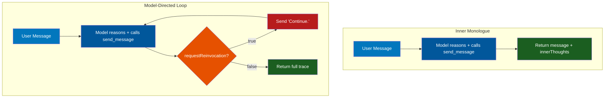
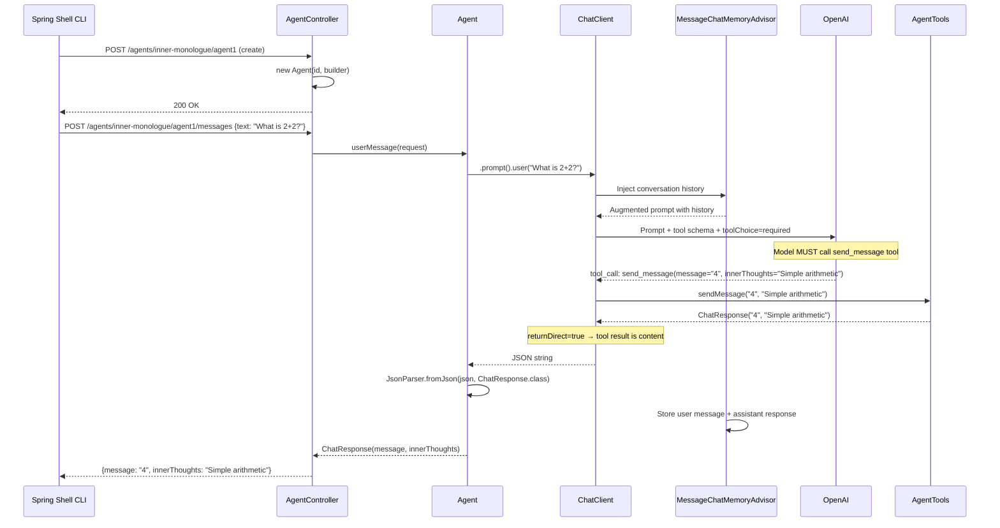
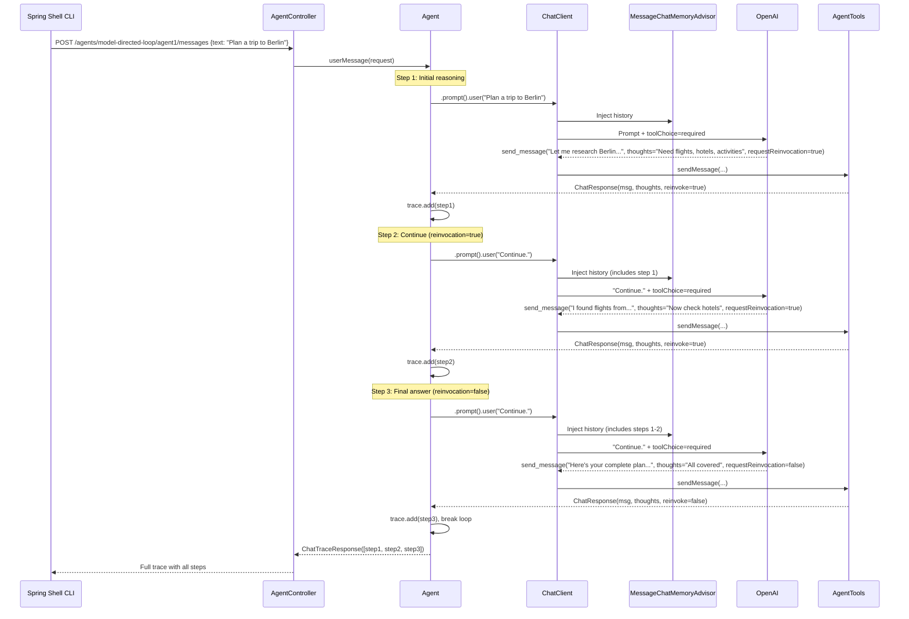
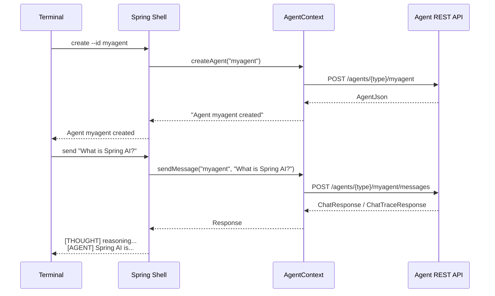
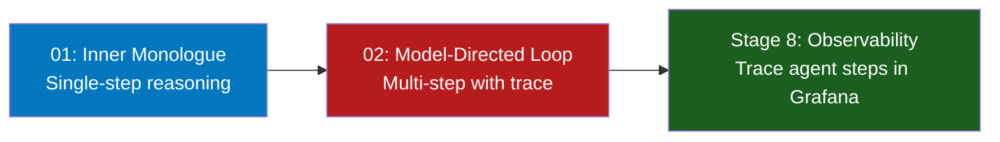

# Stage 7: Agentic Systems

**Modules:** `agentic-system/01-inner-monologue/`, `agentic-system/02-model-directed-loop/`
**Maven Artifacts:** `spring-ai-client-chat`, `spring-ai-openai`, `spring-shell-starter`
**Package Base:** `com.example.agentic.inner_monologue`, `com.example.agentic.model_directed_loop`

> **⚠ Spring AI 2.0.0-M4 → M5 note** — Stage 7 was hit by the M5 `ChatClient` options-API change in several places. Both `ChatClient.Builder.defaultOptions(...)` and `ChatClientRequestSpec.options(...)` now take a `ChatOptions.Builder` instead of a built `ChatOptions`. Consequently, the agent's `@Bean` factories return a `ChatOptions.Builder`, the `Agent` constructor accepts `ChatOptions.Builder`, and the controller injects `ChatOptions.Builder`. Code blocks below are M5-current; M4↔M5 deltas are called out where the change is non-obvious. Full migration: **[SPRING_AI_M4_TO_M5_MIGRATION.md](../../SPRING_AI_M4_TO_M5_MIGRATION.md)**.

---

## Overview

Stage 7 introduces **agentic systems** — AI applications where the model controls its own execution flow. Unlike Stages 1–6 where the developer defines the exact sequence of calls, agentic systems let the model decide what to do next, when to use tools, and when to stop.

Two patterns are demonstrated, each with a REST API server and a Spring Shell CLI client:

1. **Inner Monologue** — The model responds in a single step, but reveals its private reasoning through a structured tool call
2. **Model-Directed Loop** — The model explicitly controls a multi-step loop, deciding after each step whether to continue thinking or return a final answer

Both patterns use a key technique: **forced tool calling** via `toolChoice("required")`, which ensures the model always responds through a structured tool rather than free-form text.

> **Architecture:** Each agent is a **standalone Spring Boot application** running in its own JVM on a dedicated port (`:8091`, `:8092`). They are **not bundled into any provider app** — the dashboard on `:8080` reaches them via HTTP. Launch them with `./workshop.sh agentic start all`; the provider app and the agents run as separate processes.

### Learning Objectives

After completing this stage, developers will be able to:

- Build agentic systems where the model controls execution flow
- Use `toolChoice("required")` to force structured output via tools
- Implement inner monologue patterns for transparent AI reasoning
- Build model-directed loops with explicit continuation control
- Combine chat memory with agentic loops for multi-step context
- Create Spring Shell CLI clients for interactive agent testing

### Prerequisites

> **Background reading:** See [SPRING_AI_STAGE_1.md](SPRING_AI_STAGE_1.md) for tool calling basics and [SPRING_AI_STAGE_4.md](SPRING_AI_STAGE_4.md) for chat memory.

- OpenAI API key (these demos currently require OpenAI for `toolChoice("required")`)
- Two terminal windows: one for the agent REST server, one for the CLI client

---

## Agentic Pattern Comparison



| Aspect | Inner Monologue | Model-Directed Loop |
|--------|-----------------|---------------------|
| **Steps** | Single LLM call | Multi-step loop (max 5) |
| **Response** | `ChatResponse(message, innerThoughts)` | `ChatTraceResponse(List<ChatResponse>)` |
| **Loop Control** | None — one call, one answer | Model sets `requestReinvocation` boolean |
| **When to Stop** | Implicit (single response) | Model decides via flag + safety limit |
| **Tool Parameters** | `message`, `innerThoughts` | `message`, `innerThoughts`, `requestReinvocation` |
| **Use Case** | Simple Q&A with visible reasoning | Complex tasks requiring multi-step thinking |

---

## Spring AI Component Reference

| Component | FQN | Purpose |
|-----------|-----|---------|
| `ChatClient` | `o.s.ai.chat.client.ChatClient` | Fluent API for agent LLM interactions |
| `ChatClient.Builder` | `o.s.ai.chat.client.ChatClient.Builder` | Builds ChatClient with tools, options, advisors |
| `ChatOptions` | `o.s.ai.chat.prompt.ChatOptions` | Provider-agnostic interface — injected into `Agent` so the loop code doesn't care whether it's OpenAI or Ollama |
| `MessageChatMemoryAdvisor` | `o.s.ai.chat.client.advisor.MessageChatMemoryAdvisor` | Injects full conversation history into prompts |
| `MessageChatMemoryAdvisor.Builder.conversationId(String)` | same | Pins the advisor to a specific conversation key — used to isolate memory per-agent (see [Per-Agent Memory](#per-agent-memory-conversationid)) |
| `MessageWindowChatMemory` | `o.s.ai.chat.memory.MessageWindowChatMemory` | Sliding-window conversation memory |
| `InMemoryChatMemoryRepository` | `o.s.ai.chat.memory.InMemoryChatMemoryRepository` | In-memory storage for conversation history |
| `OpenAiChatOptions` | `o.s.ai.openai.OpenAiChatOptions` | OpenAI-specific options including `toolChoice("required")` |
| `OllamaChatOptions` | `o.s.ai.ollama.api.OllamaChatOptions` | Ollama-specific options (renamed from `OllamaOptions` in Spring AI 2.0.0-M4). Sets the model name via `.model(...)` |
| `@Tool(returnDirect = true)` | `o.s.ai.tool.annotation.Tool` | Marks `send_message` as callable. `returnDirect = true` means the tool's return value becomes the final response content (Spring AI does not re-prompt the model to summarise the tool output) |
| `@ToolParam(description = ...)` | `o.s.ai.tool.annotation.ToolParam` | Describes each tool parameter — the description goes into the tool schema the model sees |
| `JsonParser` | `o.s.ai.util.json.JsonParser` | Parses tool-call JSON into the agent's `ChatResponse` record |
| `@SpringBootApplication` + `@ComponentScan(basePackages = "com.example")` | Spring Boot / Spring Framework | Broader scan root (not just the agent's own package) so `com.example.fitness.AcmeFitnessController` (demo 02) and `com.example.tracing.SpanLoggingObservationHandler` (both agents) are discovered |

> **Notation:** `o.s.ai` = `org.springframework.ai`

---

## Per-Agent Memory (conversationId)

`MessageChatMemoryAdvisor` stores each message under a **conversation id**. Its default is the literal string `"default"`. If you build one `MessageWindowChatMemory` and share it across several `Agent` instances in the same JVM — which is tempting because memory is a bean — every agent ends up reading and writing the **same** thread of messages. Alice's chat bleeds into Bob's next turn.

The fix is one line on the advisor: pin the conversation id to the agent's unique id.

```java
// agentic-system/02-model-directed-loop/model-directed-loop-agent/src/main/java/
// com/example/agentic/model_directed_loop/Agent.java, line 70
var chatMemoryAdvisor = MessageChatMemoryAdvisor.builder(memory).conversationId(id).build();
```

> `Agent.java` in demo 01 does the same on its line 48. Both agents also isolate their memory backing stores — each `Agent` owns its own `MessageWindowChatMemory` + `InMemoryChatMemoryRepository` — but the `conversationId(id)` is what keeps the advisor from ever falling back to the shared default key.

`resetMemory()` and `getLog()` call `memory.clear(id)` / `memory.get(id)` with the same key, so cross-agent reset and log retrieval stay scoped too.

---

## Provider Selection via Spring Profiles

Both agents support **OpenAI** (default) and **Ollama** (local) by combining three mechanisms: a profile-scoped `ChatOptions` bean, autoconfigure exclusion, and agent-level YAML slices.

### The three-profile layout

```yaml
# agentic-system/02-model-directed-loop/model-directed-loop-agent/src/main/resources/application.yaml
spring:
  profiles:
    default: openai     # activates when no -Dspring-boot.run.profiles is passed
    active:             # openai (via default), ollama, spy, observation
---
spring:
  config:
    activate:
      on-profile: openai
  ai:
    openai:
      chat:
        options:
          model: gpt-4o-mini
  autoconfigure:
    exclude: org.springframework.ai.model.ollama.autoconfigure.OllamaChatAutoConfiguration
---
spring:
  config:
    activate:
      on-profile: ollama
  ai:
    ollama:
      base-url: http://localhost:11434
      chat:
        options:
          model: qwen3
  autoconfigure:
    exclude: org.springframework.ai.model.openai.autoconfigure.OpenAiChatAutoConfiguration
```

`spring.profiles.default: openai` is the trick that makes `openai` active whenever the workshop launcher doesn't pass anything explicit — without needing `-Dspring-boot.run.profiles=openai` on the command line.

### Why `spring.autoconfigure.exclude` matters

Both `spring-ai-openai` and `spring-ai-starter-model-ollama` are on the classpath. Without exclusion, **both** `ChatModel` beans auto-configure, and `ChatClient.Builder` binds ambiguously — in practice the call ends up hitting Ollama's default `mistral` model even when the `openai` profile is intended. Each profile excludes the *other* provider's auto-configuration so there is exactly one `ChatModel` in the context.

### Profile-scoped `ChatOptions` bean

`AgentOptionsConfig` produces the right `ChatOptions` per profile:

```java
// agentic-system/02-model-directed-loop/model-directed-loop-agent/src/main/java/
// com/example/agentic/model_directed_loop/config/AgentOptionsConfig.java
@Configuration("modelDirectedLoopAgentOptionsConfig")
public class AgentOptionsConfig {

  // Spring AI 2.0.0-M5: ChatClient.Builder.defaultOptions() now takes a ChatOptions.Builder
  // (so the chat client can merge with its own defaults). Beans return the builder, not a built instance.

  @Bean
  @Profile("!ollama")
  public ChatOptions.Builder openAiAgentOptions() {
    return OpenAiChatOptions.builder().toolChoice("required");
  }

  @Bean
  @Profile("ollama")
  public ChatOptions.Builder ollamaAgentOptions(@Value("${agent.ollama.model:qwen3}") String model) {
    return OllamaChatOptions.builder().model(model);
  }
}
```

**M4 → M5 delta** — return type and the missing `.build()` are the whole change:

```diff
-  public ChatOptions openAiAgentOptions() {
-    return OpenAiChatOptions.builder().toolChoice("required").build();
+  public ChatOptions.Builder openAiAgentOptions() {
+    return OpenAiChatOptions.builder().toolChoice("required");
   }
```

Demo 01 has the same class under `com.example.agentic.inner_monologue.config`, annotated `@Configuration("innerMonologueAgentOptionsConfig")`. The **explicit bean names** are load-bearing: when both agent modules sit on a single classpath (e.g. during earlier experiments that bundled them into the provider app, or now when a test context spans modules), Spring would otherwise raise a bean-name collision on `AgentOptionsConfig`. Naming each configuration explicitly sidesteps that.

The `Agent` and its controller receive a `ChatOptions.Builder` by constructor injection — they never look at `OpenAiChatOptions` or `OllamaChatOptions` directly, which is why switching providers requires no agent-code change. (In Spring AI 2.0.0-M4 this was a `ChatOptions`; M5's `ChatClient.Builder.defaultOptions(...)` now expects the builder.)

### Auxiliary profiles

| Profile | What it does |
|---|---|
| `spy` | Overrides `spring.ai.openai.chat.base-url` and `spring.ai.ollama.base-url` to `http://localhost:7777/<provider>` — routes LLM traffic through the audit gateway |
| `observation` | Enables OTLP export for traces/metrics/logs to LGTM on `:4318`, sets `spring.ai.chat.client.observation.include-input: true`, and tags metrics with `application=<service-name>` |

Stacked as needed: `./workshop.sh agentic start all --profile=ollama,spy,observation`.

---

## Fallback Handler Pattern

OpenAI honours `toolChoice("required")` — the response always contains a tool call. Ollama cannot enforce this. Weaker local models sometimes emit free-form prose instead of calling `send_message`, or emit JSON that isn't shaped like our tool payload. The agent has to survive that gracefully rather than throwing a 500.

### Demo 02 — external handler (loop-aware)

```java
// agentic-system/02-model-directed-loop/model-directed-loop-agent/src/main/java/
// com/example/agentic/model_directed_loop/AgentFallbackHandler.java
public class AgentFallbackHandler {

  static final String FALLBACK_MARKER = "[fallback: model replied without tool]";

  public ChatResponse parseOrFallback(String content) {
    try {
      ChatResponse parsed = JsonParser.fromJson(content, ChatResponse.class);
      if (parsed != null && parsed.message() != null) {
        return parsed;
      }
    } catch (Exception e) {
      log.warn("Fallback: agent content not parseable as send_message tool call. Raw: {}", content);
    }
    return new ChatResponse(content, FALLBACK_MARKER, false, true);
  }
}
```

- `JsonParser.fromJson(content, ChatResponse.class)` tries to parse the raw assistant content as the tool-call JSON.
- On any exception, or when the parsed record's `message` field is null, the handler returns a fallback `ChatResponse(rawText, "[fallback: model replied without tool]", requestReinvocation=false, isFallback=true)`.
- Crucially `requestReinvocation` is forced to `false`. The loop in `Agent.userMessage` sees that and breaks:

```java
if (step.isFallback() || !reinvoke || stepCount >= MAX_STEP_COUNT) {
  break;
}
```

That way a struggling model produces **one** clean fallback bubble, not five before `MAX_STEP_COUNT` rescues us.

### Demo 01 — inline handler (single-shot)

Demo 01 doesn't have a loop to guard, so its `parseOrFallback` lives as a private method on `Agent` itself. The `ChatResponse` record is 3-arg there (no `requestReinvocation`), so the fallback is `new ChatResponse(content, FALLBACK_MARKER, true)`.

### Why this is the honest teaching moment

OpenAI guarantees `toolChoice("required")` at the API level. Ollama does not. The fallback bubble — amber badge in the dashboard, `isFallback=true` in the JSON — surfaces the difference directly so attendees see *why* `toolChoice("required")` matters instead of just being told.

---

## User Context Injection (demo 02)

Demo 02's agent can reason about the logged-in ACME customer. The flow: browser → `POST /acme/login` with `{email}` → customer JSON returned → browser creates a new agent with `{id, customer:{…}}` → the controller folds the customer fields into the system prompt.

### Controller overload

```java
// ModelDirectedLoopAgentController.java
@PostMapping("/{id}")
public AgentJson createAgent(
    @PathVariable(name = "id") String agentId,
    @RequestBody(required = false) Map<String, Object> body) {
  String userContext = formatUserContext(body);
  Agent agent = new Agent(this.builder, agentId, this.chatOptions, userContext);
  agents.put(agentId, agent);
  return AgentJson.from(agent);
}
```

### Agent constructor overload

```java
// Agent.java (demo 02)
public Agent(ChatClient.Builder builder, String id, ChatOptions options) {
  this(builder, id, options, null);                       // backwards-compatible
}

// Spring AI 2.0.0-M5: parameter type is ChatOptions.Builder (not ChatOptions).
public Agent(ChatClient.Builder builder, String id, ChatOptions.Builder options, String userContext) {
  // ...
  String effectiveSystemPrompt = SYSTEM_PROMPT;
  if (userContext != null && !userContext.isBlank()) {
    effectiveSystemPrompt =
        SYSTEM_PROMPT + "\n\n== User Context ==\n" + userContext.trim() + "\n";
  }
  this.chatClient =
      builder.clone()
          .defaultOptions(options)               // M5: defaultOptions(ChatOptions.Builder)
          .defaultTools(new AgentTools())
          .defaultSystem(effectiveSystemPrompt)
          .defaultAdvisors(chatMemoryAdvisor)
          .build();
}
```

**M4 → M5 delta** — only the constructor parameter type changed; the call site stayed the same because `options` is now already a builder:

```diff
- public Agent(ChatClient.Builder builder, String id, ChatOptions options, String userContext) {
+ public Agent(ChatClient.Builder builder, String id, ChatOptions.Builder options, String userContext) {
```

### What the model sees

The appended block lists the fields from the seed `Customer` record: `name`, `email`, `id`, a formatted `address` (street, city, province/postalCode, country), and `created_at`. Plus a short instruction to address the user by first name and not invent facts outside the block.

### UX note

The system prompt is frozen into the `ChatClient` at `.build()` time and is **immutable** after. Logging in *before* creating the agent injects the context; logging in afterwards does not retroactively alter an existing agent. Attendees who log in mid-session need to click "New Agent" to see the customer context take effect.

---

## Dashboard UI Proxy Layer

All browser traffic for Stage 7 flows through `/dashboard/agentic/**` on the provider app (`:8080`). The proxy layer lives in `components/config-dashboard/src/main/java/com/example/dashboard/agentic/`.

### Components

| File | Role |
|---|---|
| `AgenticDemo` (record) | `{id, title, oneLiner, port, basePath, supportsLogin, traceKind}` — static metadata for one demo |
| `AgenticDemoCatalog` | `@Component` holding two hardcoded demos: `01 → :8091 /agents/inner-monologue` (SINGLE) and `02 → :8092 /agents/model-directed-loop` (MULTI_STEP) |
| `AgenticStatus` (record) | `{up, provider, model, agentCount, startCommand}` — returned by `/status` |
| `AgenticClientRegistry` | TCP-probes the agent port, caches `/actuator/info` for 1 s, and owns two `RestClient` factories |
| `AgenticInspectorController` | `@Profile("ui")` `@RestController` exposing `/dashboard/agentic/**`. Proxies every call to the underlying agent, returns 503 "offline" when the port is dead, 502 "provider-error" with a trace id on other failures |
| `AgenticFallbackDetector` | One-line `isFallback(String innerThoughts)` — true when the string starts with `[fallback: `. Used by dashboard JS for the ⚠ amber badge |

### Long vs short RestClient split

`AgenticClientRegistry` exposes two methods:

```java
// Long read timeout — for proxying messages. Observation enabled so dashboard→agent
// traces show up in Tempo.
public RestClient clientFor(AgenticDemo demo) {
  return newClient(demo, MESSAGE_READ_TIMEOUT_MS /* 300_000 ms */, true);
}

// Short read timeout — for /actuator/info and agent-list probes. Observation disabled
// so the 3-second status polling doesn't pollute LGTM with health-check noise.
public RestClient probeClient(AgenticDemo demo) {
  return newClient(demo, PROBE_READ_TIMEOUT_MS /* 500 ms */, false);
}
```

The `observationRegistry(ObservationRegistry.NOOP)` on the probe client is critical — otherwise every 3-second status poll would emit a trace span per demo and drown the actual agent conversations in noise.

### `.clone()` before `.baseUrl()` is load-bearing

```java
RestClient.Builder b =
    restClientBuilder
        .clone()                                 // <-- essential
        .baseUrl("http://localhost:" + demo.port())
        .requestFactory(factory);
```

`RestClient.Builder` is a shared Spring bean and `.baseUrl(...)` mutates it. Without the clone, a probe of demo 01 can corrupt an in-flight message call to demo 02 when both happen concurrently. The clone per call gives each request its own isolated builder state.

### Endpoint inventory

The 9 REST endpoints on `AgenticInspectorController`:

| Method | Path | Proxies to | Purpose |
|---|---|---|---|
| GET | `/dashboard/agentic/{demoId}/status` | TCP probe + `/actuator/info` | `AgenticStatus` JSON |
| GET | `/dashboard/agentic/{demoId}/agents` | `GET {basePath}/` | List agent ids |
| POST | `/dashboard/agentic/{demoId}/agents` | `POST {basePath}/{id}` with full body (forwards optional `customer` block) | Create agent |
| DELETE | `/dashboard/agentic/{demoId}/agents/{agentId}` | `DELETE {basePath}/{agentId}` | Remove agent + clear memory |
| POST | `/dashboard/agentic/{demoId}/agents/{agentId}/reset` | `POST {basePath}/{agentId}/reset` | Clear memory only |
| GET | `/dashboard/agentic/{demoId}/agents/{agentId}` | `GET {basePath}/{agentId}` | Agent JSON |
| GET | `/dashboard/agentic/{demoId}/agents/{agentId}/log` | `GET {basePath}/{agentId}/log` | Structured conversation history |
| POST | `/dashboard/agentic/{demoId}/agents/{agentId}/messages` | `POST {basePath}/{agentId}/messages` | Send user message |
| POST | `/dashboard/agentic/02/acme/login` | `POST /acme/login` on `:8092` | ACME customer lookup (demo 02 only) |

---

## Demo 01 — Inner Monologue Agent

**Agent endpoints** (on `:8091`):

| Method | Path | Purpose |
|---|---|---|
| GET | `/agents/inner-monologue` | List all agent ids |
| POST | `/agents/inner-monologue/{id}` | Create agent (no body required) |
| GET | `/agents/inner-monologue/{id}` | Agent JSON (id + system prompt) |
| POST | `/agents/inner-monologue/{id}/messages` | Send `ChatRequest{text}`, returns `ChatResponse{message, innerThoughts, isFallback}` |
| POST | `/agents/inner-monologue/{id}/reset` | Clear conversation memory |
| DELETE | `/agents/inner-monologue/{id}` | Remove agent + clear memory |
| GET | `/agents/inner-monologue/{id}/log` | Array of `{role, text, innerThoughts?, isFallback?}` |

**Dashboard proxy endpoints** (via `/dashboard/stage/7`):

- `GET /dashboard/agentic/01/status` — probe + provider/model
- `GET /dashboard/agentic/01/agents` — list agent IDs
- `POST /dashboard/agentic/01/agents` — create agent
- `POST /dashboard/agentic/01/agents/{agentId}/messages` — send message
- `POST /dashboard/agentic/01/agents/{agentId}/reset` — clear memory
- `GET /dashboard/agentic/01/agents/{agentId}/log` — fetch conversation history

**Source:** `inner_monologue/Agent.java`, `inner_monologue/AgentTools.java`, `inner_monologue/InnerMonologueAgentController.java`

### Description

The agent always responds through a `send_message` tool with two fields: `message` (what the user sees) and `innerThoughts` (private reasoning the user never sees). By forcing all output through a tool with `toolChoice("required")`, the model must structure its response rather than producing free-form text. The inner thoughts provide transparency into the model's reasoning process.

### Spring AI Components

- `ChatClient` — built with `defaultTools`, `defaultOptions` (Spring AI 2.0.0-M5: takes a `ChatOptions.Builder`), `defaultSystem`, `defaultAdvisors`
- `OpenAiChatOptions.toolChoice("required")` — forces the model to always call a tool
- `@Tool(returnDirect = true)` — tool result becomes the response content
- `MessageChatMemoryAdvisor` — persists conversation across requests
- `JsonParser` — parses the structured tool response

### Architecture

```
┌───────────────┐     ┌───────────────────────────────────────────────┐
│   CLI Client  │     │          Agent REST Server                    │
│ (Spring Shell)│     │                                               │
│               │     │  ┌──────────────────────────────────────────┐ │
│  create ──────┼────▶│  │ InnerMonologueAgentController            │ │
│  send   ──────┼────▶│  │   Map<String, Agent>                     │ │
│  log    ──────┼────▶│  │                                          │ │
│               │     │  │  Agent                                   │ │
│               │     │  │  ├── ChatClient (with forced tool call)  │ │
│               │     │  │  ├── MessageChatMemoryAdvisor            │ │
│               │     │  │  └── AgentTools.send_message             │ │
│               │     │  └──────────────────────────────────────────┘ │
└───────────────┘     └───────────────────────────────────────────────┘
```

### Flow Diagram



### Key Code — Agent Construction

```java
public Agent(String id, ChatClient.Builder chatClientBuilder) {
    this.id = id;

    var memory = MessageWindowChatMemory.builder()
        .chatMemoryRepository(new InMemoryChatMemoryRepository())
        .build();
    var chatMemoryAdvisor = MessageChatMemoryAdvisor.builder(memory).build();

    this.chatClient = chatClientBuilder.clone()
        // Spring AI 2.0.0-M5: defaultOptions() takes a ChatOptions.Builder — drop the trailing .build()
        .defaultOptions(OpenAiChatOptions.builder().toolChoice("required"))
        .defaultTools(new AgentTools())
        .defaultSystem(SYSTEM_PROMPT)
        .defaultAdvisors(chatMemoryAdvisor)
        .build();
}
```

### Key Code — Tool Definition

```java
public class AgentTools {
    @Tool(name = "send_message", description = "send a message to the user", returnDirect = true)
    public ChatResponse sendMessage(
        @ToolParam(description = "The message you want the user to see") String message,
        @ToolParam(description = "your private inner thoughts") String innerThoughts) {
        return new ChatResponse(message, innerThoughts);
    }
}
```

### System Prompt (excerpt)

```
You are a helpful AI agent. You ALWAYS respond using the send_message tool.
Never reply directly with text — always use the tool.
You must use the inner_thoughts field (max 50 words) to reason privately.
The user never sees inner_thoughts.
```

> **Takeaway:** Forcing output through a tool with `toolChoice("required")` gives you structured, predictable responses. The inner monologue pattern adds transparency — you can log, audit, or debug the model's reasoning without exposing it to the user.

---

## Demo 02 — Model-Directed Loop Agent

**Agent endpoints** (on `:8092`):

| Method | Path | Purpose |
|---|---|---|
| GET | `/agents/model-directed-loop` | List all agent ids |
| POST | `/agents/model-directed-loop/{id}` | Create agent. Optional body `{customer: {...}}` — see [User Context Injection](#user-context-injection-demo-02) |
| GET | `/agents/model-directed-loop/{id}` | Agent JSON (id + system prompt) |
| POST | `/agents/model-directed-loop/{id}/messages` | Send `ChatRequest{text}`, returns `ChatTraceResponse{trace: [ChatResponse, …]}` |
| POST | `/agents/model-directed-loop/{id}/reset` | Clear conversation memory |
| DELETE | `/agents/model-directed-loop/{id}` | Remove agent + clear memory |
| GET | `/agents/model-directed-loop/{id}/log` | Aggregated history — one bubble per user turn on the assistant side, with fields `{role, text, thoughts[], isFallback, requestReinvocation, steps}` |
| POST | `/acme/login` | ACME customer lookup — `{email}` → `Customer` JSON (used by the dashboard before agent creation) |

**Dashboard proxy endpoints** (via `/dashboard/stage/7`):

- `GET /dashboard/agentic/02/status` — probe + provider/model
- `GET /dashboard/agentic/02/agents` — list agent IDs
- `POST /dashboard/agentic/02/agents` — create agent
- `POST /dashboard/agentic/02/agents/{agentId}/messages` — send message (returns full trace)
- `POST /dashboard/agentic/02/agents/{agentId}/reset` — clear memory
- `GET /dashboard/agentic/02/agents/{agentId}/log` — fetch conversation history
- `POST /dashboard/agentic/02/acme/login` — ACME customer lookup

**Source:** `model_directed_loop/Agent.java`, `model_directed_loop/AgentTools.java`, `model_directed_loop/ModelDirectedLoopAgentController.java`

### Description

The model controls a multi-step reasoning loop. After each step, it sets `requestReinvocation = true` to keep thinking or `false` to stop. The application collects all steps into a trace, providing full visibility into the agent's reasoning process. A safety limit of 5 steps prevents infinite loops.

### Spring AI Components

- Same as Demo 01, plus:
- `requestReinvocation` boolean on the tool — model explicitly controls the loop
- `ChatTraceResponse` — collects all steps for the full reasoning trace

### Flow Diagram



### Key Code — Agent Loop

```java
private static final int MAX_STEP_COUNT = 5;

public ChatTraceResponse userMessage(ChatRequest request) {
    List<ChatResponse> trace = new ArrayList<>();
    int stepCount = 0;
    boolean firstStep = true;

    while (true) {
        String json;
        if (firstStep) {
            json = this.chatClient.prompt().user(request.text()).call().content();
            firstStep = false;
        } else {
            // Subsequent steps just say "Continue."
            // Memory advisor injects full conversation history
            json = this.chatClient.prompt().user("Continue.").call().content();
        }

        ChatResponse step = JsonParser.fromJson(json, ChatResponse.class);
        trace.add(step);
        stepCount++;

        // Model decides to stop OR safety limit reached
        if (!step.requestReinvocation() || stepCount >= MAX_STEP_COUNT) {
            break;
        }
    }

    return new ChatTraceResponse(trace);
}
```

### Key Code — Tool with Reinvocation Control

```java
public class AgentTools {
    @Tool(name = "send_message", description = "send a message to the user", returnDirect = true)
    public ChatResponse sendMessage(
        @ToolParam(description = "The message you want the user to see") String message,
        @ToolParam(description = "your private inner thoughts") String innerThoughts,
        @ToolParam(description = "Set to true to keep thinking after this message")
            Boolean requestReinvocation) {
        return new ChatResponse(message, innerThoughts, requestReinvocation);
    }
}
```

### System Prompt (excerpt)

```
Your brain activates only in short bursts. Each burst is triggered by
either a user message or requestReinvocation=true from a previous step.
After each tool call, execution halts until the next event.
You must explicitly stop the loop by setting requestReinvocation=false.
```

> **Takeaway:** The model-directed loop gives the AI explicit control over execution flow. The `requestReinvocation` boolean is the key mechanism — the model decides when to keep thinking and when to stop. Memory persistence across steps ensures context isn't lost. The safety limit (`MAX_STEP_COUNT = 5`) prevents runaway loops.

---

## CLI Client Architecture

> **Port change:** The CLI still works end-to-end, but the REST server it calls is now the **standalone agent app** (`:8091` for demo 01, `:8092` for demo 02), not the provider app on `:8080`. The `application.yaml` in `agentic-system/{01-inner-monologue,02-model-directed-loop}/*-cli/src/main/resources/` still ships with `agent.port: 8080` — override it with `-Dagent.port=8091` (or `=8092`) when launching the CLI, or edit the file locally. A CLI against `:8080` will simply 404 now.

Both demos include a Spring Shell CLI client for interactive testing:



### Shell Commands

| Command | Description | Both Agents |
|---------|-------------|-------------|
| `create [--id=ID]` | Create a new agent instance | Yes |
| `target --id=ID` | Switch to an existing agent | Yes |
| `send TEXT` | Send a message to the current agent | Yes |
| `log` | Show conversation history | Yes |
| `status` | Show agent metadata and system prompt | Yes |
| `list` | List all agent IDs on the server | Yes |
| `login EMAIL` | Login to ACME fitness store | Model-Directed Loop only |

---

## Dashboard UI — Endpoint Inventory

> **Note:** Stage 7 agents run as **standalone Spring Boot apps on dedicated ports** (`:8091`, `:8092`). They are not deployed inside the provider app — the dashboard proxies to them over HTTP. Launch via `./workshop.sh agentic start all` (or `start 01`/`start 02`); stop via `./workshop.sh agentic stop all`.

From 2.3.1 onwards, both demos are runnable from the workshop dashboard at `http://localhost:8080/dashboard/stage/7`. The dashboard proxies all browser traffic through these endpoints:

| Method | Path | Purpose |
|---|---|---|
| GET | `/dashboard/agentic/{demoId}/status` | Probe + `{up, provider, model, agentCount, startCommand}` |
| GET | `/dashboard/agentic/{demoId}/agents` | List agent IDs |
| POST | `/dashboard/agentic/{demoId}/agents` | Body `{id}` → create agent |
| DELETE | `/dashboard/agentic/{demoId}/agents/{agentId}` | Currently aliased to `/reset` (memory cleared, agent retained) |
| POST | `/dashboard/agentic/{demoId}/agents/{agentId}/reset` | Clear conversation memory |
| GET | `/dashboard/agentic/{demoId}/agents/{agentId}` | Agent JSON |
| GET | `/dashboard/agentic/{demoId}/agents/{agentId}/log` | Conversation history |
| POST | `/dashboard/agentic/{demoId}/agents/{agentId}/messages` | Send user message |
| POST | `/dashboard/agentic/02/acme/login` | ACME login (demo 02 only) |

Lifecycle via `./workshop.sh agentic start|stop|status|logs`. Ports: 01 → `:8091`, 02 → `:8092`.

---

## Running Stage 7 on Ollama

Stage 7 supports **OpenAI** (default) and **Ollama** (local). Pick the provider at launch:

```bash
./workshop.sh agentic start all                      # OpenAI (default)
./workshop.sh agentic start all --provider=ollama   # Ollama
```

### Model compatibility matrix

| Model | Tool calling | Demo 01 (Inner Monologue) | Demo 02 (Model-Directed Loop) |
|-------|:-:|---|---|
| `qwen3` (≥4B) | ✅ native | ✅ reliable | ✅ mostly reliable — best local choice |
| `llama3.2:3b` | ⚠️ limited | ⚠️ fallback fires occasionally | ❌ frequent `requestReinvocation` errors — good for seeing the fallback live |
| `llama3.2:1b` | ❌ text-only | ❌ | ❌ |
| `llava` | ❌ vision model, no tool support | ❌ | ❌ — useful counter-example (tool-capable ≠ chat-capable) |

Pull models with `ollama pull qwen3` etc. The agent reads the active model from `spring.ai.ollama.chat.options.model`. Override with `-Dagent.ollama.model=<name>`.

### <a id="ollama-fallback-behavior"></a> Ollama fallback behavior

When a local model doesn't call the `send_message` tool (either replies with free-form text or emits malformed JSON), the agent wraps the response:

```json
{
  "message": "<raw text from the model>",
  "innerThoughts": "[fallback: model replied without tool]",
  "isFallback": true,
  "requestReinvocation": false
}
```

Three consequences:

1. The **dashboard UI** renders the bubble with a ⚠ amber `fallback` badge.
2. For **demo 02**, `requestReinvocation` is forced to `false` so the loop stops on the first fallback — attendees see one clean fallback bubble instead of up to 5 before `MAX_STEP_COUNT=5` kicks in.
3. The **agent logs the raw LLM output at WARN** so trainers can inspect what the model actually said.

This is intentional — the fallback is a teaching moment about why `OpenAiChatOptions.toolChoice("required")` matters. OpenAI enforces tool use; Ollama cannot (yet).

### Observability

With the `observation` profile active (auto-selected by `./workshop.sh agentic start` when the OTel collector on `:4318` is reachable), each agent emits:

- **Traces** to Tempo with `service.name={inner-monologue-agent|model-directed-loop-agent}`. A trace spans dashboard proxy → agent → `ChatClient` → (gateway if spy) → provider.
- **Metrics** to Prometheus under the `application=<service-name>` tag.
- **Logs** to Loki via OTLP.

Open Grafana at `http://localhost:3000` → Tempo → filter by `service.name`. `innerThoughts` appears in span attributes because `spring.ai.chat.client.observation.include-input: true` is set.

### Gateway spy (OpenAI and Ollama)

Activate `spy` alongside a provider profile to route LLM traffic through the audit gateway at `:7777`:

```bash
./workshop.sh agentic start all --profile=openai,spy,observation
./workshop.sh agentic start all --profile=ollama,spy,observation
```

The gateway route `/ollama/**` already exists (`applications/gateway/src/main/java/com/example/RouteConfig.java`) — the agent's `spy` profile simply overrides `spring.ai.ollama.base-url` to `http://localhost:7777/ollama`, and the gateway proxies the request to `http://localhost:11434/` while auditing request/response bodies.

---

## Key Agentic Design Patterns

### Pattern 1: Forced Tool Calling

```java
// Spring AI 2.0.0-M5 — pass the Builder to ChatClient.Builder.defaultOptions(...)
OpenAiChatOptions.builder().toolChoice("required")
```

```diff
- OpenAiChatOptions.builder().toolChoice("required").build()   // Spring AI 2.0.0-M4
+ OpenAiChatOptions.builder().toolChoice("required")           // Spring AI 2.0.0-M5
```

Forces the model to always call a tool instead of responding with free-form text. This ensures:
- **Structured output** — responses are always parseable
- **Controlled behavior** — the model can't bypass the tool interface
- **Auditability** — every response includes inner thoughts

### Pattern 2: Inner Thoughts as Tool Parameters

The `innerThoughts` field on the tool is never shown to the user but:
- Forces the model to reason before answering
- Provides a debugging/auditing trace
- Can be logged, stored, or analyzed separately

### Pattern 3: Model-Controlled Execution

The `requestReinvocation` boolean lets the model decide:
- `true` — "I need more steps to complete this task"
- `false` — "I'm done, here's my final answer"

Combined with a safety limit, this creates a flexible but bounded execution model.

### Pattern 4: Memory Across Steps

`MessageChatMemoryAdvisor` is critical for multi-step agents:
- In the loop, subsequent steps send just `"Continue."`
- The advisor injects the full conversation history including previous steps
- The model sees its own prior reasoning and can build on it

---

## Stage 7 Progression



### Provider Note

As of 2.3.1, both agents run on **OpenAI** (default) and **Ollama** (local) via Spring profiles. OpenAI uses `OpenAiChatOptions.toolChoice("required")` to guarantee tool calls; Ollama relies on a strong system prompt plus tool-capable models (`qwen3` recommended). See [Running Stage 7 on Ollama](#running-stage-7-on-ollama) and the [fallback behavior](#ollama-fallback-behavior) for what happens when the local model doesn't comply. A future migration to provider-agnostic `ToolCallingChatOptions` would unlock more providers.
