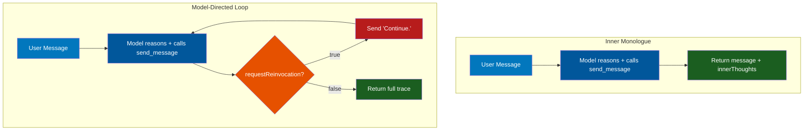
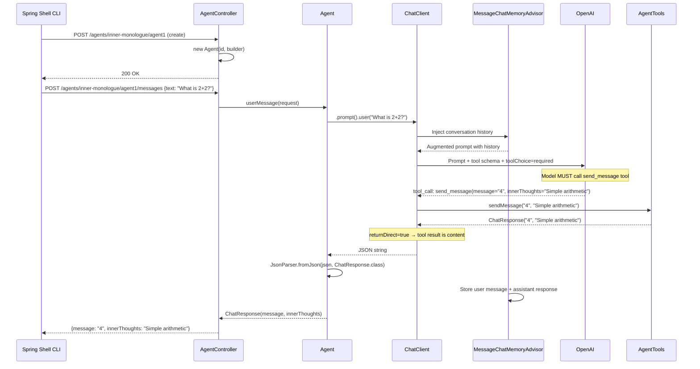
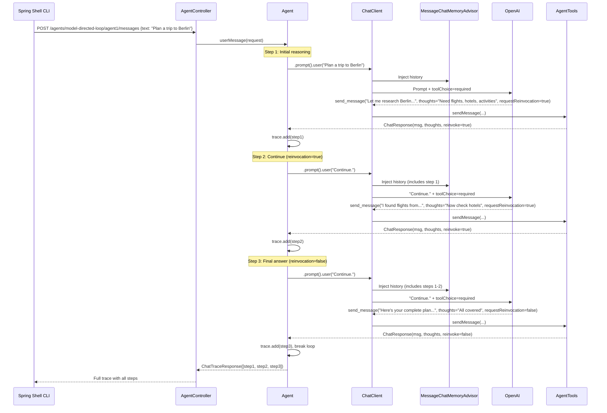
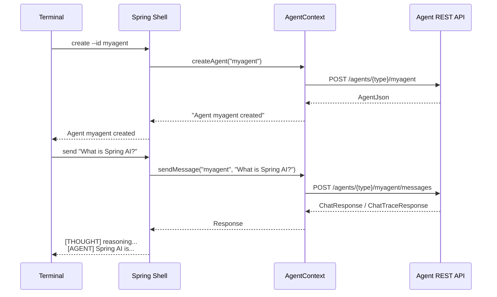

# Stage 7: Agentic Systems

**Modules:** `agentic-system/01-inner-monologue/`, `agentic-system/02-model-directed-loop/`
**Maven Artifacts:** `spring-ai-client-chat`, `spring-ai-openai`, `spring-shell-starter`
**Package Base:** `com.example.agentic.inner_monologue`, `com.example.agentic.model_directed_loop`

---

## Overview

Stage 7 introduces **agentic systems** — AI applications where the model controls its own execution flow. Unlike Stages 1–6 where the developer defines the exact sequence of calls, agentic systems let the model decide what to do next, when to use tools, and when to stop.

Two patterns are demonstrated, each with a REST API server and a Spring Shell CLI client:

1. **Inner Monologue** — The model responds in a single step, but reveals its private reasoning through a structured tool call
2. **Model-Directed Loop** — The model explicitly controls a multi-step loop, deciding after each step whether to continue thinking or return a final answer

Both patterns use a key technique: **forced tool calling** via `toolChoice("required")`, which ensures the model always responds through a structured tool rather than free-form text.

### Learning Objectives

After completing this stage, developers will be able to:

- Build agentic systems where the model controls execution flow
- Use `toolChoice("required")` to force structured output via tools
- Implement inner monologue patterns for transparent AI reasoning
- Build model-directed loops with explicit continuation control
- Combine chat memory with agentic loops for multi-step context
- Create Spring Shell CLI clients for interactive agent testing

### Prerequisites

> **Background reading:** See [SPRING_AI_STAGE_1.md](SPRING_AI_STAGE_1.md) for tool calling basics and [SPRING_AI_STAGE_4.md](SPRING_AI_STAGE_4.md) for chat memory.

- OpenAI API key (these demos currently require OpenAI for `toolChoice("required")`)
- Two terminal windows: one for the agent REST server, one for the CLI client

---

## Agentic Pattern Comparison



| Aspect | Inner Monologue | Model-Directed Loop |
|--------|-----------------|---------------------|
| **Steps** | Single LLM call | Multi-step loop (max 5) |
| **Response** | `ChatResponse(message, innerThoughts)` | `ChatTraceResponse(List<ChatResponse>)` |
| **Loop Control** | None — one call, one answer | Model sets `requestReinvocation` boolean |
| **When to Stop** | Implicit (single response) | Model decides via flag + safety limit |
| **Tool Parameters** | `message`, `innerThoughts` | `message`, `innerThoughts`, `requestReinvocation` |
| **Use Case** | Simple Q&A with visible reasoning | Complex tasks requiring multi-step thinking |

---

## Spring AI Component Reference

| Component | FQN | Purpose |
|-----------|-----|---------|
| `ChatClient` | `o.s.ai.chat.client.ChatClient` | Fluent API for agent LLM interactions |
| `ChatClient.Builder` | `o.s.ai.chat.client.ChatClient.Builder` | Builds ChatClient with tools, options, advisors |
| `MessageChatMemoryAdvisor` | `o.s.ai.chat.client.advisor.MessageChatMemoryAdvisor` | Injects full conversation history into prompts |
| `MessageWindowChatMemory` | `o.s.ai.chat.memory.MessageWindowChatMemory` | Sliding-window conversation memory |
| `InMemoryChatMemoryRepository` | `o.s.ai.chat.memory.InMemoryChatMemoryRepository` | In-memory storage for conversation history |
| `OpenAiChatOptions` | `o.s.ai.openai.OpenAiChatOptions` | OpenAI-specific options including `toolChoice` |
| `@Tool` | `o.s.ai.tool.annotation.Tool` | Marks the `send_message` method as callable |
| `@ToolParam` | `o.s.ai.tool.annotation.ToolParam` | Describes tool parameters |
| `JsonParser` | `o.s.ai.util.json.JsonParser` | Parses tool call JSON results |

> **Notation:** `o.s.ai` = `org.springframework.ai`

---

## Demo 01 — Inner Monologue Agent

**Endpoints:** `POST /agents/inner-monologue/{id}` (create) | `POST /agents/inner-monologue/{id}/messages` (chat)
**Source:** `inner_monologue/Agent.java`, `inner_monologue/AgentTools.java`, `inner_monologue/InnerMonologueAgentController.java`

### Description

The agent always responds through a `send_message` tool with two fields: `message` (what the user sees) and `innerThoughts` (private reasoning the user never sees). By forcing all output through a tool with `toolChoice("required")`, the model must structure its response rather than producing free-form text. The inner thoughts provide transparency into the model's reasoning process.

### Spring AI Components

- `ChatClient` — built with `defaultTools`, `defaultOptions`, `defaultSystem`, `defaultAdvisors`
- `OpenAiChatOptions.toolChoice("required")` — forces the model to always call a tool
- `@Tool(returnDirect = true)` — tool result becomes the response content
- `MessageChatMemoryAdvisor` — persists conversation across requests
- `JsonParser` — parses the structured tool response

### Architecture

```
┌───────────────┐     ┌───────────────────────────────────────────────┐
│   CLI Client  │     │          Agent REST Server                    │
│ (Spring Shell)│     │                                               │
│               │     │  ┌──────────────────────────────────────────┐ │
│  create ──────┼────▶│  │ InnerMonologueAgentController            │ │
│  send   ──────┼────▶│  │   Map<String, Agent>                     │ │
│  log    ──────┼────▶│  │                                          │ │
│               │     │  │  Agent                                   │ │
│               │     │  │  ├── ChatClient (with forced tool call)  │ │
│               │     │  │  ├── MessageChatMemoryAdvisor            │ │
│               │     │  │  └── AgentTools.send_message             │ │
│               │     │  └──────────────────────────────────────────┘ │
└───────────────┘     └───────────────────────────────────────────────┘
```

### Flow Diagram



### Key Code — Agent Construction

```java
public Agent(String id, ChatClient.Builder chatClientBuilder) {
    this.id = id;

    var memory = MessageWindowChatMemory.builder()
        .chatMemoryRepository(new InMemoryChatMemoryRepository())
        .build();
    var chatMemoryAdvisor = MessageChatMemoryAdvisor.builder(memory).build();

    this.chatClient = chatClientBuilder.clone()
        .defaultOptions(OpenAiChatOptions.builder().toolChoice("required").build())
        .defaultTools(new AgentTools())
        .defaultSystem(SYSTEM_PROMPT)
        .defaultAdvisors(chatMemoryAdvisor)
        .build();
}
```

### Key Code — Tool Definition

```java
public class AgentTools {
    @Tool(name = "send_message", description = "send a message to the user", returnDirect = true)
    public ChatResponse sendMessage(
        @ToolParam(description = "The message you want the user to see") String message,
        @ToolParam(description = "your private inner thoughts") String innerThoughts) {
        return new ChatResponse(message, innerThoughts);
    }
}
```

### System Prompt (excerpt)

```
You are a helpful AI agent. You ALWAYS respond using the send_message tool.
Never reply directly with text — always use the tool.
You must use the inner_thoughts field (max 50 words) to reason privately.
The user never sees inner_thoughts.
```

> **Takeaway:** Forcing output through a tool with `toolChoice("required")` gives you structured, predictable responses. The inner monologue pattern adds transparency — you can log, audit, or debug the model's reasoning without exposing it to the user.

---

## Demo 02 — Model-Directed Loop Agent

**Endpoints:** `POST /agents/model-directed-loop/{id}` (create) | `POST /agents/model-directed-loop/{id}/messages` (chat)
**Source:** `model_directed_loop/Agent.java`, `model_directed_loop/AgentTools.java`, `model_directed_loop/ModelDirectedLoopAgentController.java`

### Description

The model controls a multi-step reasoning loop. After each step, it sets `requestReinvocation = true` to keep thinking or `false` to stop. The application collects all steps into a trace, providing full visibility into the agent's reasoning process. A safety limit of 5 steps prevents infinite loops.

### Spring AI Components

- Same as Demo 01, plus:
- `requestReinvocation` boolean on the tool — model explicitly controls the loop
- `ChatTraceResponse` — collects all steps for the full reasoning trace

### Flow Diagram



### Key Code — Agent Loop

```java
private static final int MAX_STEP_COUNT = 5;

public ChatTraceResponse userMessage(ChatRequest request) {
    List<ChatResponse> trace = new ArrayList<>();
    int stepCount = 0;
    boolean firstStep = true;

    while (true) {
        String json;
        if (firstStep) {
            json = this.chatClient.prompt().user(request.text()).call().content();
            firstStep = false;
        } else {
            // Subsequent steps just say "Continue."
            // Memory advisor injects full conversation history
            json = this.chatClient.prompt().user("Continue.").call().content();
        }

        ChatResponse step = JsonParser.fromJson(json, ChatResponse.class);
        trace.add(step);
        stepCount++;

        // Model decides to stop OR safety limit reached
        if (!step.requestReinvocation() || stepCount >= MAX_STEP_COUNT) {
            break;
        }
    }

    return new ChatTraceResponse(trace);
}
```

### Key Code — Tool with Reinvocation Control

```java
public class AgentTools {
    @Tool(name = "send_message", description = "send a message to the user", returnDirect = true)
    public ChatResponse sendMessage(
        @ToolParam(description = "The message you want the user to see") String message,
        @ToolParam(description = "your private inner thoughts") String innerThoughts,
        @ToolParam(description = "Set to true to keep thinking after this message")
            Boolean requestReinvocation) {
        return new ChatResponse(message, innerThoughts, requestReinvocation);
    }
}
```

### System Prompt (excerpt)

```
Your brain activates only in short bursts. Each burst is triggered by
either a user message or requestReinvocation=true from a previous step.
After each tool call, execution halts until the next event.
You must explicitly stop the loop by setting requestReinvocation=false.
```

> **Takeaway:** The model-directed loop gives the AI explicit control over execution flow. The `requestReinvocation` boolean is the key mechanism — the model decides when to keep thinking and when to stop. Memory persistence across steps ensures context isn't lost. The safety limit (`MAX_STEP_COUNT = 5`) prevents runaway loops.

---

## CLI Client Architecture

Both demos include a Spring Shell CLI client for interactive testing:



### Shell Commands

| Command | Description | Both Agents |
|---------|-------------|-------------|
| `create [--id=ID]` | Create a new agent instance | Yes |
| `target --id=ID` | Switch to an existing agent | Yes |
| `send TEXT` | Send a message to the current agent | Yes |
| `log` | Show conversation history | Yes |
| `status` | Show agent metadata and system prompt | Yes |
| `list` | List all agent IDs on the server | Yes |
| `login EMAIL` | Login to ACME fitness store | Model-Directed Loop only |

---

## Key Agentic Design Patterns

### Pattern 1: Forced Tool Calling

```java
OpenAiChatOptions.builder().toolChoice("required").build()
```

Forces the model to always call a tool instead of responding with free-form text. This ensures:
- **Structured output** — responses are always parseable
- **Controlled behavior** — the model can't bypass the tool interface
- **Auditability** — every response includes inner thoughts

### Pattern 2: Inner Thoughts as Tool Parameters

The `innerThoughts` field on the tool is never shown to the user but:
- Forces the model to reason before answering
- Provides a debugging/auditing trace
- Can be logged, stored, or analyzed separately

### Pattern 3: Model-Controlled Execution

The `requestReinvocation` boolean lets the model decide:
- `true` — "I need more steps to complete this task"
- `false` — "I'm done, here's my final answer"

Combined with a safety limit, this creates a flexible but bounded execution model.

### Pattern 4: Memory Across Steps

`MessageChatMemoryAdvisor` is critical for multi-step agents:
- In the loop, subsequent steps send just `"Continue."`
- The advisor injects the full conversation history including previous steps
- The model sees its own prior reasoning and can build on it

---

## Stage 7 Progression


### Provider Note

Both agents currently require **OpenAI** due to `OpenAiChatOptions.toolChoice("required")`. A future migration to provider-agnostic `ToolCallingChatOptions` would enable running these agents on any provider that supports tool calling.
