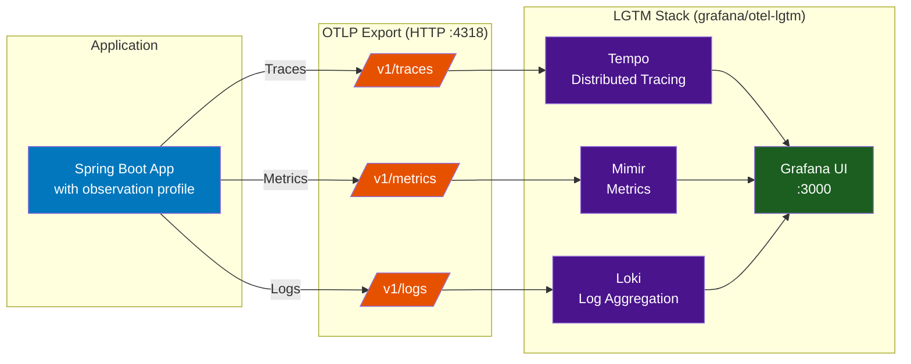
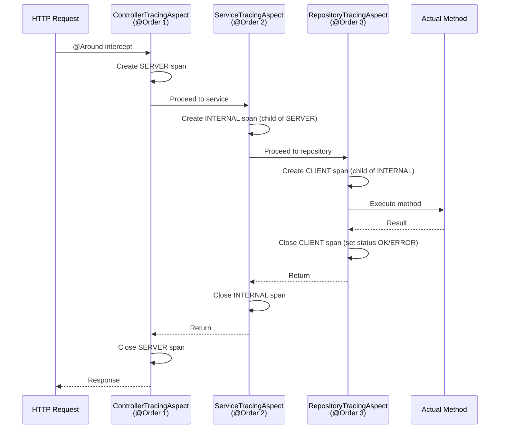
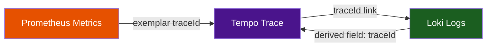
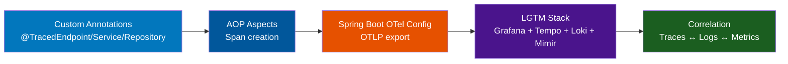

# Stage 8: Observability

**Module:** `components/patterns/04-distributed-tracing/`
**Infrastructure:** `docker/observability-stack/`
**Maven Artifact:** `spring-boot-starter-opentelemetry`
**Package Base:** `com.example.tracing`

---

## Overview

Stage 8 adds **full observability** to the Spring AI workshop — distributed tracing, metrics, and structured logging — using the **LGTM stack** (Loki, Grafana, Tempo, Mimir). Every AI interaction across all stages becomes visible: HTTP requests, ChatClient calls, embedding operations, vector store queries, and tool invocations are captured as traces with correlated logs and metrics.

The implementation uses three custom annotations (`@TracedEndpoint`, `@TracedService`, `@TracedRepository`) backed by Spring AOP aspects that create nested OpenTelemetry spans. All telemetry is exported via OTLP to a single `grafana/otel-lgtm` Docker container.

### Learning Objectives

After completing this stage, developers will be able to:

- Understand the three pillars of observability: traces, metrics, logs
- Use custom tracing annotations to create hierarchical spans
- Configure Spring Boot for OpenTelemetry export (traces, metrics, logs)
- Set up the LGTM observability stack with Docker
- Navigate Grafana to explore traces in Tempo, logs in Loki, and metrics in Mimir
- Correlate traces and logs using traceId/spanId

### Prerequisites

> **Background reading:** See [SPRING_AI_INTRODUCTION.md](SPRING_AI_INTRODUCTION.md) for Spring AI fundamentals. This stage applies observability to all demos from Stages 1–7.

- Docker for the observability stack
- Activate the `observation` Spring profile when running any provider app

---

## The Three Pillars of Observability



| Pillar | Backend | What It Captures | Example |
|--------|---------|-----------------|---------|
| **Traces** | Tempo | Request flow across components, timing | `GET /rag/01/query` → VectorStore search → ChatClient call → LLM response |
| **Metrics** | Mimir | Counters, gauges, histograms over time | HTTP request rate, p95 latency, JVM heap, HikariCP pool usage |
| **Logs** | Loki | Structured log events with trace correlation | `[traceId=abc123] RagController - similarity search returned 4 documents` |

---

## Spring AI Component Reference

| Component | FQN / Location | Purpose |
|-----------|----------------|---------|
| `@TracedEndpoint` | `com.example.tracing.TracedEndpoint` | Marks controllers — creates SERVER spans |
| `@TracedService` | `com.example.tracing.TracedService` | Marks services — creates INTERNAL spans |
| `@TracedRepository` | `com.example.tracing.TracedRepository` | Marks repositories — creates CLIENT spans |
| `ControllerTracingAspect` | `com.example.tracing.ControllerTracingAspect` | AOP aspect for endpoint spans (`@Order(1)`) |
| `ServiceTracingAspect` | `com.example.tracing.ServiceTracingAspect` | AOP aspect for service spans (`@Order(2)`) |
| `RepositoryTracingAspect` | `com.example.tracing.RepositoryTracingAspect` | AOP aspect for repository spans (`@Order(3)`) |
| `OpenTelemetryConfig` | `com.example.tracing.OpenTelemetryConfig` | Configures Tracer bean, observation predicate, OTLP log appender |
| `spring-boot-starter-opentelemetry` | Spring Boot | Auto-configures OTLP export, Micrometer bridge |

---

## Custom Tracing Annotations

### The Span Hierarchy

The three annotations create a nested span structure that mirrors the application architecture:

```
HTTP Request: GET /rag/01/query?topic=bikes
│
└── @TracedEndpoint: "GET /rag/01/query" (SpanKind.SERVER)     ← Controller
    │
    ├── @TracedService: "RagService.query" (SpanKind.INTERNAL)  ← Business logic
    │   │
    │   ├── @TracedRepository: "VectorStore.search" (SpanKind.CLIENT)  ← Data access
    │   │
    │   └── Spring AI auto-instrumented: ChatClient.call → LLM API
    │
    └── Spring AI auto-instrumented: EmbeddingModel.embed
```

### Annotation Details

```java
// Controller layer — creates root SERVER span
@Target({ElementType.TYPE, ElementType.METHOD})
@Retention(RetentionPolicy.RUNTIME)
public @interface TracedEndpoint {
    String name() default "";  // Custom span name (defaults to ClassName.methodName)
}

// Service layer — creates INTERNAL child span
@Target({ElementType.TYPE, ElementType.METHOD})
@Retention(RetentionPolicy.RUNTIME)
public @interface TracedService {
    String module() default "";  // e.g., "chat", "embedding", "rag"
}

// Repository layer — creates CLIENT child span
@Target({ElementType.TYPE, ElementType.METHOD})
@Retention(RetentionPolicy.RUNTIME)
public @interface TracedRepository {
    String operation() default "";  // e.g., "SELECT", "similaritySearch"
}
```

### AOP Aspect Implementation

Each annotation has a corresponding `@Aspect` class that creates spans using the OpenTelemetry `Tracer`:



### Key Code — Controller Aspect

```java
@Aspect
@Component
@Order(1)
public class ControllerTracingAspect {
    private final Tracer tracer;

    @Around("@within(TracedEndpoint) || @annotation(TracedEndpoint)")
    public Object traceEndpoint(ProceedingJoinPoint joinPoint) throws Throwable {
        String spanName = deriveSpanName(joinPoint); // HTTP method + URI

        Span span = tracer.spanBuilder(spanName)
            .setSpanKind(SpanKind.SERVER)
            .startSpan();

        try (Scope scope = span.makeCurrent()) {
            span.setAttribute("component", "controller");
            span.setAttribute("method", joinPoint.getSignature().getName());
            Object result = joinPoint.proceed();
            span.setStatus(StatusCode.OK);
            return result;
        } catch (Throwable t) {
            span.setStatus(StatusCode.ERROR, t.getMessage());
            span.recordException(t);
            throw t;
        } finally {
            span.end();
        }
    }
}
```

> **Takeaway:** The `@Order` annotations control nesting: Order(1) = outermost span (controller), Order(2) = middle (service), Order(3) = innermost (repository). `Context.current()` in child aspects automatically links to the parent span.

---

## Usage Across All Stages

The `@TracedEndpoint` annotation is applied to every controller in the workshop:

```java
@TracedEndpoint   // ← Creates distributed trace for every request
@RestController
@RequestMapping("/chat/02/client")
public class ChatClientController {
    // Every endpoint automatically traced
}
```

**Controllers traced in each stage:**

| Stage | Controllers | Endpoints Traced |
|-------|-------------|-----------------|
| 1 — Chat | BasicPromptController, ChatClientController, ChatModelController, PromptTemplateController, StructuredOutputConverterController, ToolController, RoleController, MultiModalController, StreamingChatModelController | 14 |
| 2 — Embeddings | BasicEmbeddingController, SimilarityController, EmbeddingRequestController, DocumentController | 10 |
| 3 — Vector Stores | VectorStoreController | 2 |
| 4 — AI Patterns | StuffController, RagController, AdvisorController, StatelessController, ChatHistoryController | 7 |
| 5 — Advanced | ChainOfThoughtController, ReflectionAgentController | 4 |
| **Total** | | **37+ endpoints** |

---

## OpenTelemetry Configuration

### Spring Boot Configuration (`observation` profile)

```yaml
spring:
  config:
    activate:
      on-profile: observation
  ai:
    chat:
      client:
        observation:
          include-input: true          # Log AI request payloads in traces
      observations:
        include-error-logging: true    # Log AI errors
    vector:
      store:
        observations:
          include-query-response: true # Log vector search results

management:
  tracing:
    enabled: true
    sampling:
      probability: 1.0                # 100% sampling (development)
    propagation:
      type: w3c                       # W3C Trace Context standard

  opentelemetry:
    resource-attributes:
      "service.name": ${spring.application.name}
      "service.version": 1.0.0
      "deployment.environment": development
    tracing:
      export:
        otlp:
          endpoint: http://localhost:4318/v1/traces
    logging:
      export:
        enabled: true
        otlp:
          endpoint: http://localhost:4318/v1/logs

  otlp:
    metrics:
      export:
        url: http://localhost:4318/v1/metrics
        step: 10s

  endpoints:
    web:
      exposure:
        include: health,info,metrics,prometheus
```

### Logback Configuration

```xml
<!-- Console with traceId/spanId for correlation -->
<appender name="CONSOLE" class="ch.qos.logback.core.ConsoleAppender">
  <pattern>%d{HH:mm:ss.SSS} [%X{traceId:-},%X{spanId:-}] %-5level [%thread] %logger{36} - %msg%n</pattern>
</appender>

<!-- OTLP export to Loki -->
<appender name="OTEL" class="io.opentelemetry.instrumentation.logback.appender.v1_0.OpenTelemetryAppender">
  <captureCodeAttributes>true</captureCodeAttributes>
  <captureMdcAttributes>*</captureMdcAttributes>
</appender>
```

> **Takeaway:** The `observation` profile enables all three telemetry signals. Spring AI's own observations (`include-input`, `include-error-logging`, `include-query-response`) add AI-specific data to traces. The Logback OTLP appender exports structured logs with embedded traceId for Grafana correlation.

---

## Infrastructure: LGTM Stack

### Docker Setup

```yaml
# docker/observability-stack/docker-compose.yaml
services:
  lgtm:
    image: grafana/otel-lgtm:latest
    ports:
      - "3000:3000"   # Grafana UI
      - "4317:4317"   # OTLP gRPC
      - "4318:4318"   # OTLP HTTP
    volumes:
      - grafana-data:/otel-lgtm/grafana/data
      - ./grafana/dashboards:/otel-lgtm/grafana/conf/provisioning/dashboards/custom
      - ./grafana/provisioning/datasources:/otel-lgtm/grafana/conf/provisioning/datasources
```

### What's Inside the Container

```
grafana/otel-lgtm (all-in-one)
├── OpenTelemetry Collector  ← Receives OTLP on :4317/:4318
│   ├── Receiver: OTLP (gRPC + HTTP)
│   ├── Processor: batch
│   └── Exporters:
│       ├── → Tempo (traces)
│       ├── → Mimir (metrics)
│       └── → Loki (logs)
├── Tempo                    ← Trace storage & query
├── Mimir                    ← Prometheus-compatible metrics
├── Loki                     ← Log aggregation
└── Grafana                  ← UI on :3000
```

### Pre-Provisioned Dashboards

| Dashboard | Content |
|-----------|---------|
| **Spring AI Workshop Overview** | Application uptime, HTTP request rates, p95 response times, JVM heap, CPU, GC pauses, log event rates |
| **JVM Micrometer** | Comprehensive JVM metrics (threads, memory pools, class loading, GC) |
| **Microservices Spring Boot** | RED metrics (Rate, Errors, Duration) per endpoint |
| **HikariCP JDBC** | Database connection pool monitoring (active, idle, pending, timeouts) |

### Datasource Correlation

Grafana datasources are configured for **cross-signal correlation**:



- **Tempo → Loki:** Click a trace span → see correlated logs for that traceId
- **Loki → Tempo:** Click a traceId in a log line → jump to the full trace
- **Metrics → Tempo:** Click an exemplar point on a histogram → view the trace

---

## Running Observability

```bash
# 1. Start the LGTM stack
docker compose -f docker/observability-stack/docker-compose.yaml up -d

# 2. Run any provider with the observation profile
./mvnw spring-boot:run -pl applications/provider-ollama \
  -Dspring-boot.run.profiles=pgvector,observation

# 3. Open Grafana
open http://localhost:3000
```

### What to Explore in Grafana

| Action | Where | What You See |
|--------|-------|-------------|
| View traces | Explore → Tempo | Full request traces: HTTP → Spring AI → LLM API |
| Drill into spans | Trace detail view | Nested spans: `@TracedEndpoint` → ChatClient → EmbeddingModel |
| Search logs | Explore → Loki | Structured logs filterable by traceId, level, service |
| View metrics | Dashboards → Workshop | HTTP rates, latency percentiles, JVM stats |
| Correlate | Click traceId in any signal | Jump between traces ↔ logs ↔ metrics |

---

## Example: Tracing a RAG Request

A single `GET /rag/01/query?topic=long+range+bikes` produces this trace:

```mermaid
gantt
    title Trace: GET /rag/01/query (1250ms total)
    dateFormat X
    axisFormat %L ms

    section Controller
    @TracedEndpoint GET /rag/01/query :0, 1250

    section Vector Store
    VectorStore.similaritySearch :50, 350
    EmbeddingModel.embed (query) :50, 200

    section Chat
    ChatClient.call :400, 1200
    LLM API request (OpenAI/Ollama) :450, 1150
```



Each span captures:
- **Duration** — how long the operation took
- **Attributes** — component type, method name, HTTP status
- **Events** — exceptions, tool calls
- **Parent-child** — which operation triggered which

---

## Stage 8 Progression



### Key Takeaways

| Concept | Implementation |
|---------|---------------|
| **Annotations over configuration** | `@TracedEndpoint` on any controller — no manual span code needed |
| **Span hierarchy via AOP order** | `@Order(1)` → `@Order(2)` → `@Order(3)` creates nested parent-child spans |
| **All-in-one infrastructure** | Single `grafana/otel-lgtm` container replaces 5+ separate services |
| **Spring AI observation support** | `include-input: true` adds AI-specific data (prompts, responses) to traces |
| **Cross-signal correlation** | traceId links traces → logs → metrics in Grafana |
| **Zero-code AI tracing** | Spring AI auto-instruments ChatClient, EmbeddingModel, VectorStore calls |
